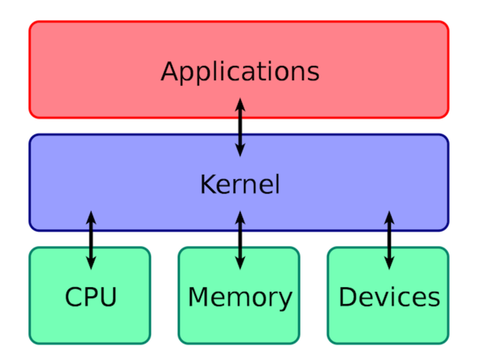
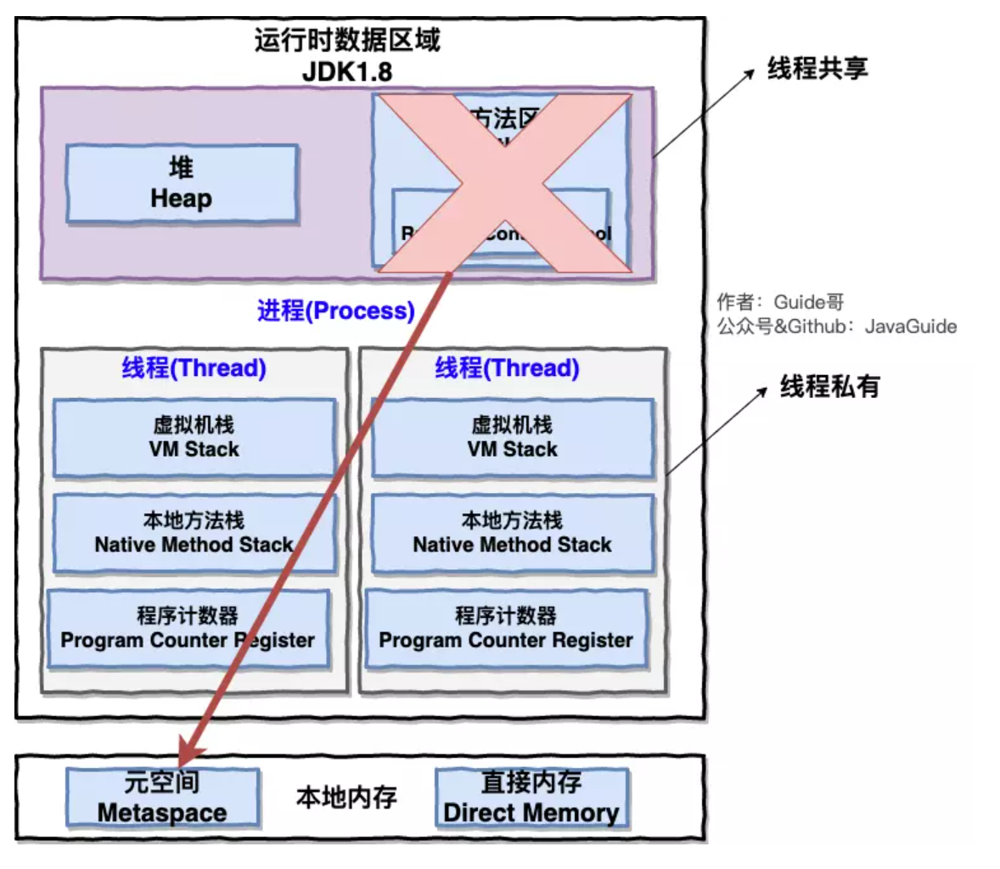
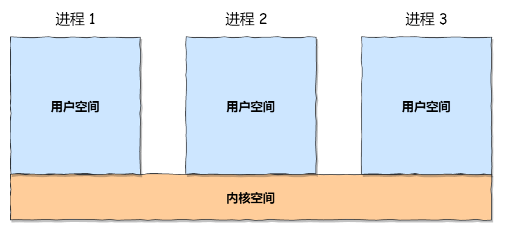
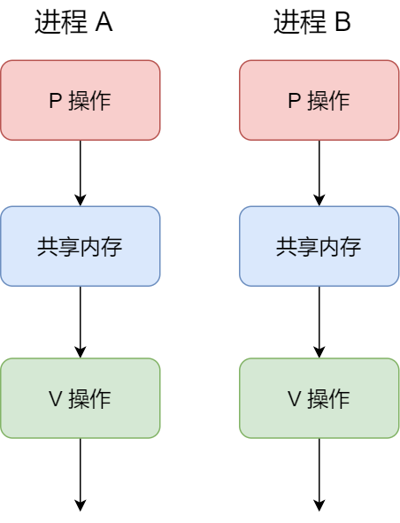
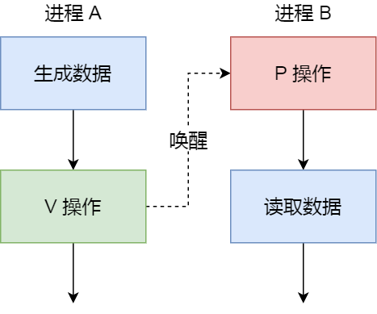
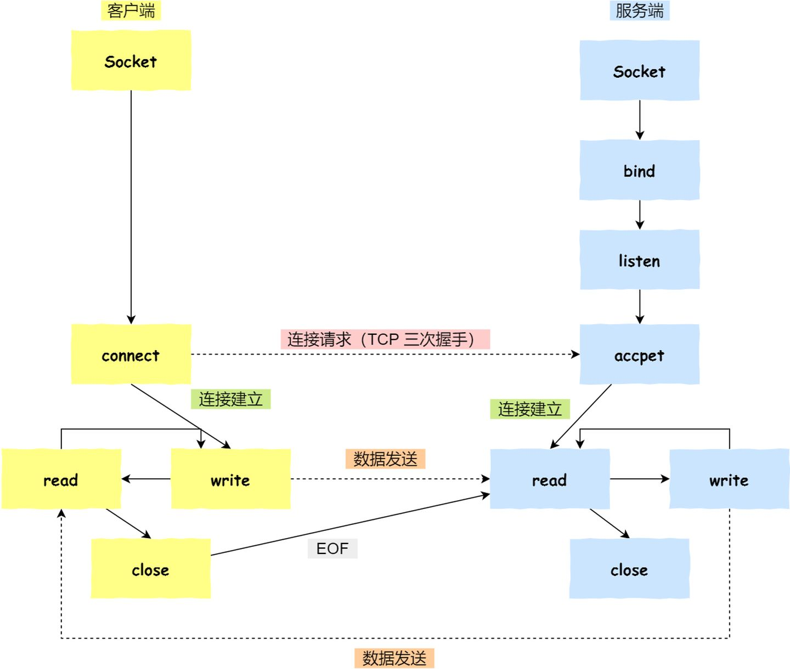
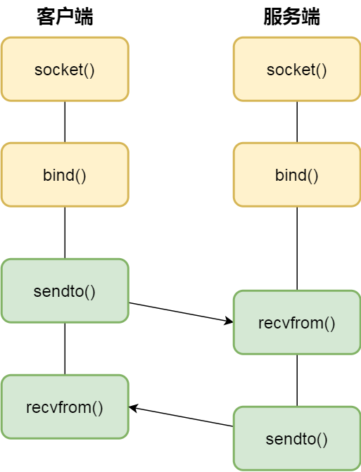
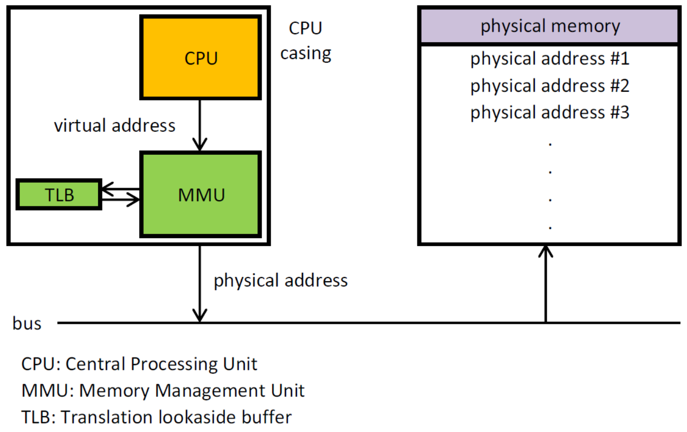

# 操作系统

**解释一下什么是操作系统**

操作系统是运行在计算机上最重要的一种软件，它管理计算机的资源和进程以及所有的硬件和软件。它为计算机硬件和软件提供了一种中间层


通常情况下，计算机上会运行着许多应用程序，它们都需要对内存和 CPU 进行交互，操作系统的目的就是为了保证这些访问和交互能够准确无误的进行。


## 操作系统概述


先来个简单问题吧！**什么是操作系统？**

🙋 **我** ：我通过以下四点向您介绍一下什么是操作系统吧！

1. **操作系统（Operating System，简称 OS）是管理计算机硬件与软件资源的程序，是计算机的基石。**
2. **操作系统本质上是一个运行在计算机上的软件程序 ，用于管理计算机硬件和软件资源。** 举例：运行在你电脑上的所有应用程序都通过操作系统来调用系统内存以及磁盘等等硬件。
3. **操作系统存在屏蔽了硬件层的复杂性。** 操作系统就像是硬件使用的负责人，统筹着各种相关事项。
4. **操作系统的内核（Kernel）是操作系统的核心部分，它负责系统的内存管理，硬件设备的管理，文件系统的管理以及应用程序的管理**。 内核是连接应用程序和硬件的桥梁，决定着系统的性能和稳定性。




### 系统调用

👨‍💻**面试官** ：**什么是系统调用呢？** 能不能详细介绍一下。

🙋 **我** ：介绍系统调用之前，我们先来了解一下用户态和系统态。

根据进程访问资源的特点，我们可以把进程在系统上的运行分为两个级别：

1. 用户态(user mode) : 用户态运行的进程可以直接读取用户程序的数据。
2. 系统态(kernel mode):可以简单的理解系统态运行的进程或程序几乎可以访问计算机的任何资源，不受限制。

说了用户态和系统态之后，那么什么是系统调用呢？

我们运行的程序基本都是运行在用户态，如果我们调用操作系统提供的系统态级别的子功能咋办呢？那就需要系统调用了！

也就是说在我们运行的用户程序中，凡是与系统态级别的资源有关的操作（如文件管理、进程控制、内存管理等)，都必须通过系统调用方式向操作系统提出服务请求，并由操作系统代为完成。

这些系统调用按功能大致可分为如下几类：

- 设备管理。完成设备的请求或释放，以及设备启动等功能。
- 文件管理。完成文件的读、写、创建及删除等功能。
- 进程控制。完成进程的创建、撤销、阻塞及唤醒等功能。
- 进程通信。完成进程之间的消息传递或信号传递等功能。
- 内存管理。完成内存的分配、回收以及获取作业占用内存区大小及地址等功能。


## 进程和线程

### 1 进程和线程的区别

👨‍💻**面试官**: 好的！我明白了！那你再说一下： **进程和线程的区别**。

🙋 **我：** 好的！ 下图是 Java 内存区域，我们从 JVM 的角度来说一下线程和进程之间的关系吧！



从上图可以看出：一个进程中可以有多个线程，多个线程共享进程的**堆**和**方法区 (JDK1.8 之后的元空间)\**资源，但是每个线程有自己的\**程序计数器**、**虚拟机栈** 和 **本地方法栈**。

**总结：** 线程是进程划分成的更小的运行单位,一个进程在其执行的过程中可以产生多个线程。线程和进程最大的不同在于基本上各进程是独立的，而各线程则不一定，因为同一进程中的线程极有可能会相互影响。线程执行开销小，但不利于资源的管理和保护；而进程正相反。


### 2 进程有哪几种状态?

👨‍💻**面试官** ： 那你再说说**进程有哪几种状态?**

🙋 **我** ：我们一般把进程大致分为 5 种状态，这一点和[线程](https://github.com/Snailclimb/JavaGuide/blob/master/docs/java/Multithread/JavaConcurrencyBasicsCommonInterviewQuestionsSummary.md#6-说说线程的生命周期和状态)很像！

- **创建状态(new)** ：进程正在被创建，尚未到就绪状态。
- **就绪状态(ready)** ：进程已处于准备运行状态，即进程获得了除了处理器之外的一切所需资源，一旦得到处理器资源(处理器分配的时间片)即可运行。
- **运行状态(running)** ：进程正在处理器上上运行(单核 CPU 下任意时刻只有一个进程处于运行状态)。
- **阻塞状态(waiting)** ：又称为等待状态，进程正在等待某一事件而暂停运行如等待某资源为可用或等待 IO 操作完成。即使处理器空闲，该进程也不能运行。
- **结束状态(terminated)** ：进程正在从系统中消失。可能是进程正常结束或其他原因中断退出运行。

### 3 进程间的通信方式

每个进程的用户地址空间都是独立的，一般而言是不能互相访问的，但内核空间是每个进程都共享的，所以进程之间要通信必须通过内核。




👨‍💻**面试官** ：**进程间的通信常见的的有哪几种方式呢?**

🙋 **我** ：大概有 7 种常见的进程间的通信方式。

> 下面这部分总结参考了:[《进程间通信 IPC (InterProcess Communication)》](https://www.jianshu.com/p/c1015f5ffa74) 这篇文章，推荐阅读，总结的非常不错。

#### **管道/匿名管道(Pipes)** ：

用于具有亲缘关系的父子进程间或者兄弟进程之间的通信。**有名管道(Names Pipes)** : 匿名管道由于没有名字，只能用于亲缘关系的进程间通信。为了克服这个缺点，提出了有名管道。有名管道严格遵循**先进先出(first in first out)**。有名管道以磁盘文件的方式存在，可以实现本机任意两个进程通信。

如果你学过 Linux 命令，那你肯定很熟悉「`|`」这个竖线。

```text
$ ps auxf | grep mysql
```

上面命令行里的「`|`」竖线就是一个**管道**，它的功能是将前一个命令（`ps auxf`）的输出，作为后一个命令（`grep mysql`）的输入，从这功能描述，可以看出**管道传输数据是单向的**，如果想相互通信，我们需要创建两个管道才行。

同时，我们得知上面这种管道是没有名字，所以「`|`」表示的管道称为**匿名管道**，用完了就销毁。

管道还有另外一个类型是**命名管道**，也被叫做 `FIFO`，因为数据是先进先出的传输方式。

在使用命名管道前，先需要通过 `mkfifo` 命令来创建，并且指定管道名字：

```text
$ mkfifo myPipe
```

myPipe 就是这个管道的名称，基于 Linux 一切皆文件的理念，所以管道也是以文件的方式存在，我们可以用 ls 看一下，这个文件的类型是 p，也就是 pipe（管道） 的意思：

```text
$ ls -l
prw-r--r--. 1 root    root         0 Jul 17 02:45 myPipe
```

接下来，我们往 myPipe 这个管道写入数据：

```text
$ echo "hello" > myPipe  // 将数据写进管道
                         // 停住了 ...
```

你操作了后，你会发现命令执行后就停在这了，这是因为管道里的内容没有被读取，只有当管道里的数据被读完后，命令才可以正常退出。

于是，我们执行另外一个命令来读取这个管道里的数据：

```text
$ cat < myPipe  // 读取管道里的数据
hello
```

可以看到，管道里的内容被读取出来了，并打印在了终端上，另外一方面，echo 那个命令也正常退出了。

我们可以看出，**管道这种通信方式效率低，不适合进程间频繁地交换数据**。当然，它的好处，自然就是简单，同时也我们很容易得知管道里的数据已经被另一个进程读取了。


#### **消息队列(Message Queuing)** ：

消息队列是消息的链表,具有特定的格式,存放在内存中并由消息队列标识符标识。管道和消息队列的通信数据都是先进先出的原则。与管道（无名管道：只存在于内存中的文件；命名管道：存在于实际的磁盘介质或者文件系统）不同的是消息队列存放在内核中，只有在内核重启(即，操作系统重启)或者显示地删除一个消息队列时，该消息队列才会被真正的删除。消息队列可以实现消息的随机查询,消息不一定要以先进先出的次序读取,也可以按消息的类型读取.比 FIFO 更有优势。**消息队列克服了信号承载信息量少，管道只能承载无格式字 节流以及缓冲区大小受限等缺。**

前面说到管道的通信方式是效率低的，因此管道不适合进程间频繁地交换数据。

对于这个问题，**消息队列**的通信模式就可以解决。比如，A 进程要给 B 进程发送消息，A 进程把数据放在对应的消息队列后就可以正常返回了，B 进程需要的时候再去读取数据就可以了。同理，B 进程要给 A 进程发送消息也是如此。

再来，**消息队列是保存在内核中的消息链表**，在发送数据时，会分成一个一个独立的数据单元，也就是消息体（数据块），消息体是用户自定义的数据类型，消息的发送方和接收方要约定好消息体的数据类型，所以每个消息体都是固定大小的存储块，不像管道是无格式的字节流数据。如果进程从消息队列中读取了消息体，内核就会把这个消息体删除。

消息队列生命周期随内核，如果没有释放消息队列或者没有关闭操作系统，消息队列会一直存在，而前面提到的匿名管道的生命周期，是随进程的创建而建立，随进程的结束而销毁。

消息这种模型，两个进程之间的通信就像平时发邮件一样，你来一封，我回一封，可以频繁沟通了。

但邮件的通信方式存在不足的地方有两点，**一是通信不及时，二是附件也有大小限制**，这同样也是消息队列通信不足的点。

**消息队列不适合比较大数据的传输**，因为在内核中每个消息体都有一个最大长度的限制，同时所有队列所包含的全部消息体的总长度也是有上限。在 Linux 内核中，会有两个宏定义 `MSGMAX` 和 `MSGMNB`，它们以字节为单位，分别定义了一条消息的最大长度和一个队列的最大长度。

**消息队列通信过程中，存在用户态与内核态之间的数据拷贝开销**，因为进程写入数据到内核中的消息队列时，会发生从用户态拷贝数据到内核态的过程，同理另一进程读取内核中的消息数据时，会发生从内核态拷贝数据到用户态的过程。再来，**消息队列是保存在内核中的消息链表**，在发送数据时，会分成一个一个独立的数据单元，也就是消息体（数据块），消息体是用户自定义的数据类型，消息的发送方和接收方要约定好消息体的数据类型，所以每个消息体都是固定大小的存储块，不像管道是无格式的字节流数据。如果进程从消息队列中读取了消息体，内核就会把这个消息体删除。

消息队列生命周期随内核，如果没有释放消息队列或者没有关闭操作系统，消息队列会一直存在，而前面提到的匿名管道的生命周期，是随进程的创建而建立，随进程的结束而销毁。

消息这种模型，两个进程之间的通信就像平时发邮件一样，你来一封，我回一封，可以频繁沟通了。

但邮件的通信方式存在不足的地方有两点，**一是通信不及时，二是附件也有大小限制**，这同样也是消息队列通信不足的点。

**消息队列不适合比较大数据的传输**，因为在内核中每个消息体都有一个最大长度的限制，同时所有队列所包含的全部消息体的总长度也是有上限。在 Linux 内核中，会有两个宏定义 `MSGMAX` 和 `MSGMNB`，它们以字节为单位，分别定义了一条消息的最大长度和一个队列的最大长度。

**消息队列通信过程中，存在用户态与内核态之间的数据拷贝开销**，因为进程写入数据到内核中的消息队列时，会发生从用户态拷贝数据到内核态的过程，同理另一进程读取内核中的消息数据时，会发生从内核态拷贝数据到用户态的过程。


#### **共享内存(Shared memory)** ：

使得多个进程可以访问同一块内存空间，不同进程可以及时看到对方进程中对共享内存中数据的更新。这种方式需要依靠某种同步操作，如互斥锁和信号量等。可以说这是最有用的进程间通信方式。

消息队列的读取和写入的过程，都会有发生用户态与内核态之间的消息拷贝过程。那**共享内存**的方式，就很好的解决了这一问题。

现代操作系统，对于内存管理，采用的是虚拟内存技术，也就是每个进程都有自己独立的虚拟内存空间，不同进程的虚拟内存映射到不同的物理内存中。所以，即使进程 A 和 进程 B 的虚拟地址是一样的，其实访问的是不同的物理内存地址，对于数据的增删查改互不影响。

**共享内存的机制，就是拿出一块虚拟地址空间来，映射到相同的物理内存中**。这样这个进程写入的东西，另外一个进程马上就能看到了，都不需要拷贝来拷贝去，传来传去，大大提高了进程间通信的速度。


#### **信号(Signal)** ：

信号是一种比较复杂的通信方式，用于通知接收进程某个事件已经发生；

上面说的进程间通信，都是常规状态下的工作模式。**对于异常情况下的工作模式，就需要用「信号」的方式来通知进程。**

信号跟信号量虽然名字相似度 66.66%，但两者用途完全不一样，就好像 Java 和 JavaScript 的区别。

在 Linux 操作系统中， 为了响应各种各样的事件，提供了几十种信号，分别代表不同的意义。我们可以通过 `kill -l` 命令，查看所有的信号：

```text
$ kill -l
 1) SIGHUP       2) SIGINT       3) SIGQUIT      4) SIGILL       5) SIGTRAP
 6) SIGABRT      7) SIGBUS       8) SIGFPE       9) SIGKILL     10) SIGUSR1
11) SIGSEGV     12) SIGUSR2     13) SIGPIPE     14) SIGALRM     15) SIGTERM
16) SIGSTKFLT   17) SIGCHLD     18) SIGCONT     19) SIGSTOP     20) SIGTSTP
21) SIGTTIN     22) SIGTTOU     23) SIGURG      24) SIGXCPU     25) SIGXFSZ
26) SIGVTALRM   27) SIGPROF     28) SIGWINCH    29) SIGIO       30) SIGPWR
31) SIGSYS      34) SIGRTMIN    35) SIGRTMIN+1  36) SIGRTMIN+2  37) SIGRTMIN+3
38) SIGRTMIN+4  39) SIGRTMIN+5  40) SIGRTMIN+6  41) SIGRTMIN+7  42) SIGRTMIN+8
43) SIGRTMIN+9  44) SIGRTMIN+10 45) SIGRTMIN+11 46) SIGRTMIN+12 47) SIGRTMIN+13
48) SIGRTMIN+14 49) SIGRTMIN+15 50) SIGRTMAX-14 51) SIGRTMAX-13 52) SIGRTMAX-12
53) SIGRTMAX-11 54) SIGRTMAX-10 55) SIGRTMAX-9  56) SIGRTMAX-8  57) SIGRTMAX-7
58) SIGRTMAX-6  59) SIGRTMAX-5  60) SIGRTMAX-4  61) SIGRTMAX-3  62) SIGRTMAX-2
63) SIGRTMAX-1  64) SIGRTMAX
```

运行在 shell 终端的进程，我们可以通过键盘输入某些组合键的时候，给进程发送信号。例如

- Ctrl+C 产生 `SIGINT` 信号，表示终止该进程；
- Ctrl+Z 产生 `SIGTSTP` 信号，表示停止该进程，但还未结束；

如果进程在后台运行，可以通过 `kill` 命令的方式给进程发送信号，但前提需要知道运行中的进程 PID 号，例如：

- kill -9 1050 ，表示给 PID 为 1050 的进程发送 `SIGKILL` 信号，用来立即结束该进程；

所以，信号事件的来源主要有硬件来源（如键盘 Cltr+C ）和软件来源（如 kill 命令）。

信号是进程间通信机制中**唯一的异步通信机制**，因为可以在任何时候发送信号给某一进程，一旦有信号产生，我们就有下面这几种，用户进程对信号的处理方式。

**1.执行默认操作**。Linux 对每种信号都规定了默认操作，例如，上面列表中的 SIGTERM 信号，就是终止进程的意思。Core 的意思是 Core Dump，也即终止进程后，通过 Core Dump 将当前进程的运行状态保存在文件里面，方便程序员事后进行分析问题在哪里。

**2.捕捉信号**。我们可以为信号定义一个信号处理函数。当信号发生时，我们就执行相应的信号处理函数。

**3.忽略信号**。当我们不希望处理某些信号的时候，就可以忽略该信号，不做任何处理。有两个信号是应用进程无法捕捉和忽略的，即 `SIGKILL` 和 `SEGSTOP`，它们用于在任何时候中断或结束某一进程。


#### **信号量(Semaphores)** ：

信号量是一个计数器，用于多进程对共享数据的访问，信号量的意图在于进程间同步。这种通信方式主要用于解决与同步相关的问题并避免竞争条件。

用了共享内存通信方式，带来新的问题，那就是如果多个进程同时修改同一个共享内存，很有可能就冲突了。例如两个进程都同时写一个地址，那先写的那个进程会发现内容被别人覆盖了。

为了防止多进程竞争共享资源，而造成的数据错乱，所以需要保护机制，使得共享的资源，在任意时刻只能被一个进程访问。正好，**信号量**就实现了这一保护机制。

**信号量其实是一个整型的计数器，主要用于实现进程间的互斥与同步，而不是用于缓存进程间通信的数据**。

信号量表示资源的数量，控制信号量的方式有两种原子操作：

- 一个是 **P 操作**，这个操作会把信号量减去 -1，相减后如果信号量 < 0，则表明资源已被占用，进程需阻塞等待；相减后如果信号量 >= 0，则表明还有资源可使用，进程可正常继续执行。
- 另一个是 **V 操作**，这个操作会把信号量加上 1，相加后如果信号量 <= 0，则表明当前有阻塞中的进程，于是会将该进程唤醒运行；相加后如果信号量 > 0，则表明当前没有阻塞中的进程；

P 操作是用在进入共享资源之前，V 操作是用在离开共享资源之后，这两个操作是必须成对出现的。

接下来，举个例子，如果要使得两个进程互斥访问共享内存，我们可以初始化信号量为 `1`。





具体的过程如下：

- 进程 A 在访问共享内存前，先执行了 P 操作，由于信号量的初始值为 1，故在进程 A 执行 P 操作后信号量变为 0，表示共享资源可用，于是进程 A 就可以访问共享内存。
- 若此时，进程 B 也想访问共享内存，执行了 P 操作，结果信号量变为了 -1，这就意味着临界资源已被占用，因此进程 B 被阻塞。
- 直到进程 A 访问完共享内存，才会执行 V 操作，使得信号量恢复为 0，接着就会唤醒阻塞中的线程 B，使得进程 B 可以访问共享内存，最后完成共享内存的访问后，执行 V 操作，使信号量恢复到初始值 1。

可以发现，信号初始化为 `1`，就代表着是**互斥信号量**，它可以保证共享内存在任何时刻只有一个进程在访问，这就很好的保护了共享内存。

另外，在多进程里，每个进程并不一定是顺序执行的，它们基本是以各自独立的、不可预知的速度向前推进，但有时候我们又希望多个进程能密切合作，以实现一个共同的任务。

例如，进程 A 是负责生产数据，而进程 B 是负责读取数据，这两个进程是相互合作、相互依赖的，进程 A 必须先生产了数据，进程 B 才能读取到数据，所以执行是有前后顺序的。

那么这时候，就可以用信号量来实现多进程同步的方式，我们可以初始化信号量为 `0`。





具体过程：

- 如果进程 B 比进程 A 先执行了，那么执行到 P 操作时，由于信号量初始值为 0，故信号量会变为 -1，表示进程 A 还没生产数据，于是进程 B 就阻塞等待；
- 接着，当进程 A 生产完数据后，执行了 V 操作，就会使得信号量变为 0，于是就会唤醒阻塞在 P 操作的进程 B；
- 最后，进程 B 被唤醒后，意味着进程 A 已经生产了数据，于是进程 B 就可以正常读取数据了。

可以发现，信号初始化为 `0`，就代表着是**同步信号量**，它可以保证进程 A 应在进程 B 之前执行。


#### **套接字(Sockets)** : 

此方法主要用于在客户端和服务器之间通过网络进行通信。套接字是支持 TCP/IP 的网络通信的基本操作单元，可以看做是不同主机之间的进程进行双向通信的端点，简单的说就是通信的两方的一种约定，用套接字中的相关函数来完成通信过程。

前面提到的管道、消息队列、共享内存、信号量和信号都是在同一台主机上进行进程间通信，那要想**跨网络与不同主机上的进程之间通信，就需要 Socket 通信了。**

实际上，Socket 通信不仅可以跨网络与不同主机的进程间通信，还可以在同主机上进程间通信。

我们来看看创建 socket 的系统调用：

```text
int socket(int domain, int type, int protocal)
```

三个参数分别代表：

- domain 参数用来指定协议族，比如 AF_INET 用于 IPV4、AF_INET6 用于 IPV6、AF_LOCAL/AF_UNIX 用于本机；
- type 参数用来指定通信特性，比如 SOCK_STREAM 表示的是字节流，对应 TCP、SOCK_DGRAM 表示的是数据报，对应 UDP、SOCK_RAW 表示的是原始套接字；
- protocal 参数原本是用来指定通信协议的，但现在基本废弃。因为协议已经通过前面两个参数指定完成，protocol 目前一般写成 0 即可；

根据创建 socket 类型的不同，通信的方式也就不同：

- 实现 TCP 字节流通信： socket 类型是 AF_INET 和 SOCK_STREAM；
- 实现 UDP 数据报通信：socket 类型是 AF_INET 和 SOCK_DGRAM；
- 实现本地进程间通信： 「本地字节流 socket 」类型是 AF_LOCAL 和 SOCK_STREAM，「本地数据报 socket 」类型是 AF_LOCAL 和 SOCK_DGRAM。另外，AF_UNIX 和 AF_LOCAL 是等价的，所以 AF_UNIX 也属于本地 socket；

接下来，简单说一下这三种通信的编程模式。

> 针对 TCP 协议通信的 socket 编程模型





- 服务端和客户端初始化 `socket`，得到文件描述符；
- 服务端调用 `bind`，将绑定在 IP 地址和端口;
- 服务端调用 `listen`，进行监听；
- 服务端调用 `accept`，等待客户端连接；
- 客户端调用 `connect`，向服务器端的地址和端口发起连接请求；
- 服务端 `accept` 返回用于传输的 `socket` 的文件描述符；
- 客户端调用 `write` 写入数据；服务端调用 `read` 读取数据；
- 客户端断开连接时，会调用 `close`，那么服务端 `read` 读取数据的时候，就会读取到了 `EOF`，待处理完数据后，服务端调用 `close`，表示连接关闭。

这里需要注意的是，服务端调用 `accept` 时，连接成功了会返回一个已完成连接的 socket，后续用来传输数据。

所以，监听的 socket 和真正用来传送数据的 socket，是「**两个**」 socket，一个叫作**监听 socket**，一个叫作**已完成连接 socket**。

成功连接建立之后，双方开始通过 read 和 write 函数来读写数据，就像往一个文件流里面写东西一样。

> 针对 UDP 协议通信的 socket 编程模型





UDP 是没有连接的，所以不需要三次握手，也就不需要像 TCP 调用 listen 和 connect，但是 UDP 的交互仍然需要 IP 地址和端口号，因此也需要 bind。

对于 UDP 来说，不需要要维护连接，那么也就没有所谓的发送方和接收方，甚至都不存在客户端和服务端的概念，只要有一个 socket 多台机器就可以任意通信，因此每一个 UDP 的 socket 都需要 bind。

另外，每次通信时，调用 sendto 和 recvfrom，都要传入目标主机的 IP 地址和端口。

> 针对本地进程间通信的 socket 编程模型

本地 socket 被用于在**同一台主机上进程间通信**的场景：

- 本地 socket 的编程接口和 IPv4 、IPv6 套接字编程接口是一致的，可以支持「字节流」和「数据报」两种协议；
- 本地 socket 的实现效率大大高于 IPv4 和 IPv6 的字节流、数据报 socket 实现；

对于本地字节流 socket，其 socket 类型是 AF_LOCAL 和 SOCK_STREAM。

对于本地数据报 socket，其 socket 类型是 AF_LOCAL 和 SOCK_DGRAM。

本地字节流 socket 和 本地数据报 socket 在 bind 的时候，不像 TCP 和 UDP 要绑定 IP 地址和端口，而是**绑定一个本地文件**，这也就是它们之间的最大区别。

#### 总结

由于每个进程的用户空间都是独立的，不能相互访问，这时就需要借助内核空间来实现进程间通信，原因很简单，每个进程都是共享一个内核空间。

Linux 内核提供了不少进程间通信的方式，其中最简单的方式就是管道，管道分为「匿名管道」和「命名管道」。

**匿名管道**顾名思义，它没有名字标识，匿名管道是特殊文件只存在于内存，没有存在于文件系统中，shell 命令中的「`|`」竖线就是匿名管道，通信的数据是**无格式的流并且大小受限**，通信的方式是**单向**的，数据只能在一个方向上流动，如果要双向通信，需要创建两个管道，再来**匿名管道是只能用于存在父子关系的进程间通信**，匿名管道的生命周期随着进程创建而建立，随着进程终止而消失。

**命名管道**突破了匿名管道只能在亲缘关系进程间的通信限制，因为使用命名管道的前提，需要在文件系统创建一个类型为 p 的设备文件，那么毫无关系的进程就可以通过这个设备文件进行通信。另外，不管是匿名管道还是命名管道，进程写入的数据都是**缓存在内核**中，另一个进程读取数据时候自然也是从内核中获取，同时通信数据都遵循**先进先出**原则，不支持 lseek 之类的文件定位操作。

**消息队列**克服了管道通信的数据是无格式的字节流的问题，消息队列实际上是保存在内核的「消息链表」，消息队列的消息体是可以用户自定义的数据类型，发送数据时，会被分成一个一个独立的消息体，当然接收数据时，也要与发送方发送的消息体的数据类型保持一致，这样才能保证读取的数据是正确的。消息队列通信的速度不是最及时的，毕竟**每次数据的写入和读取都需要经过用户态与内核态之间的拷贝过程。**

**共享内存**可以解决消息队列通信中用户态与内核态之间数据拷贝过程带来的开销，**它直接分配一个共享空间，每个进程都可以直接访问**，就像访问进程自己的空间一样快捷方便，不需要陷入内核态或者系统调用，大大提高了通信的速度，享有**最快**的进程间通信方式之名。但是便捷高效的共享内存通信，**带来新的问题，多进程竞争同个共享资源会造成数据的错乱。**

那么，就需要**信号量**来保护共享资源，以确保任何时刻只能有一个进程访问共享资源，这种方式就是互斥访问。**信号量不仅可以实现访问的互斥性，还可以实现进程间的同步**，信号量其实是一个计数器，表示的是资源个数，其值可以通过两个原子操作来控制，分别是 **P 操作和 V 操作**。

与信号量名字很相似的叫**信号**，它俩名字虽然相似，但功能一点儿都不一样。信号是进程间通信机制中**唯一的异步通信机制**，信号可以在应用进程和内核之间直接交互，内核也可以利用信号来通知用户空间的进程发生了哪些系统事件，信号事件的来源主要有硬件来源（如键盘 Ctrl+C ）和软件来源（如 kill 命令），一旦有信号发生，**进程有三种方式响应信号 1. 执行默认操作、2. 捕捉信号、3. 忽略信号**。有两个信号是应用进程无法捕捉和忽略的，即 `SIGKILL` 和 `SEGSTOP`，这是为了方便我们能在任何时候结束或停止某个进程。

前面说到的通信机制，都是工作于同一台主机，如果**要与不同主机的进程间通信，那么就需要 Socket 通信了**。Socket 实际上不仅用于不同的主机进程间通信，还可以用于本地主机进程间通信，可根据创建 Socket 的类型不同，分为三种常见的通信方式，一个是基于 TCP 协议的通信方式，一个是基于 UDP 协议的通信方式，一个是本地进程间通信方式。


### 4 线程间的同步的方式

👨‍💻**面试官** ：**那线程间的同步的方式有哪些呢?**

🙋 **我** ：线程同步是两个或多个共享关键资源的线程的并发执行。应该同步线程以避免关键的资源使用冲突。操作系统一般有下面三种线程同步的方式：

1. **互斥量(Mutex)**：采用互斥对象机制，只有拥有互斥对象的线程才有访问公共资源的权限。因为互斥对象只有一个，所以可以保证公共资源不会被多个线程同时访问。比如 Java 中的 synchronized 关键词和各种 Lock 都是这种机制。
2. **信号量(Semphares)** ：它允许同一时刻多个线程访问同一资源，但是需要控制同一时刻访问此资源的最大线程数量
3. **事件(Event)** :Wait/Notify：通过通知操作的方式来保持多线程同步，还可以方便的实现多线程优先级的比较操作


### 5 进程的调度算法

👨‍💻**面试官** ：**你知道操作系统中进程的调度算法有哪些吗?**

🙋 **我** ：嗯嗯！这个我们大学的时候学过，是一个很重要的知识点！

为了确定首先执行哪个进程以及最后执行哪个进程以实现最大 CPU 利用率，计算机科学家已经定义了一些算法，它们是：

- **先到先服务(FCFS)调度算法** : 从就绪队列中选择一个最先进入该队列的进程为之分配资源，使它立即执行并一直执行到完成或发生某事件而被阻塞放弃占用 CPU 时再重新调度。
- **短作业优先(SJF)的调度算法** : 从就绪队列中选出一个估计运行时间最短的进程为之分配资源，使它立即执行并一直执行到完成或发生某事件而被阻塞放弃占用 CPU 时再重新调度。
- **时间片轮转调度算法** : 时间片轮转调度是一种最古老，最简单，最公平且使用最广的算法，又称 RR(Round robin)调度。每个进程被分配一个时间段，称作它的时间片，即该进程允许运行的时间。
- **多级反馈队列调度算法** ：前面介绍的几种进程调度的算法都有一定的局限性。如**短进程优先的调度算法，仅照顾了短进程而忽略了长进程** 。多级反馈队列调度算法既能使高优先级的作业得到响应又能使短作业（进程）迅速完成。，因而它是目前**被公认的一种较好的进程调度算法**，UNIX 操作系统采取的便是这种调度算法。
- **优先级调度** ： 为每个流程分配优先级，首先执行具有最高优先级的进程，依此类推。具有相同优先级的进程以 FCFS 方式执行。可以根据内存要求，时间要求或任何其他资源要求来确定优先级。


## 内存管理


### 1 内存管理介绍

👨‍💻 **面试官**: **操作系统的内存管理主要是做什么？**

🙋 **我：** 操作系统的内存管理主要负责内存的分配与回收（malloc 函数：申请内存，free 函数：释放内存），另外地址转换也就是将逻辑地址转换成相应的物理地址等功能也是操作系统内存管理做的事情。


### 2 常见的几种内存管理机制

**操作系统的内存管理机制了解吗？内存管理有哪几种方式?**

🙋 **我：** 这个在学习操作系统的时候有了解过。

简单分为**连续分配管理方式**和**非连续分配管理方式**这两种。连续分配管理方式是指为一个用户程序分配一个连续的内存空间，常见的如 **块式管理** 。同样地，非连续分配管理方式允许一个程序使用的内存分布在离散或者说不相邻的内存中，常见的如**页式管理** 和 **段式管理**。

1. **块式管理** ： 远古时代的计算机操系统的内存管理方式。将内存分为几个固定大小的块，每个块中只包含一个进程。如果程序运行需要内存的话，操作系统就分配给它一块，如果程序运行只需要很小的空间的话，分配的这块内存很大一部分几乎被浪费了。这些在每个块中未被利用的空间，我们称之为碎片。
2. 段页式管理机制结合了段式管理和页式管理的优点。简单来说段页式管理机制就是把主存先分成若干段，每个段又分成若干页，也就是说 **段页式管理机制** 中段与段之间以及段的内部的都是离散的。


### 3 快表和多级页表

👨‍💻**面试官** ： 页表管理机制中有两个很重要的概念：快表和多级页表，这两个东西分别解决了页表管理中很重要的两个问题。你给我简单介绍一下吧！

🙋 **我** ：在分页内存管理中，很重要的两点是：

1. 虚拟地址到物理地址的转换要快。
2. 解决虚拟地址空间大，页表也会很大的问题。


#### 快表

为了解决虚拟地址到物理地址的转换速度，操作系统在 **页表方案** 基础之上引入了 **快表** 来加速虚拟地址到物理地址的转换。我们可以把快表理解为一种特殊的高速缓冲存储器（Cache），其中的内容是页表的一部分或者全部内容。作为页表的 Cache，它的作用与页表相似，但是提高了访问速率。由于采用页表做地址转换，读写内存数据时 CPU 要访问两次主存。有了快表，有时只要访问一次高速缓冲存储器，一次主存，这样可加速查找并提高指令执行速度。

使用快表之后的地址转换流程是这样的：

1. 根据虚拟地址中的页号查快表；
2. 如果该页在快表中，直接从快表中读取相应的物理地址；
3. 如果该页不在快表中，就访问内存中的页表，再从页表中得到物理地址，同时将页表中的该映射表项添加到快表中；
4. 当快表填满后，又要登记新页时，就按照一定的淘汰策略淘汰掉快表中的一个页。

看完了之后你会发现快表和我们平时经常在我们开发的系统使用的缓存（比如 Redis）很像，的确是这样的，操作系统中的很多思想、很多经典的算法，你都可以在我们日常开发使用的各种工具或者框架中找到它们的影子。

#### 多级页表

引入多级页表的主要目的是为了避免把全部页表一直放在内存中占用过多空间，特别是那些根本就不需要的页表就不需要保留在内存中。多级页表属于时间换空间的典型场景，具体可以查看下面这篇文章


### 4 分页机制和分段机制的共同点和区别

1. 共同点
   - 分页机制和分段机制都是为了提高内存利用率，较少内存碎片。
   - 页和段都是离散存储的，所以两者都是离散分配内存的方式。但是，每个页和段中的内存是连续的。
2. 区别
   - 页的大小是固定的，由操作系统决定；而段的大小不固定，取决于我们当前运行的程序。
   - 分页仅仅是为了满足操作系统内存管理的需求，而段是逻辑信息的单位，在程序中可以体现为代码段，数据段，能够更好满足用户的需要。


### 5 逻辑(虚拟)地址和物理地址

现代处理器使用的是一种称为 **虚拟寻址(Virtual Addressing)** 的寻址方式。**使用虚拟寻址，CPU 需要将虚拟地址翻译成物理地址，这样才能访问到真实的物理内存。** 实际上完成虚拟地址转换为物理地址转换的硬件是 CPU 中含有一个被称为 **内存管理单元（Memory Management Unit, MMU）** 的硬件。如下图所示：




**为什么要有虚拟地址空间呢？**

先从没有虚拟地址空间的时候说起吧！没有虚拟地址空间的时候，**程序都是直接访问和操作的都是物理内存** 。但是这样有什么问题呢？

1. 用户程序可以访问任意内存，寻址内存的每个字节，这样就很容易（有意或者无意）破坏操作系统，造成操作系统崩溃。
2. 想要同时运行多个程序特别困难，比如你想同时运行一个微信和一个 QQ 音乐都不行。为什么呢？举个简单的例子：微信在运行的时候给内存地址 1xxx 赋值后，QQ 音乐也同样给内存地址 1xxx 赋值，那么 QQ 音乐对内存的赋值就会覆盖微信之前所赋的值，这就造成了微信这个程序就会崩溃。

**总结来说：如果直接把物理地址暴露出来的话会带来严重问题，比如可能对操作系统造成伤害以及给同时运行多个程序造成困难。**

通过虚拟地址访问内存有以下优势：

- 程序可以使用一系列相邻的虚拟地址来访问物理内存中不相邻的大内存缓冲区。
- 程序可以使用一系列虚拟地址来访问大于可用物理内存的内存缓冲区。当物理内存的供应量变小时，内存管理器会将物理内存页（通常大小为 4 KB）保存到磁盘文件。数据或代码页会根据需要在物理内存与磁盘之间移动。
- 不同进程使用的虚拟地址彼此隔离。一个进程中的代码无法更改正在由另一进程或操作系统使用的物理内存。


### 虚拟内存

虚拟内存：使用虚拟内存，可以将整个地址空间以很小的单位映射到物理内存中

####  什么是虚拟内存(Virtual Memory)?

👨‍💻**面试官** ：再问你一个常识性的问题！**什么是虚拟内存(Virtual Memory)?**

🙋 **我** ：这个在我们平时使用电脑特别是 Windows 系统的时候太常见了。很多时候我们使用点开了很多占内存的软件，这些软件占用的内存可能已经远远超出了我们电脑本身具有的物理内存。**为什么可以这样呢？** 正是因为 **虚拟内存** 的存在，通过 **虚拟内存** 可以让程序可以拥有超过系统物理内存大小的可用内存空间。另外，**虚拟内存为每个进程提供了一个一致的、私有的地址空间，它让每个进程产生了一种自己在独享主存的错觉（每个进程拥有一片连续完整的内存空间）**。这样会更加有效地管理内存并减少出错。

**虚拟内存**是计算机系统内存管理的一种技术，我们可以手动设置自己电脑的虚拟内存。不要单纯认为虚拟内存只是“使用硬盘空间来扩展内存“的技术。**虚拟内存的重要意义是它定义了一个连续的虚拟地址空间**，并且 **把内存扩展到硬盘空间**。

**虚拟内存** 使得应用程序认为它拥有连续的可用的内存（一个连续完整的地址空间），而实际上，它通常是被分隔成多个物理内存碎片，还有部分暂时存储在外部磁盘存储器上，在需要时进行数据交换。与没有使用虚拟内存技术的系统相比，使用这种技术的系统使得大型程序的编写变得更容易，对真正的物理内存（例如 RAM）的使用也更有效率。

###  局部性原理

👨‍💻**面试官** ：要想更好地理解虚拟内存技术，必须要知道计算机中著名的**局部性原理**。另外，局部性原理既适用于程序结构，也适用于数据结构，是非常重要的一个概念。

🙋 **我** ：局部性原理是虚拟内存技术的基础，正是因为程序运行具有局部性原理，才可以只装入部分程序到内存就开始运行。

> 以下内容摘自《计算机操作系统教程》 第 4 章存储器管理。

早在 1968 年的时候，就有人指出我们的程序在执行的时候往往呈现局部性规律，也就是说在某个较短的时间段内，程序执行局限于某一小部分，程序访问的存储空间也局限于某个区域。

局部性原理表现在以下两个方面：

1. **时间局部性** ：如果程序中的某条指令一旦执行，不久以后该指令可能再次执行；如果某数据被访问过，不久以后该数据可能再次被访问。产生时间局部性的典型原因，是由于在程序中存在着大量的循环操作。
2. **空间局部性** ：一旦程序访问了某个存储单元，在不久之后，其附近的存储单元也将被访问，即程序在一段时间内所访问的地址，可能集中在一定的范围之内，这是因为指令通常是顺序存放、顺序执行的，数据也一般是以向量、数组、表等形式簇聚存储的。

时间局部性是通过将近来使用的指令和数据保存到高速缓存存储器中，并使用高速缓存的层次结构实现。空间局部性通常是使用较大的高速缓存，并将预取机制集成到高速缓存控制逻辑中实现。虚拟内存技术实际上就是建立了 “内存一外存”的两级存储器的结构，利用局部性原理实现髙速缓存。

### 虚拟存储器

> **勘误：虚拟存储器又叫做虚拟内存，都是 Virtual Memory 的翻译，属于同一个概念。**

👨‍💻**面试官** ：~~都说了虚拟内存了。你再讲讲**虚拟存储器**把！~~

🙋 **我** ：

> 这部分内容来自：[王道考研操作系统知识点整理](https://wizardforcel.gitbooks.io/wangdaokaoyan-os/content/13.html)。

基于局部性原理，在程序装入时，可以将程序的一部分装入内存，而将其他部分留在外存，就可以启动程序执行。由于外存往往比内存大很多，所以我们运行的软件的内存大小实际上是可以比计算机系统实际的内存大小大的。在程序执行过程中，当所访问的信息不在内存时，由操作系统将所需要的部分调入内存，然后继续执行程序。另一方面，操作系统将内存中暂时不使用的内容换到外存上，从而腾出空间存放将要调入内存的信息。这样，计算机好像为用户提供了一个比实际内存大的多的存储器——**虚拟存储器**。

实际上，我觉得虚拟内存同样是一种时间换空间的策略，你用 CPU 的计算时间，页的调入调出花费的时间，换来了一个虚拟的更大的空间来支持程序的运行。不得不感叹，程序世界几乎不是时间换空间就是空间换时间。


### 页面置换算法

👨‍💻**面试官** ：虚拟内存管理很重要的一个概念就是页面置换算法。那你说一下 **页面置换算法的作用?常见的页面置换算法有哪些?**

🙋 **我** ：

> 这个题目经常作为笔试题出现，网上已经给出了很不错的回答，我这里只是总结整理了一下。

地址映射过程中，若在页面中发现所要访问的页面不在内存中，则发生缺页中断 。

> **缺页中断** 就是要访问的**页**不在主存，需要操作系统将其调入主存后再进行访问。 在这个时候，被内存映射的文件实际上成了一个分页交换文件。

当发生缺页中断时，如果当前内存中并没有空闲的页面，操作系统就必须在内存选择一个页面将其移出内存，以便为即将调入的页面让出空间。用来选择淘汰哪一页的规则叫做页面置换算法，我们可以把页面置换算法看成是淘汰页面的规则。

- **OPT 页面置换算法（最佳页面置换算法）** ：最佳(Optimal, OPT)置换算法所选择的被淘汰页面将是以后永不使用的，或者是在最长时间内不再被访问的页面,这样可以保证获得最低的缺页率。但由于人们目前无法预知进程在内存下的若千页面中哪个是未来最长时间内不再被访问的，因而该算法无法实现。一般作为衡量其他置换算法的方法。
- **FIFO（First In First Out） 页面置换算法（先进先出页面置换算法）** : 总是淘汰最先进入内存的页面，即选择在内存中驻留时间最久的页面进行淘汰。
- **LRU （Least Currently Used）页面置换算法（最近最久未使用页面置换算法）** ：LRU算法赋予每个页面一个访问字段，用来记录一个页面自上次被访问以来所经历的时间 T，当须淘汰一个页面时，选择现有页面中其 T 值最大的，即最近最久未使用的页面予以淘汰。
- **LFU （Least Frequently Used）页面置换算法（最少使用页面置换算法）** : 该置换算法选择在之前时期使用最少的页面作为淘汰页。


### 分页

大部分使用虚拟内存的系统中都会使用一种 `分页(paging)` 技术。

**在使用虚拟内存时，虚拟地址不会直接发送到内存总线上**。相反，会使用 `MMU(Memory Management Unit)` 内存管理单元把**虚拟地址映射为物理内存地址**


下面这幅图展示了这种映射是如何工作的


在这个例子中，我们可能有一个 16 位地址的计算机，地址从 0 - 64 K - 1，这些是`虚拟地址`。然而只有 32 KB 的物理地址。所以虽然可以编写 64 KB 的程序，但是程序无法全部调入内存运行，在磁盘上必须有一个最多 64 KB 的程序核心映像的完整副本，以保证程序片段在需要时被调入内存。

#### 存在映射的页如何映射

虚拟地址空间由固定大小的单元组成，这种固定大小的单元称为 `页(pages)`。而相对的，物理内存中也有固定大小的物理单元，称为 `页框(page frames)`。页和页框的大小一样。

在上面这个例子中，页的大小为 4KB ，但是实际的使用过程中页的大小范围可能是 512 字节 - 1G 字节的大小。对应于 64 KB 的虚拟地址空间和 32 KB 的物理内存，可得到 16 个虚拟页面和 8 个页框。RAM 和磁盘之间的交换总是以整个页为单元进行交换的。

通过恰当的设置 MMU，可以把 16 个虚拟页面映射到 8 个页框中的任何一个。但是这并没有解决虚拟地址空间比物理内存大的问题。

上图中有 8 个物理页框，于是只有 8 个虚拟页被映射到了物理内存中，在上图中用 `X` 号表示的其他页面没有被映射。在实际的硬件中，会使用一个 `在/不在(Present/absent bit)`位记录页面在内存中的实际存在情况。


#### 未映射的页如何映射

当程序访问一个未映射的页面，如执行指令

```
MOV REG, 32780
```

将会发生什么情况呢？虚拟页面 8 （从 32768 开始）的第 12 个字节所对应的物理地址是什么？MMU 注意到该页面没有被映射（在图中用 X 号表示），于是 CPU 会`陷入(trap)`到操作系统中。这个陷入称为 `缺页中断(page fault)` 或者是 `缺页错误`。操作系统会选择一个很少使用的页并把它的内容写入磁盘（如果它不在磁盘上）。随后把需要访问的页面读到刚才回收的页框中，修改映射关系，然后重新启动引起陷入的指令。有点不太好理解，举个例子来看一下。

例如，如果操作系统决定放弃页框 1，那么它将把虚拟机页面 8 装入物理地址 4096，并对 MMU 映射做两处修改。首先，它要将虚拟页中的 1 表项标记为未映射，使以后任何对虚拟地址 4096 - 8191 的访问都将导致陷入。随后把虚拟页面 8 的表项的叉号改为 1，因此在引起陷阱的指令重新启动时，它将把虚拟地址 32780 映射为物理地址（4096 + 12）。

下面查看一下 MMU 的内部构造以便了解它们是如何工作的，以及了解为什么我们选用的页大小都是 2 的整数次幂。下图我们可以看到一个虚拟地址的例子


虚拟地址 8196 （二进制 0010000000000100）用上面的页表映射图所示的 MMU 映射机制进行映射，输入的 16 位虚拟地址被分为 4 位的页号和 12 位的偏移量。4 位的页号可以表示 16 个页面，12 位的偏移可以为一页内的全部 4096 个字节。

可用页号作为`页表(page table)` 的索引，以得出对应于该虚拟页面的页框号。如果`在/不在`位则是 0 ，则引起一个操作系统陷入。如果该位是 1，则将在页表中查到的页框号复制到输出寄存器的高 3 位中，再加上输入虚拟地址中的低 12 位偏移量。如此就构成了 15 位的物理地址。输出寄存器的内容随即被作为物理地址送到总线。


#### 页表

在上面这个简单的例子中，虚拟地址到物理地址的映射可以总结如下：虚拟地址被分为`虚拟页号（高位部分）`和`偏移量（低位部分）`。例如，对于 16 位地址和 4 KB 的页面大小，高 4 位可以指定 16 个虚拟页面中的一页，而低 12 位接着确定了所选页面中的偏移量（0-4095）。

虚拟页号可作为页表的索引用来找到虚拟页中的内容。由页表项可以找到页框号（如果有的话）。然后把页框号拼接到偏移量的高位端，以替换掉虚拟页号，形成物理地址。


因此，页表的目的是把虚拟页映射到页框中。从数学上说，页表是一个函数，它的参数是虚拟页号，结果是物理页框号。


通过这个函数可以把虚拟地址中的虚拟页转换为页框，从而形成物理地址。

#### 未映射的页如何映射

当程序访问一个未映射的页面，如执行指令

```
MOV REG, 32780
```

将会发生什么情况呢？虚拟页面 8 （从 32768 开始）的第 12 个字节所对应的物理地址是什么？MMU 注意到该页面没有被映射（在图中用 X 号表示），于是 CPU 会`陷入(trap)`到操作系统中。这个陷入称为 `缺页中断(page fault)` 或者是 `缺页错误`。操作系统会选择一个很少使用的页并把它的内容写入磁盘（如果它不在磁盘上）。随后把需要访问的页面读到刚才回收的页框中，修改映射关系，然后重新启动引起陷入的指令。有点不太好理解，举个例子来看一下。

例如，如果操作系统决定放弃页框 1，那么它将把虚拟机页面 8 装入物理地址 4096，并对 MMU 映射做两处修改。首先，它要将虚拟页中的 1 表项标记为未映射，使以后任何对虚拟地址 4096 - 8191 的访问都将导致陷入。随后把虚拟页面 8 的表项的叉号改为 1，因此在引起陷阱的指令重新启动时，它将把虚拟地址 32780 映射为物理地址（4096 + 12）。

下面查看一下 MMU 的内部构造以便了解它们是如何工作的，以及了解为什么我们选用的页大小都是 2 的整数次幂。下图我们可以看到一个虚拟地址的例子


虚拟地址 8196 （二进制 0010000000000100）用上面的页表映射图所示的 MMU 映射机制进行映射，输入的 16 位虚拟地址被分为 4 位的页号和 12 位的偏移量。4 位的页号可以表示 16 个页面，12 位的偏移可以为一页内的全部 4096 个字节。

可用页号作为`页表(page table)` 的索引，以得出对应于该虚拟页面的页框号。如果`在/不在`位则是 0 ，则引起一个操作系统陷入。如果该位是 1，则将在页表中查到的页框号复制到输出寄存器的高 3 位中，再加上输入虚拟地址中的低 12 位偏移量。如此就构成了 15 位的物理地址。输出寄存器的内容随即被作为物理地址送到总线。


### 页面置换算法

当发生缺页异常时，操作系统会选择一个页面进行换出从而为新进来的页面腾出空间。如果要换出的页面在内存中`已经被修改`，那么必须将其写到磁盘中以使磁盘副本`保持最新状态`。如果页面没有被修改过，并且磁盘中的副本也已经是最新的，那么就`不需要`进行重写。那么就直接使用调入的页面覆盖需要移除的页面就可以了。

当发生缺页中断时，虽然可以随机的选择一个页面进行置换，但是如果每次都选择一个不常用的页面会提升系统的性能。如果一个经常使用的页面被换出，那么这个页面在短时间内又可能被重复使用，那么就可能会造成额外的性能开销。在关于页面的主题上有很多`页面置换算法(page replacement algorithms)`，这些已经从理论上和实践上得到了证明。

需要指出的是，`页面置换`问题在计算机的其他领域中也会出现。例如，多数计算机把最近使用过的 32 字节或者 64 字节的存储块保存在一个或多个高速缓存中。当缓存满的时候，一些块就被选择和移除。这些块的移除除了花费时间较短外，这个问题同页面置换问题完全一样。之所以花费时间较短，是因为丢掉的高速缓存可以从`内存`中获取，而内存没有寻找磁道的时间也不存在旋转延迟。

第二个例子是 Web 服务器。服务器会在内存中缓存一些经常使用到的 Web 页面。然而，当缓存满了并且已经引用了新的页面，那么必须决定退出哪个 Web 页面。在高速缓存中的 Web 页面不会被修改。因此磁盘中的 Web 页面经常是最新的，同样的考虑也适用在虚拟内存中。在虚拟系统中，内存中的页面可能会修改也可能不会修改。

下面我们就来探讨一下有哪些页面置换算法。


#### 最优页面置换算法

最优的页面置换算法很容易描述但在实际情况下很难实现。它的工作流程如下：在缺页中断发生时，这些页面之一将在下一条指令（包含该指令的页面）上被引用。其他页面则可能要到 10、100 或者 1000 条指令后才会被访问。每个页面都可以用在该页首次被访问前所要执行的指令数作为标记。

最优化的页面算法表明应该标记最大的页面。如果一个页面在 800 万条指令内不会被使用，另外一个页面在 600 万条指令内不会被使用，则置换前一个页面，从而把需要调入这个页面而发生的缺页中断推迟。计算机也像人类一样，会把不愿意做的事情尽可能的往后拖。

这个算法最大的问题时无法实现。当缺页中断发生时，操作系统无法知道各个页面的下一次将在什么时候被访问。这种算法在实际过程中根本不会使用。


##### 最近未使用页面置换算法

为了能够让操作系统收集页面使用信息，大部分使用虚拟地址的计算机都有两个状态位，R 和 M，来和每个页面进行关联。**每当引用页面（读入或写入）时都设置 R，写入（即修改）页面时设置 M**，这些位包含在每个页表项中，就像下面所示


因为每次访问时都会更新这些位，因此由`硬件`来设置它们非常重要。一旦某个位被设置为 1，就会一直保持 1 直到操作系统下次来修改此位。

如果硬件没有这些位，那么可以使用操作系统的`缺页中断`和`时钟中断`机制来进行模拟。当启动一个进程时，将其所有的页面都标记为`不在内存`；一旦访问任何一个页面就会引发一次缺页中断，此时操作系统就可以设置 `R 位(在它的内部表中)`，修改页表项使其指向正确的页面，并设置为 `READ ONLY` 模式，然后重新启动引起缺页中断的指令。如果页面随后被修改，就会发生另一个缺页异常。从而允许操作系统设置 M 位并把页面的模式设置为 `READ/WRITE`。

可以用 R 位和 M 位来构造一个简单的页面置换算法：当启动一个进程时，操作系统将其所有页面的两个位都设置为 0。R 位定期的被清零（在每个时钟中断）。用来将最近未引用的页面和已引用的页面分开。

当出现缺页中断后，操作系统会检查所有的页面，并根据它们的 R 位和 M 位将当前值分为四类：

- 第 0 类：没有引用 R，没有修改 M
- 第 1 类：没有引用 R，已修改 M
- 第 2 类：引用 R ，没有修改 M
- 第 3 类：已被访问 R，已被修改 M

尽管看起来好像无法实现第一类页面，但是当第三类页面的 R 位被时钟中断清除时，它们就会发生。时钟中断不会清除 M 位，因为需要这个信息才能知道是否写回磁盘中。清除 R 但不清除 M 会导致出现一类页面。

`NRU(Not Recently Used)` 算法从编号最小的非空类中随机删除一个页面。此算法隐含的思想是，在一个时钟内（约 20 ms）淘汰一个已修改但是没有被访问的页面要比一个大量引用的未修改页面好，NRU 的主要优点是**易于理解并且能够有效的实现**。


#### 最近未使用页面置换算法

为了能够让操作系统收集页面使用信息，大部分使用虚拟地址的计算机都有两个状态位，R 和 M，来和每个页面进行关联。**每当引用页面（读入或写入）时都设置 R，写入（即修改）页面时设置 M**，这些位包含在每个页表项中，就像下面所示


因为每次访问时都会更新这些位，因此由`硬件`来设置它们非常重要。一旦某个位被设置为 1，就会一直保持 1 直到操作系统下次来修改此位。

如果硬件没有这些位，那么可以使用操作系统的`缺页中断`和`时钟中断`机制来进行模拟。当启动一个进程时，将其所有的页面都标记为`不在内存`；一旦访问任何一个页面就会引发一次缺页中断，此时操作系统就可以设置 `R 位(在它的内部表中)`，修改页表项使其指向正确的页面，并设置为 `READ ONLY` 模式，然后重新启动引起缺页中断的指令。如果页面随后被修改，就会发生另一个缺页异常。从而允许操作系统设置 M 位并把页面的模式设置为 `READ/WRITE`。

可以用 R 位和 M 位来构造一个简单的页面置换算法：当启动一个进程时，操作系统将其所有页面的两个位都设置为 0。R 位定期的被清零（在每个时钟中断）。用来将最近未引用的页面和已引用的页面分开。

当出现缺页中断后，操作系统会检查所有的页面，并根据它们的 R 位和 M 位将当前值分为四类：

- 第 0 类：没有引用 R，没有修改 M
- 第 1 类：没有引用 R，已修改 M
- 第 2 类：引用 R ，没有修改 M
- 第 3 类：已被访问 R，已被修改 M

尽管看起来好像无法实现第一类页面，但是当第三类页面的 R 位被时钟中断清除时，它们就会发生。时钟中断不会清除 M 位，因为需要这个信息才能知道是否写回磁盘中。清除 R 但不清除 M 会导致出现一类页面。

`NRU(Not Recently Used)` 算法从编号最小的非空类中随机删除一个页面。此算法隐含的思想是，在一个时钟内（约 20 ms）淘汰一个已修改但是没有被访问的页面要比一个大量引用的未修改页面好，NRU 的主要优点是**易于理解并且能够有效的实现**。


#### 时钟页面置换算法

即使上面提到的第二次页面置换算法也是一种比较合理的算法，但它经常要在链表中移动页面，既降低了效率，而且这种算法也不是必须的。一种比较好的方式是把所有的页面都保存在一个类似钟面的环形链表中，一个表针指向最老的页面。如下图所示


当缺页错误出现时，算法首先检查表针指向的页面，如果它的 R 位是 0 就淘汰该页面，并把新的页面插入到这个位置，然后把表针向前移动一位；如果 R 位是 1 就清除 R 位并把表针前移一个位置。重复这个过程直到找到了一个 R 位为 0 的页面位置。了解这个算法的工作方式，就明白为什么它被称为 `时钟(clokc)`算法了。


#### 最近最少使用页面置换算法

最近最少使用页面置换算法的一个解释会是下面这样：在前面几条指令中频繁使用的页面和可能在后面的几条指令中被使用。反过来说，已经很久没有使用的页面有可能在未来一段时间内仍不会被使用。这个思想揭示了一个可以实现的算法：在缺页中断时，置换未使用时间最长的页面。这个策略称为 `LRU(Least Recently Used)` ，最近最少使用页面置换算法。

虽然 LRU 在理论上是可以实现的，但是从长远看来代价比较高。为了完全实现 LRU，会在内存中维护一个所有页面的链表，最频繁使用的页位于表头，最近最少使用的页位于表尾。困难的是在每次内存引用时更新整个链表。在链表中找到一个页面，删除它，然后把它移动到表头是一个非常耗时的操作，即使使用`硬件`来实现也是一样的费时。

然而，还有其他方法可以通过硬件实现 LRU。让我们首先考虑最简单的方式。这个方法要求硬件有一个 64 位的计数器，它在每条指令执行完成后自动加 1，每个页表必须有一个足够容纳这个计数器值的域。在每次访问内存后，将当前的值保存到被访问页面的页表项中。一旦发生缺页异常，操作系统就检查所有页表项中计数器的值，找到值最小的一个页面，这个页面就是最少使用的页面。


#### 工作集页面置换算法

在最单纯的分页系统中，刚启动进程时，在内存中并没有页面。此时如果 CPU 尝试匹配第一条指令，就会得到一个缺页异常，使操作系统装入含有第一条指令的页面。其他的错误比如 `全局变量`和 `堆栈` 引起的缺页异常通常会紧接着发生。一段时间以后，进程需要的大部分页面都在内存中了，此时进程开始在较少的缺页异常环境中运行。这个策略称为 `请求调页(demand paging)`，因为页面是根据需要被调入的，而不是预先调入的。

在一个大的地址空间中系统的读所有的页面，将会造成很多缺页异常，因此会导致没有足够的内存来容纳这些页面。不过幸运的是，大部分进程不是这样工作的，它们都会以`局部性方式(locality of reference)` 来访问，这意味着在执行的任何阶段，程序只引用其中的一小部分。

一个进程当前正在使用的页面的集合称为它的 `工作集(working set)`，如果整个工作集都在内存中，那么进程在运行到下一运行阶段（例如，编译器的下一遍扫面）之前，不会产生很多缺页中断。**如果内存太小从而无法容纳整个工作集，那么进程的运行过程中会产生大量的缺页中断，会导致运行速度也会变得缓慢**。因为通常只需要几纳秒就能执行一条指令，而通常需要十毫秒才能从磁盘上读入一个页面。如果一个程序每 10 ms 只能执行一到两条指令，那么它将需要很长时间才能运行完。如果只是执行几条指令就会产生中断，那么就称作这个程序产生了 `颠簸(thrashing)`。

在多道程序的系统中，通常会把进程移到磁盘上（即从内存中移走所有的页面），这样可以让其他进程有机会占用 CPU 。有一个问题是，当进程想要再次把之前调回磁盘的页面调回内存怎么办？从技术的角度上来讲，并不需要做什么，此进程会一直产生缺页中断直到它的`工作集` 被调回内存。然后，每次装入一个进程需要 20、100 甚至 1000 次缺页中断，速度显然太慢了，并且由于 CPU 需要几毫秒时间处理一个缺页中断，因此由相当多的 CPU 时间也被浪费了。

因此，不少分页系统中都会设法跟踪进程的工作集，确保这些工作集在进程运行时被调入内存。这个方法叫做 `工作集模式(working set model)`。它被设计用来减少缺页中断的次数的。在进程运行前首先装入工作集页面的这一个过程被称为 `预先调页(prepaging)`，工作集是随着时间来变化的。

根据研究表明，大多数程序并不是均匀的访问地址空间的，而访问往往是集中于一小部分页面。一次内存访问可能会取出一条指令，也可能会取出数据，或者是存储数据。在任一时刻 t，都存在一个集合，它包含所哟欧最近 k 次内存访问所访问过的页面。这个集合 `w(k,t)` 就是工作集。因为最近 k = 1次访问肯定会访问最近 k > 1 次访问所访问过的页面，所以 `w(k,t)` 是 k 的单调递减函数。随着 k 的增大，`w(k,t)` 是不会无限变大的，因为程序不可能访问比所能容纳页面数量上限还多的页面。


事实上大多数应用程序只会任意访问一小部分页面集合，但是这个集合会随着时间而缓慢变化，所以为什么一开始曲线会快速上升而 k 较大时上升缓慢。为了实现工作集模型，操作系统必须跟踪**哪些页面在工作集中**。一个进程从它开始执行到当前所实际使用的 CPU 时间总数通常称作 `当前实际运行时间`。进程的工作集可以被称为在过去的 t 秒实际运行时间中它所访问过的页面集合。

下面来简单描述一下工作集的页面置换算法，基本思路就是找出一个不在工作集中的页面并淘汰它。下面是一部分机器页表


因为只有那些在内存中的页面才可以作为候选者被淘汰，所以该算法忽略了那些不在内存中的页面。每个表项至少包含两条信息：上次使用该页面的近似时间和 R（访问）位。空白的矩形表示该算法不需要其他字段，例如页框数量、保护位、修改位。

算法的工作流程如下，假设硬件要设置 R 和 M 位。同样的，在每个时钟周期内，一个周期性的时钟中断会使软件清除 `Referenced(引用)`位。在每个缺页异常，页表会被扫描以找出一个合适的页面把它置换。

随着每个页表项的处理，都需要检查 R 位。如果 R 位是 1，那么就会将当前时间写入页表项的 `上次使用时间`域，表示的意思就是缺页异常发生时页面正在被使用。因为页面在当前时钟周期内被访问过，那么它应该出现在工作集中而不是被删除（假设 t 是横跨了多个时钟周期）。

如果 R 位是 0 ，那么在当前的时钟周期内这个页面没有被访问过，应该作为被删除的对象。为了查看是否应该将其删除，会计算其使用期限（当前虚拟时间 - 上次使用时间），来用这个时间和 t 进行对比。如果使用期限大于 t，那么这个页面就不再工作集中，而使用新的页面来替换它。然后继续扫描更新剩下的表项。

然而，如果 R 位是 0 但是使用期限小于等于 t，那么此页应该在工作集中。此时就会把页面临时保存起来，但是会记`生存时间最长（即上次使用时间的最小值）`的页面。如果扫描完整个页表却没有找到适合被置换的页面，也就意味着所有的页面都在工作集中。在这种情况下，如果找到了一个或者多个 R = 0 的页面，就淘汰生存时间最长的页面。最坏的情况下是，在当前时钟周期内，所有的页面都被访问过了（也就是都有 R = 1），因此就随机选择一个页面淘汰，如果有的话最好选一个未被访问的页面，也就是干净的页面。


#### 工作集时钟页面置换算法

当缺页异常发生后，需要扫描整个页表才能确定被淘汰的页面，因此基本工作集算法还是比较浪费时间的。一个对基本工作集算法的提升是基于时钟算法但是却使用工作集的信息，这种算法称为`WSClock(工作集时钟)`。由于它的实现简单并且具有高性能，因此在实践中被广泛应用。

与时钟算法一样，所需的数据结构是一个以页框为元素的循环列表，就像下面这样


工作集时钟页面置换算法的操作：a) 和 b) 给出 R = 1 时所发生的情形；c) 和 d) 给出 R = 0 的例子

最初的时候，该表是空的。当装入第一个页面后，把它加载到该表中。随着更多的页面的加入，它们形成一个环形结构。每个表项包含来自基本工作集算法的上次使用时间，以及 R 位（已标明）和 M 位（未标明）。

与时钟算法一样，在每个缺页异常时，首先检查指针指向的页面。如果 R 位被是设置为 1，该页面在当前时钟周期内就被使用过，那么该页面就不适合被淘汰。然后把该页面的 R 位置为 0，指针指向下一个页面，并重复该算法。该事件序列化后的状态参见图 b。

现在考虑指针指向的页面 R = 0 时会发生什么，参见图 c，如果页面的使用期限大于 t 并且页面为被访问过，那么这个页面就不会在工作集中，并且在磁盘上会有一个此页面的副本。申请重新调入一个新的页面，并把新的页面放在其中，如图 d 所示。另一方面，如果页面被修改过，就不能重新申请页面，因为这个页面在磁盘上没有有效的副本。为了避免由于调度写磁盘操作引起的进程切换，指针继续向前走，算法继续对下一个页面进行操作。毕竟，有可能存在一个老的，没有被修改过的页面可以立即使用。

原则上来说，所有的页面都有可能因为`磁盘I/O` 在某个时钟周期内被调度。为了降低磁盘阻塞，需要设置一个限制，即最大只允许写回 n 个页面。一旦达到该限制，就不允许调度新的写操作。

那么就有个问题，指针会绕一圈回到原点的，如果回到原点，它的起始点会发生什么？这里有两种情况：

- 至少调度了一次写操作
- 没有调度过写操作

在第一种情况中，指针仅仅是不停的移动，寻找一个未被修改过的页面。由于已经调度了一个或者多个写操作，最终会有某个写操作完成，它的页面会被标记为未修改。置换遇到的第一个未被修改过的页面，这个页面不一定是第一个被调度写操作的页面，因为硬盘驱动程序为了优化性能可能会把写操作重排序。

对于第二种情况，所有的页面都在工作集中，否则将至少调度了一个写操作。由于缺乏额外的信息，最简单的方法就是置换一个未被修改的页面来使用，扫描中需要记录未被修改的页面的位置，如果不存在未被修改的页面，就选定当前页面并把它写回磁盘。

#### 页面置换算法小结

我们到现在已经研究了各种页面置换算法，现在我们来一个简单的总结，算法的总结归纳如下


- `最优算法`在当前页面中置换最后要访问的页面。不幸的是，没有办法来判定哪个页面是最后一个要访问的，`因此实际上该算法不能使用`。然而，它可以作为衡量其他算法的标准。
- `NRU` 算法根据 R 位和 M 位的状态将页面氛围四类。从编号最小的类别中随机选择一个页面。NRU 算法易于实现，但是性能不是很好。存在更好的算法。
- `FIFO` 会跟踪页面加载进入内存中的顺序，并把页面放入一个链表中。有可能删除存在时间最长但是还在使用的页面，因此这个算法也不是一个很好的选择。
- `第二次机会`算法是对 FIFO 的一个修改，它会在删除页面之前检查这个页面是否仍在使用。如果页面正在使用，就会进行保留。这个改进大大提高了性能。
- `时钟` 算法是第二次机会算法的另外一种实现形式，时钟算法和第二次算法的性能差不多，但是会花费更少的时间来执行算法。
- `LRU` 算法是一个非常优秀的算法，但是没有`特殊的硬件(TLB)`很难实现。如果没有硬件，就不能使用 LRU 算法。
- `NFU` 算法是一种近似于 LRU 的算法，它的性能不是非常好。
- `老化` 算法是一种更接近 LRU 算法的实现，并且可以更好的实现，因此是一个很好的选择
- 最后两种算法都使用了工作集算法。工作集算法提供了合理的性能开销，但是它的实现比较复杂。`WSClock` 是另外一种变体，它不仅能够提供良好的性能，而且可以高效地实现。


总之，**最好的算法是老化算法和WSClock算法**。他们分别是基于 LRU 和工作集算法。他们都具有良好的性能并且能够被有效的实现。还存在其他一些好的算法，但实际上这两个可能是最重要的。


## Linux操作系统


### Linux 文件系统概览

#### Linux 文件系统简介

**在 Linux 操作系统中，所有被操作系统管理的资源，例如网络接口卡、磁盘驱动器、打印机、输入输出设备、普通文件或是目录都被看作是一个文件。** 也就是说在 Linux 系统中有一个重要的概念：**一切都是文件**。

其实这是 UNIX 哲学的一个体现，在 UNIX 系统中，把一切资源都看作是文件，Linux 的文件系统也是借鉴 UNIX 文件系统而来。

#### inode 介绍

**inode 是 linux/unix 文件系统的基础。那么，inode 是什么?有什么作用呢?**

硬盘的最小存储单位是扇区(Sector)，块(block)由多个扇区组成。文件数据存储在块中。块的最常见的大小是 4kb，约为 8 个连续的扇区组成（每个扇区存储 512 字节）。一个文件可能会占用多个 block，但是一个块只能存放一个文件。

虽然，我们将文件存储在了块(block)中，但是我们还需要一个空间来存储文件的 **元信息 metadata** ：如某个文件被分成几块、每一块在的地址、文件拥有者，创建时间，权限，大小等。这种 **存储文件元信息的区域就叫 inode**，译为索引节点：**i（index）+node**。 每个文件都有一个 inode，存储文件的元信息。

可以使用 `stat` 命令可以查看文件的 inode 信息。每个 inode 都有一个号码，Linux/Unix 操作系统不使用文件名来区分文件，而是使用 inode 号码区分不同的文件。

简单来说：inode 就是用来维护某个文件被分成几块、每一块在的地址、文件拥有者，创建时间，权限，大小等信息。

简单总结一下：

- **inode** ：记录文件的属性信息，可以使用 stat 命令查看 inode 信息。
- **block** ：实际文件的内容，如果一个文件大于一个块时候，那么将占用多个 block，但是一个块只能存放一个文件。（因为数据是由 inode 指向的，如果有两个文件的数据存放在同一个块中，就会乱套了）

[](https://github.com/lobsterllj/JavaGuide/blob/master/docs/operating-system/images/文件inode信息.png)

#### Linux 文件类型

Linux 支持很多文件类型，其中非常重要的文件类型有: **普通文件**，**目录文件**，**链接文件**，**设备文件**，**管道文件**，**Socket 套接字文件**等。

- **普通文件（-）** ： 用于存储信息和数据， Linux 用户可以根据访问权限对普通文件进行查看、更改和删除。比如：图片、声音、PDF、text、视频、源代码等等。
- **目录文件（d，directory file）** ：目录也是文件的一种，用于表示和管理系统中的文件，目录文件中包含一些文件名和子目录名。打开目录事实上就是打开目录文件。
- **符号链接文件（l，symbolic link）** ：保留了指向文件的地址而不是文件本身。
- **字符设备（c，char）** ：用来访问字符设备比如硬盘。
- **设备文件（b，block）** ： 用来访问块设备比如硬盘、软盘。
- **管道文件(p,pipe)** : 一种特殊类型的文件，用于进程之间的通信。
- **套接字(s,socket)** ：用于进程间的网络通信，也可以用于本机之间的非网络通信。

#### Linux 目录树

所有可操作的计算机资源都存在于目录树这个结构中，对计算资源的访问，可以看做是对这棵目录树的访问。

**Linux 的目录结构如下：**

Linux 文件系统的结构层次鲜明，就像一棵倒立的树，最顶层是其根目录： [](https://github.com/lobsterllj/JavaGuide/blob/master/docs/operating-system/images/Linux目录树.png)

**常见目录说明：**

- **/bin：** 存放二进制可执行文件(ls、cat、mkdir 等)，常用命令一般都在这里；
- **/etc：** 存放系统管理和配置文件；
- **/home：** 存放所有用户文件的根目录，是用户主目录的基点，比如用户 user 的主目录就是/home/user，可以用~user 表示；
- **/usr ：** 用于存放系统应用程序；
- **/opt：** 额外安装的可选应用程序包所放置的位置。一般情况下，我们可以把 tomcat 等都安装到这里；
- **/proc：** 虚拟文件系统目录，是系统内存的映射。可直接访问这个目录来获取系统信息；
- **/root：** 超级用户（系统管理员）的主目录（特权阶级^o^）；
- **/sbin:** 存放二进制可执行文件，只有 root 才能访问。这里存放的是系统管理员使用的系统级别的管理命令和程序。如 ifconfig 等；
- **/dev：** 用于存放设备文件；
- **/mnt：** 系统管理员安装临时文件系统的安装点，系统提供这个目录是让用户临时挂载其他的文件系统；
- **/boot：** 存放用于系统引导时使用的各种文件；
- **/lib ：** 存放着和系统运行相关的库文件 ；
- **/tmp：** 用于存放各种临时文件，是公用的临时文件存储点；
- **/var：** 用于存放运行时需要改变数据的文件，也是某些大文件的溢出区，比方说各种服务的日志文件（系统启动日志等。）等；
- **/lost+found：** 这个目录平时是空的，系统非正常关机而留下“无家可归”的文件（windows 下叫什么.chk）就在这里。


### Linux 基本命令

#### 目录切换命令

- **`cd usr`：** 切换到该目录下 usr 目录
- **`cd ..（或cd../）`：** 切换到上一层目录
- **`cd /`：** 切换到系统根目录
- **`cd ~`：** 切换到用户主目录
- **`cd -`：** 切换到上一个操作所在目录


####  目录的操作命令(增删改查)

- **`mkdir 目录名称`：** 增加目录。
- **`ls/ll`**（ll 是 ls -l 的别名，ll 命令可以看到该目录下的所有目录和文件的详细信息）：查看目录信息。
- **`find 目录 参数`：** 寻找目录（查）。示例：① 列出当前目录及子目录下所有文件和文件夹: `find .`；② 在`/home`目录下查找以.txt 结尾的文件名:`find /home -name "*.txt"` ,忽略大小写: `find /home -iname "*.txt"` ；③ 当前目录及子目录下查找所有以.txt 和.pdf 结尾的文件:`find . \( -name "*.txt" -o -name "*.pdf" \)`或`find . -name "*.txt" -o -name "*.pdf"`。
- **`mv 目录名称 新目录名称`：** 修改目录的名称（改）。注意：mv 的语法不仅可以对目录进行重命名而且也可以对各种文件，压缩包等进行 重命名的操作。mv 命令用来对文件或目录重新命名，或者将文件从一个目录移到另一个目录中。后面会介绍到 mv 命令的另一个用法。
- **`mv 目录名称 目录的新位置`：** 移动目录的位置---剪切（改）。注意：mv 语法不仅可以对目录进行剪切操作，对文件和压缩包等都可执行剪切操作。另外 mv 与 cp 的结果不同，mv 好像文件“搬家”，文件个数并未增加。而 cp 对文件进行复制，文件个数增加了。
- **`cp -r 目录名称 目录拷贝的目标位置`：** 拷贝目录（改），-r 代表递归拷贝 。注意：cp 命令不仅可以拷贝目录还可以拷贝文件，压缩包等，拷贝文件和压缩包时不 用写-r 递归。
- **`rm [-rf] 目录` :** 删除目录（删）。注意：rm 不仅可以删除目录，也可以删除其他文件或压缩包，为了增强大家的记忆， 无论删除任何目录或文件，都直接使用`rm -rf` 目录/文件/压缩包。


#### 文件的操作命令(增删改查)

- **`touch 文件名称`:** 文件的创建（增）。
- **`cat/more/less/tail 文件名称`** ：文件的查看（查） 。命令 `tail -f 文件` 可以对某个文件进行动态监控，例如 tomcat 的日志文件， 会随着程序的运行，日志会变化，可以使用 `tail -f catalina-2016-11-11.log` 监控 文 件的变化 。
- **`vim 文件`：** 修改文件的内容（改）。vim 编辑器是 Linux 中的强大组件，是 vi 编辑器的加强版，vim 编辑器的命令和快捷方式有很多，但此处不一一阐述，大家也无需研究的很透彻，使用 vim 编辑修改文件的方式基本会使用就可以了。在实际开发中，使用 vim 编辑器主要作用就是修改配置文件，下面是一般步骤： `vim 文件------>进入文件----->命令模式------>按i进入编辑模式----->编辑文件 ------->按Esc进入底行模式----->输入：wq/q!` （输入 wq 代表写入内容并退出，即保存；输入 q!代表强制退出不保存）。
- **`rm -rf 文件`：** 删除文件（删）。


#### 压缩文件的操作命令

**1）打包并压缩文件：**

Linux 中的打包文件一般是以.tar 结尾的，压缩的命令一般是以.gz 结尾的。而一般情况下打包和压缩是一起进行的，打包并压缩后的文件的后缀名一般.tar.gz。 命令：`tar -zcvf 打包压缩后的文件名 要打包压缩的文件` ，其中：

- z：调用 gzip 压缩命令进行压缩
- c：打包文件
- v：显示运行过程
- f：指定文件名

比如：假如 test 目录下有三个文件分别是：aaa.txt bbb.txt ccc.txt，如果我们要打包 test 目录并指定压缩后的压缩包名称为 test.tar.gz 可以使用命令：**`tar -zcvf test.tar.gz aaa.txt bbb.txt ccc.txt` 或 `tar -zcvf test.tar.gz /test/`**

**2）解压压缩包：**

命令：`tar [-xvf] 压缩文件``

其中：x：代表解压

示例：

- 将 /test 下的 test.tar.gz 解压到当前目录下可以使用命令：**`tar -xvf test.tar.gz`**
- 将 /test 下的 test.tar.gz 解压到根目录/usr 下:**`tar -xvf test.tar.gz -C /usr`**（- C 代表指定解压的位置）


#### Linux 的权限命令

操作系统中每个文件都拥有特定的权限、所属用户和所属组。权限是操作系统用来限制资源访问的机制，在 Linux 中权限一般分为读(readable)、写(writable)和执行(excutable)，分为三组。分别对应文件的属主(owner)，属组(group)和其他用户(other)，通过这样的机制来限制哪些用户、哪些组可以对特定的文件进行什么样的操作。

通过 **`ls -l`** 命令我们可以 查看某个目录下的文件或目录的权限

示例：在随意某个目录下`ls -l`

[](https://github.com/lobsterllj/JavaGuide/blob/master/docs/operating-system/images/Linux权限命令.png)

第一列的内容的信息解释如下：

[](https://github.com/lobsterllj/JavaGuide/blob/master/docs/operating-system/images/Linux权限解读.png)

> 下面将详细讲解文件的类型、Linux 中权限以及文件有所有者、所在组、其它组具体是什么？

**文件的类型：**

- d： 代表目录
- -： 代表文件
- l： 代表软链接（可以认为是 window 中的快捷方式）

**Linux 中权限分为以下几种：**

- r：代表权限是可读，r 也可以用数字 4 表示
- w：代表权限是可写，w 也可以用数字 2 表示
- x：代表权限是可执行，x 也可以用数字 1 表示

**文件和目录权限的区别：**

对文件和目录而言，读写执行表示不同的意义。

对于文件：

| 权限名称 | 可执行操作                  |
| -------- | --------------------------- |
| r        | 可以使用 cat 查看文件的内容 |
| w        | 可以修改文件的内容          |
| x        | 可以将其运行为二进制文件    |

对于目录：

| 权限名称 | 可执行操作               |
| -------- | ------------------------ |
| r        | 可以查看目录下列表       |
| w        | 可以创建和删除目录下文件 |
| x        | 可以使用 cd 进入目录     |

需要注意的是： **超级用户可以无视普通用户的权限，即使文件目录权限是 000，依旧可以访问。**

**在 linux 中的每个用户必须属于一个组，不能独立于组外。在 linux 中每个文件有所有者、所在组、其它组的概念。**

- **所有者(u)** ：一般为文件的创建者，谁创建了该文件，就天然的成为该文件的所有者，用 `ls ‐ahl` 命令可以看到文件的所有者 也可以使用 chown 用户名 文件名来修改文件的所有者 。
- **文件所在组(g)** ：当某个用户创建了一个文件后，这个文件的所在组就是该用户所在的组用 `ls ‐ahl`命令可以看到文件的所有组也可以使用 chgrp 组名 文件名来修改文件所在的组。
- **其它组(o)** ：除开文件的所有者和所在组的用户外，系统的其它用户都是文件的其它组。

> 我们再来看看如何修改文件/目录的权限。

**修改文件/目录的权限的命令：`chmod`**

示例：修改/test 下的 aaa.txt 的权限为文件所有者有全部权限，文件所有者所在的组有读写权限，其他用户只有读的权限。

**`chmod u=rwx,g=rw,o=r aaa.txt`** 或者 **`chmod 764 aaa.txt`**

[](https://github.com/lobsterllj/JavaGuide/blob/master/docs/operating-system/images/修改文件权限.png)


**补充一个比较常用的东西:**

假如我们装了一个 zookeeper，我们每次开机到要求其自动启动该怎么办？

1. 新建一个脚本 zookeeper
2. 为新建的脚本 zookeeper 添加可执行权限，命令是:`chmod +x zookeeper`
3. 把 zookeeper 这个脚本添加到开机启动项里面，命令是：`chkconfig --add zookeeper`
4. 如果想看看是否添加成功，命令是：`chkconfig --list`


####  Linux 用户管理

Linux 系统是一个多用户多任务的分时操作系统，任何一个要使用系统资源的用户，都必须首先向系统管理员申请一个账号，然后以这个账号的身份进入系统。

用户的账号一方面可以帮助系统管理员对使用系统的用户进行跟踪，并控制他们对系统资源的访问；另一方面也可以帮助用户组织文件，并为用户提供安全性保护。

**Linux 用户管理相关命令:**

- `useradd 选项 用户名`:添加用户账号
- `userdel 选项 用户名`:删除用户帐号
- `usermod 选项 用户名`:修改帐号
- `passwd 用户名`:更改或创建用户的密码
- `passwd -S 用户名` :显示用户账号密码信息
- `passwd -d 用户名`: 清除用户密码

`useradd` 命令用于 Linux 中创建的新的系统用户。`useradd`可用来建立用户帐号。帐号建好之后，再用`passwd`设定帐号的密码．而可用`userdel`删除帐号。使用`useradd`指令所建立的帐号，实际上是保存在 `/etc/passwd`文本文件中。

`passwd`命令用于设置用户的认证信息，包括用户密码、密码过期时间等。系统管理者则能用它管理系统用户的密码。只有管理者可以指定用户名称，一般用户只能变更自己的密码。


#### Linux 系统用户组的管理

每个用户都有一个用户组，系统可以对一个用户组中的所有用户进行集中管理。不同 Linux 系统对用户组的规定有所不同，如 Linux 下的用户属于与它同名的用户组，这个用户组在创建用户时同时创建。

用户组的管理涉及用户组的添加、删除和修改。组的增加、删除和修改实际上就是对`/etc/group`文件的更新。

**Linux 系统用户组的管理相关命令:**

- `groupadd 选项 用户组` :增加一个新的用户组
- `groupdel 用户组`:要删除一个已有的用户组
- `groupmod 选项 用户组` : 修改用户组的属性


#### 其他常用命令

- **`pwd`：** 显示当前所在位置

- `sudo + 其他命令`：以系统管理者的身份执行指令，也就是说，经由 sudo 所执行的指令就好像是 root 亲自执行。

- **`grep 要搜索的字符串 要搜索的文件 --color`：** 搜索命令，--color 代表高亮显示

- **`ps -ef`/`ps -aux`：** 这两个命令都是查看当前系统正在运行进程，两者的区别是展示格式不同。如果想要查看特定的进程可以使用这样的格式：**`ps aux|grep redis`** （查看包括 redis 字符串的进程），也可使用 `pgrep redis -a`。

  注意：如果直接用 ps（（Process Status））命令，会显示所有进程的状态，通常结合 grep 命令查看某进程的状态。

- **`kill -9 进程的pid`：** 杀死进程（-9 表示强制终止。）

  先用 ps 查找进程，然后用 kill 杀掉

- **网络通信命令：**

  - 查看当前系统的网卡信息：ifconfig
  - 查看与某台机器的连接情况：ping
  - 查看当前系统的端口使用：netstat -an

- **net-tools 和 iproute2 ：** `net-tools`起源于 BSD 的 TCP/IP 工具箱，后来成为老版本 LinuxLinux 中配置网络功能的工具。但自 2001 年起，Linux 社区已经对其停止维护。同时，一些 Linux 发行版比如 Arch Linux 和 CentOS/RHEL 7 则已经完全抛弃了 net-tools，只支持`iproute2`。linux ip 命令类似于 ifconfig，但功能更强大，旨在替代它。更多详情请阅读[如何在 Linux 中使用 IP 命令和示例](https://linoxide.com/linux-command/use-ip-command-linux)

- **`shutdown`：** `shutdown -h now`： 指定现在立即关机；`shutdown +5 "System will shutdown after 5 minutes"`：指定 5 分钟后关机，同时送出警告信息给登入用户。

- **`reboot`：** **`reboot`：** 重开机。**`reboot -w`：** 做个重开机的模拟（只有纪录并不会真的重开机）。