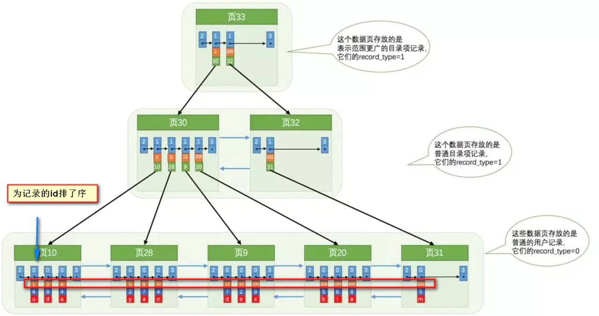

# 数据库

## MySQL

### 什么是MySQL?

MySQL 是一种关系型数据库，在Java企业级开发中非常常用，因为 MySQL 是开源免费的，MySQL的默认端口号是**3306**。


### 什么是事务?

**事务是逻辑上的一组操作，要么都执行，要么都不执行。**

事务最经典也经常被拿出来说例子就是转账了。假如小明要给小红转账1000元，这个转账会涉及到两个关键操作就是：将小明的余额减少1000元，将小红的余额增加1000元。万一在这两个操作之间突然出现错误比如银行系统崩溃，导致小明余额减少而小红的余额没有增加，这样就不对了。事务就是保证这两个关键操作要么都成功，要么都要失败。


### 事务的四大特性(ACID)

[](https://camo.githubusercontent.com/a56cfc4add00ae0a268516f154d400fecd22a80b1bde794c8188b1293ee093e7/68747470733a2f2f6d792d626c6f672d746f2d7573652e6f73732d636e2d6265696a696e672e616c6979756e63732e636f6d2f323031392d362f2545342542412538422545352538412541312545372538392542392545362538302541372e706e67)

1. **原子性（Atomicity）：** 事务是最小的执行单位，不允许分割。事务的原子性确保动作要么全部完成，要么完全不起作用；

2. **一致性（Consistency）：** 数据库事务的一致性是指：保证事务只能把数据库从一个有效（正确）的状态“转移”到另一个有效（正确）的状态。那么，什么是数据库的有效(正确）的状态？

   ​		一致性是指数据处于一种语义上的有意义且正确的状态。一致性是对数据可见性的约束，保证在一个事务中的多次操作的数据中间状态对其他事务不可见的。因为这些中间状态，是一个过渡状态，与事务的开始状态和事务的结束状态是不一致的。
   　　举个粒子，张三给李四转账100元。事务要做的是从张三账户上减掉100元，李四账户上加上100元。一致性的含义是其他事务要么看到张三还没有给李四转账的状态，要么张三已经成功转账给李四的状态，而对于张三少了100元，李四还没加上100元这个中间状态是不可见的。
   　　那么反驳的声音来了：
   　　要么转账操作全部成功，要么全部失败，这是原子性。从例子上看全部成功，那么一致性就是原子性的一部分咯，为什么还要单独说一致性和原子性？
   　　你说的不对。在未提交读的隔离级别下是事务内部操作是可见的，明显违背了一致性，怎么解释？
   　　好吧，需要注意的是：
   原子性和一致性的的侧重点不同：**原子性关注状态，要么全部成功，要么全部失败，不存在部分成功的状态。**而**一致性关注数据的可见性，中间状态的数据对外部不可见，只有最初状态和最终状态的数据对外可见**

   　　隔离性是多个事物的时候, 相互不能干扰，一致性是要保证操作前和操作后数据或者数据结构的一致性，而我提到的事务的一致性是**关注**数据的中间状态，也就是一致性需要监视中间状态的数据，如果有变化，即刻回滚

3. **隔离性（Isolation）：** 并发访问数据库时，一个用户的事务不被其他事务所干扰，各并发事务之间数据库是独立的；一个事务所做的修改在最终提交以前，对其它事务是不可见的。

4. **持久性（Durability）：** 一个事务被提交之后。它对数据库中数据的改变是持久的，即使数据库发生故障也不应该对其有任何影响。


### 并发事务带来哪些问题?

在典型的应用程序中，多个事务并发运行，经常会操作相同的数据来完成各自的任务（多个用户对同一数据进行操作）。并发虽然是必须的，但可能会导致以下的问题。

- **丢失修改（Lost to modify）:** 指在一个事务读取一个数据时，另外一个事务也访问了该数据，那么在第一个事务中修改了这个数据后，第二个事务也修改了这个数据。这样第一个事务内的修改结果就被丢失，因此称为丢失修改。 例如：事务1读取某表中的数据A=20，事务2也读取A=20，事务1修改A=A-1，事务2也修改A=A-1，最终结果A=19，事务1的修改被丢失。

  第一类丢失更新： A事务撤销事务，覆盖了B事务提交的事务。

  

  

  第二类丢失更新：A事务提交事务，覆盖了B事务提交的事务。

  

  

- **脏读（Dirty read）:** 当一个事务正在访问数据并且对数据进行了修改，而这种修改还没有提交到数据库中，这时另外一个事务也访问了这个数据，然后使用了这个数据。因为这个数据是还没有提交的数据，那么另外一个事务读到的这个数据是“脏数据”，依据“脏数据”所做的操作可能是不正确的。

  所谓脏读就是A事务读取到了B事务还未提交的数据。
   图例分析：
  

  

- **不可重复读（Unrepeatableread）:** 指在一个事务内多次读同一数据。在这个事务还没有结束时，另一个事务也访问该数据。那么，在第一个事务中的两次读数据之间，由于第二个事务的修改导致第一个事务两次读取的数据可能不太一样。这就发生了在一个事务内两次读到的数据是不一样的情况，因此称为不可重复读。

  不可重复读指的是A事务读取到了B事务已经提交的更改数据，在同个时间段内，两次查询结果不一致。 图例分析：

  

  

  

- **幻读（Phantom read）:** 幻读与不可重复读类似。它发生在一个事务（T1）读取了几行数据，接着另一个并发事务（T2）插入了一些数据时。在随后的查询中，第一个事务（T1）就会发现多了一些原本不存在的记录，就好像发生了幻觉一样，所以称为幻读。

  幻读一般是在数据统计的事务上，A事务读取到了B事务提交的新增数据，导致统计结果前后不一致。
   图例分析：
  

**不可重复读和幻读区别：**

其中针对不可重复读和幻象读容易混淆，不可重复读一般针对的是行级别的数据的更改（修改或删除），幻象读一般针对表级别的新增数据，在统计事务中，两次读取的数据统计不一致。针对这两种情况，采用不同的策略进行预防。针对不可重复读，一般采取行级锁机制，防止读到更改的数据。针对幻象读，一般采用表级锁机制，将整个表锁住，防止新增数据行。


### 事务隔离级别有哪些?MySQL的默认隔离级别是?

**SQL 标准定义了四个隔离级别：**

- **READ-UNCOMMITTED(读取未提交)：** 最低的隔离级别，允许读取尚未提交的数据变更，**可能会导致脏读、幻读或不可重复读**。

  如果一个事务已经开始写数据，则另外一个事务则不允许同时进行写操作，但允许其他事务读此行数据。该隔离级别可以通过“排他写锁”实现。这样就避免了更新丢失，却可能出现脏读。也就是说事务B读取到了事务A未提交的数据。(写不让写)

- **READ-COMMITTED(读取已提交)：** 允许读取并发事务已经提交的数据，**可以阻止脏读，但是幻读或不可重复读仍有可能发生**。

  读取数据的事务允许其他事务继续访问该行数据，但是未提交的写事务将会禁止其他事务访问该行。该隔离级别避免了脏读，但是却可能出现不可重复读。事务A事先读取了数据，事务B紧接了更新了数据，并提交了事务，而事务A再次读取该数据时，数据已经发生了改变。（写不让读）

- **REPEATABLE-READ(可重复读)：** 对同一字段的多次读取结果都是一致的，除非数据是被本身事务自己所修改，**可以阻止脏读和不可重复读，但幻读仍有可能发生**。

  可重复读是指在一个事务内，多次读同一数据。在这个事务还没有结束时，另外一个事务也访问该同一数据。那么，在第一个事务中的两次读数据之间，即使第二个事务对数据进行修改，第一个事务两次读到的的数据是一样的。这样就发生了在一个事务内两次读到的数据是一样的，因此称为是可重复读。读取数据的事务将会禁止写事务（但允许读事务），写事务则禁止任何其他事务。这样避免了不可重复读取和脏读，但是有时可能出现幻象读。（读取数据的事务）这可以通过“共享读锁”和“排他写锁”实现。（读不让写）

- **SERIALIZABLE(可串行化)：** 最高的隔离级别，完全服从ACID的隔离级别。所有的事务依次逐个执行，这样事务之间就完全不可能产生干扰，也就是说，**该级别可以防止脏读、不可重复读以及幻读**。

  


### 索引

在之前，我对索引有以下的认知：

- **索引可以加快数据库的检索速度**
- 表**经常**进行`INSERT/UPDATE/DELETE`操作就不要建立索引了，换言之：**索引会降低**插入、删除、修改等维护任务的速度。
- 索引需要**占物理和数据空间**。
- 了解过索引的最左匹配原则
- 知道索引的分类：聚集索引和非聚集索引
- Mysql支持Hash索引和B+树索引两种

看起来好像啥都知道，但面试让你说的时候可能就GG了：

- 使用索引为什么可以加快数据库的检索速度啊？
- 为什么说索引会降低插入、删除、修改等维护任务的速度。
- 索引的最左匹配原则指的是什么？
- Hash索引和B+树索引有什么区别？主流的使用哪一个比较多？InnoDB存储都支持吗？
- 聚集索引和非聚集索引有什么区别？

#### 1.1聊聊索引的基础知识

首先Mysql的基本存储结构是**页**(记录都存在页里边)：


- **各个数据页**可以组成一个**双向链表**
- 而每个数据页中的记录又可以组成一个单向链表
  - 每个数据页都会为存储在它里边儿的记录生成一个**页目录**，在通过**主键**查找某条记录的时候可以在页目录中使用**二分法快速定位**到对应的槽，然后再遍历该槽对应分组中的记录即可快速找到指定的记录
  - 以**其他列**(非主键)作为搜索条件：只能从最小记录开始**依次遍历单链表中的每条记录**。

所以说，如果我们写`select * from user where username = 'Java3y'`这样没有进行任何优化的sql语句，默认会这样做：

- 定位到记录所在的页
  - 需要遍历双向链表，找到所在的页
- 从所在的页内中查找相应的记录
  - 由于不是根据主键查询，只能遍历所在页的单链表了

很明显，在数据量很大的情况下这样查找会**很慢**！

#### 1.2索引提高检索速度

索引做了些什么可以让我们查询加快速度呢？

其实就是**将无序的数据变成有序(相对)**：



要找到id为8的记录简要步骤：


很明显的是：**没有用索引**我们是需要**遍历双向链表**来定位对应的页，现在通过**“目录”**就可以很快地定位到对应的页上了！

其实底层结构就是**B+树**，B+树作为树的一种实现，能够让我们**很快地**查找出对应的记录。


### InnoDB

https://mp.weixin.qq.com/s?__biz=MzI5MzE4MzYxMw==&mid=2247487458&idx=1&sn=0ae7cca5ce826f81d60d85ce74adb2e6&source=41#wechat_redirect

####  **逻辑存储结构**

MySQL 的存储结构分为 5 级：表空间、段、簇、页、行。


**表空间 Table Space**

上节课讲磁盘结构的时候讲过了，表空间可以看做是 InnoDB 存储引擎逻辑结构的最高层，所有的数据都存放在表空间中。

分为：系统表空间、独占表空间、通用表空间、临时表空间、Undo 表空间。

**段 Segment**

表空间是由各个段组成的，常见的段有数据段、索引段、回滚段等，段是一个逻辑的概念。一个 ibd 文件（独立表空间文件）里面会由很多个段组成。

创建一个索引会创建两个段，一个是索引段：leaf node segment，一个是数据段：non-leaf node segment。

索引段管理非叶子节点的数据。数据段管理叶子节点的数据。

也就是说，一个表的段数，就是索引的个数乘以 2。

**簇 Extent**

一个段（Segment）又由很多的簇（也可以叫区）组成，每个区的大小是 1MB（64个连续的页）。

每一个段至少会有一个簇，一个段所管理的空间大小是无限的，可以一直扩展下去，但是扩展的最小单位就是簇。

**页 Page**

为了高效管理物理空间，对簇进一步细分，就得到了页。簇是由连续的页（Page）组成的空间，一个簇中有 64 个连续的页。（1MB／16KB=64）。这些页面在物理上和逻辑上都是连续的。

跟大多数数据库一样，InnoDB 也有页的概念（也可以称为块），每个页默认 16KB。

页是 InnoDB 存储引擎磁盘管理的最小单位，通过 innodb_page_size 设置。

一个表空间最多拥有 2^32 个页，默认情况下一个页的大小为 16KB，也就是说一个表空间最多存储 64TB 的数据。

注意，文件系统中，也有页的概念。

操作系统和内存打交道，最小的单位是页 Page。文件系统的内存页通常是 4K。


**行 Row（仅供了解）**

InnoDB 存储引擎是面向行的（row-oriented），也就是说数据的存放按行进行存放。


###  **B+树（ 加强版多路平衡查找树）**

我们来看一下 InnoDB 里面的 B+树的存储结构：


MySQL 中的 B+Tree 有几个特点：

**1、它的关键字的数量是跟路数相等的；**

**2、B+Tree 的根节点和枝节点中都不会存储数据，只有叶子节点才存储数据。搜索到关键字不会直接返回，会到最后一层的叶子节点。比如我们搜索 id=28，虽然在第一层直接命中了，但是全部的数据在叶子节点上面，所以我还要继续往下搜索，一直到叶子节点。**

举个例子：假设一条记录是 1K，一个叶子节点（一页）可以存储 16 条记录。非叶子节点可以存储多少个指针？


假设索引字段是 bigint 类型，长度为 8 字节。指针大小在 InnoDB 源码中设置为6 字节，这样一共 14 字节。非叶子节点（一页）可以存储 16384/14=1170 个这样的单元（键值+指针），代表有 1170 个指针。


树 深 度 为 2 的 时 候 ， 有 1170^2 个 叶 子 节 点 ， 可 以 存 储 的 数 据 为1170*1170*16=21902400。


在查找数据时一次页的查找代表一次 IO，也就是说，一张 2000 万左右的表，查询数据最多需要访问 3 次磁盘。

所以在 InnoDB 中 B+ 树深度一般为 1-3 层，它就能满足千万级的数据存储。

**3、B+Tree 的每个叶子节点增加了一个指向相邻叶子节点的指针，它的最后一个数据会指向下一个叶子节点的第一个数据，形成了一个有序链表的结构。**

**4、它是根据左闭右开的区间 [ )来检索数据。**

**我们来看一下 B+Tree 的数据搜寻过程：**

1）比如我们要查找 28，在根节点就找到了键值，但是因为它不是页子节点，所以会继续往下搜寻，28 是[28,66)的左闭右开的区间的临界值，所以会走中间的子节点，然后继续搜索，它又是[28,34)的左闭右开的区间的临界值，所以会走左边的子节点，最后在叶子节点上找到了需要的数据。

2）第二个，如果是范围查询，比如要查询从 22 到 60 的数据，当找到 22 之后，只需要顺着节点和指针顺序遍历就可以一次性访问到所有的数据节点，这样就极大地提高了区间查询效率（不需要返回上层父节点重复遍历查找）。

**总结一下，InnoDB 中的 B+Tree 的特点：**

1)它是 B Tree 的变种，B Tree 能解决的问题，它都能解决。B Tree 解决的两大问题是什么？（每个节点存储更多关键字；路数更多）

2)扫库、扫表能力更强（如果我们要对表进行全表扫描，只需要遍历叶子节点就可以了，不需要遍历整棵 B+Tree 拿到所有的数据）

3) B+Tree 的磁盘读写能力相对于 B Tree 来说更强（根节点和枝节点不保存数据区，所以一个节点可以保存更多的关键字，一次磁盘加载的关键字更多）

4)排序能力更强（因为叶子节点上有下一个数据区的指针，数据形成了链表）

5)效率更加稳定（B+Tree 永远是在叶子节点拿到数据，所以 IO 次数是稳定的）

**为什么不用红黑树？**

红黑树也是 BST 树，但是不是严格平衡的。

必须满足 5 个约束：

**1、节点分为红色或者黑色。**

**2、根节点必须是黑色的。**

**3、叶子节点都是黑色的 NULL 节点。**

**4、红色节点的两个子节点都是黑色（不允许两个相邻的红色节点）。**

**5、从任意节点出发，到其每个叶子节点的路径中包含相同数量的黑色节点。**

插入：60、56、68、45、64、58、72、43、49


基于以上规则，可以推导出：

从根节点到叶子节点的最长路径（红黑相间的路径）不大于最短路径（全部是黑色节点）的 2 倍。

为什么不用红黑树？1、只有两路；2、不够平衡。3.不能范围查找。4.哈希扩容太慢（resize 方法

进行扩容，会伴随着一次重新 hash 分配，并且会遍历 hash 表中所有的元素，是非常耗时的。在编写程序中，要尽量避免 resize）

红黑树一般只放在内存里面用。例如 Java 的 TreeMap。


### MyISAM和InnoDB区别

MyISAM是MySQL的默认数据库引擎（5.5版之前）。虽然性能极佳，而且提供了大量的特性，包括全文索引、压缩、空间函数等，但MyISAM不支持事务和行级锁，而且最大的缺陷就是崩溃后无法安全恢复。不过，5.5版本之后，MySQL引入了InnoDB（事务性数据库引擎），MySQL 5.5版本后默认的存储引擎为InnoDB。

大多数时候我们使用的都是 InnoDB 存储引擎，但是在某些情况下使用 MyISAM 也是合适的比如读密集的情况下。（如果你不介意 MyISAM 崩溃恢复问题的话）。

**两者的对比：**

1. **是否支持行级锁** : MyISAM 只有表级锁(table-level locking)，而InnoDB 支持行级锁(row-level locking)和表级锁,默认为行级锁。
2. **是否支持事务和崩溃后的安全恢复： MyISAM** 强调的是性能，每次查询具有原子性,其执行速度比InnoDB类型更快，但是不提供事务支持。但是**InnoDB** 提供事务支持，外部键等高级数据库功能。 具有事务(commit)、回滚(rollback)和崩溃修复能力(crash recovery capabilities)的事务安全(transaction-safe (ACID compliant))型表。
3. **是否支持外键：** MyISAM不支持，而InnoDB支持。
4. **是否支持MVCC** ：仅 InnoDB 支持。应对高并发事务, MVCC比单纯的加锁更高效;MVCC只在 `READ COMMITTED` 和 `REPEATABLE READ` 两个隔离级别下工作;MVCC可以使用 乐观(optimistic)锁 和 悲观(pessimistic)锁来实现;各数据库中MVCC实现并不统一。推荐阅读：[MySQL-InnoDB-MVCC多版本并发控制](https://segmentfault.com/a/1190000012650596)
5. ......

《MySQL高性能》上面有一句话这样写到:

> 不要轻易相信“MyISAM比InnoDB快”之类的经验之谈，这个结论往往不是绝对的。在很多我们已知场景中，InnoDB的速度都可以让MyISAM望尘莫及，尤其是用到了聚簇索引，或者需要访问的数据都可以放入内存的应用。

一般情况下我们选择 InnoDB 都是没有问题的，但是某些情况下你并不在乎可扩展能力和并发能力，也不需要事务支持，也不在乎崩溃后的安全恢复问题的话，选择MyISAM也是一个不错的选择。但是一般情况下，我们都是需要考虑到这些问题的。

#### MyISAM和InnoDB实现BTree索引方式的区别

#### MyISAM

B+Tree叶节点的data域存放的是数据记录的地址。在索引检索的时候，首先按照B+Tree搜索算法搜索索引，如果指定的Key存在，则取出其 data 域的值，然后以 data 域的值为地址读取相应的数据记录。这被称为“非聚簇索引”。

#### InnoDB

其数据文件本身就是索引文件。相比MyISAM，索引文件和数据文件是分离的，其表数据文件本身就是按B+Tree组织的一个索引结构，树的叶节点data域保存了完整的数据记录。这个索引的key是数据表的主键，因此InnoDB表数据文件本身就是主索引。这被称为“聚簇索引（或聚集索引）”，而其余的索引都作为辅助索引，辅助索引的data域存储相应记录主键的值而不是地址，这也是和MyISAM不同的地方。在根据主索引搜索时，直接找到key所在的节点即可取出数据；在根据辅助索引查找时，则需要先取出主键的值，在走一遍主索引。 因此，在设计表的时候，不建议使用过长的字段作为主键，也不建议使用非单调的字段作为主键，这样会造成主索引频繁分裂。 PS：整理自《Java工程师修炼之道》

**4.2.1.MyISAM**

在 MyISAM 里面，另外有两个文件：

一个是.MYD 文件，D 代表 Data，是 MyISAM 的数据文件，存放数据记录，比如我们的 user_myisam 表的所有的表数据。

一个是.MYI 文件，I 代表 Index，是 MyISAM 的索引文件，存放索引，比如我们在id 字段上面创建了一个主键索引，那么主键索引就是在这个索引文件里面。

也就是说，在 MyISAM 里面，索引和数据是两个独立的文件。

> 那我们怎么根据索引找到数据呢？

MyISAM 的 B+Tree 里面，叶子节点存储的是数据文件对应的磁盘地址。所以从索引文件.MYI 中找到键值后，会到数据文件.MYD 中获取相应的数据记录。


> 这里是主键索引，如果是辅助索引，有什么不一样呢？

在 MyISAM 里面，辅助索引也在这个.MYI 文件里面。

辅助索引跟主键索引存储和检索数据的方式是没有任何区别的，一样是在索引文件里面找到磁盘地址，然后到数据文件里面获取数据。


**InnoDB**

> InnoDB 只有一个文件（.ibd 文件），那索引放在哪里呢？

在 InnoDB 里面，它是以主键为索引来组织数据的存储的，所以索引文件和数据文件是同一个文件，都在.ibd 文件里面。

在 InnoDB 的主键索引的叶子节点上，它直接存储了我们的数据。


### **联合索引最左匹配**

前面我们说的都是针对单列创建的索引，但有的时候我们的多条件查询的时候，也会建立联合索引。单列索引可以看成是特殊的联合索引。

比如我们在 user 表上面，给 name 和 phone 建立了一个联合索引。

```
ALTER TABLE user_innodb DROP INDEX comidx_name_phone;
ALTER TABLE user_innodb add INDEX comidx_name_phone (name,phone);
```


联合索引在 B+Tree 中是复合的数据结构，它是按照从左到右的顺序来建立搜索树的（name 在左边，phone 在右边）。

从这张图可以看出来，name 是有序的，phone 是无序的。当 name 相等的时候，phone 才是有序的。

这个时候我们使用 where name='青山' and phone = '136xx '去查询数据的时候，B+Tree 会优先比较 name 来确定下一步应该搜索的方向，往左还是往右。如果 name相同的时候再比较 phone。

但是如果查询条件没有 name，就不知道第一步应该查哪个节点，因为建立搜索树的时候 name 是第一个比较因子，所以用不到索引。

**什么时候用到联合索引**

所以，我们在建立联合索引的时候，一定要把最常用的列放在最左边。

> 比如下面的三条语句，能用到联合索引吗？

1）使用两个字段，可以用到联合索引：

```
EXPLAIN SELECT * FROM user_innodb WHERE name= '权亮' AND phone = '15204661800';
```


2）使用左边的 name 字段，可以用到联合索引：

```
EXPLAIN SELECT * FROM user_innodb WHERE name= '权亮'
```


3）使用右边的 phone 字段，无法使用索引，全表扫描：

```
EXPLAIN SELECT * FROM user_innodb WHERE phone = '15204661800'
```


**如何创建联合索引**

有一天我们的 DBA 找到我，说我们的项目里面有两个查询很慢。

```
SELECT * FROM user_innodb WHERE name= ? AND phone = ?;
SELECT * FROM user_innodb WHERE name= ?;
```

按照我们的想法，一个查询创建一个索引，所以我们针对这两条 SQL 创建了两个索引，这种做法觉得正确吗？

```
CREATE INDEX idx_name on user_innodb(name);
CREATE INDEX idx_name_phone on user_innodb(name,phone);
```

当我们创建一个联合索引的时候，按照最左匹配原则，用左边的字段 name 去查询的时候，也能用到索引，所以第一个索引完全没必要。

相当于建立了两个联合索引(name),(name,phone)。

如果我们创建三个字段的索引 index(a,b,c)，相当于创建三个索引：

**index(a)**

**index(a,b)**

**index(a,b,c)**

用 where b=? 和 where b=? and c=? 和 where a=? and c=?是不能使用到索引的。不能不用第一个字段，不能中断。

这里就是 MySQL 联合索引的**最左匹配原则**。

**5.1. 索引的创建**

1、在用于 where 判断 order 排序和 join 的（on）字段上创建索引

2、索引的个数不要过多。

——浪费空间，更新变慢。

3、区分度低的字段，例如性别，不要建索引。

——离散度太低，导致扫描行数过多。

4、频繁更新的值，不要作为主键或者索引。

——页分裂

如果数据不是连续的，往已经写满的页中插入数据，会导致叶页面分裂：


5、组合索引把散列性高（区分度高）的值放在前面。

6、创建复合索引，而不是修改单列索引。


### mysql覆盖索引与回表

*select id,name where name='shenjian'*

*select id,name**,sex** where name='shenjian'*

**多查询了一个属性，为何检索过程完全不同？**

**什么是回表查询？**

**什么是索引覆盖？**

**如何实现索引覆盖？**

**哪些场景，可以利用索引覆盖来优化SQL？**

这些，这是今天要分享的内容。

*画外音：本文试验基于MySQL5.6-InnoDB。*

**一、什么是回表查询？**

这先要从InnoDB的索引实现说起，InnoDB有两大类索引：

- 聚集索引(clustered index)
- 普通索引(secondary index)

**InnoDB聚集索引和普通索引有什么差异？**

InnoDB**聚集索引**的叶子节点存储行记录，因此， InnoDB必须要有，且只有一个聚集索引：

（1）如果表定义了PK，则PK就是聚集索引；

（2）如果表没有定义PK，则第一个not NULL unique列是聚集索引；

（3）否则，InnoDB会创建一个隐藏的row-id作为聚集索引；

*画外音：所以PK查询非常快，直接定位行记录。*

InnoDB**普通索引**的叶子节点存储主键值。

*画外音：注意，不是存储行记录头指针，MyISAM的索引叶子节点存储记录指针。*

举个栗子，不妨设有表：

*t(id PK, name KEY, sex, flag);*

*画外音：id是聚集索引，name是普通索引。*

表中有四条记录：

*1, shenjian, m, A*

*3, zhangsan, m, A*

*5, lisi, m, A*

*9, wangwu, f, B*


两个B+树索引分别如上图：

（1）id为PK，聚集索引，叶子节点存储行记录；

（2）name为KEY，普通索引，叶子节点存储PK值，即id；

既然从普通索引无法直接定位行记录，那**普通索引的查询过程是怎么样的呢？**

通常情况下，需要扫码两遍索引树。

例如：

```mysql
select * from t where name='lisi';
```

**是如何执行的呢？**


如**粉红色**路径，需要扫码两遍索引树：

（1）先通过普通索引定位到主键值id=5；

（2）在通过聚集索引定位到行记录；

这就是所谓的**回表查询**，先定位主键值，再定位行记录，它的性能较扫一遍索引树更低。

**二、什么是索引覆盖\**\**(Covering index)\**\**？**

额，楼主并没有在MySQL的官网找到这个概念。

*画外音：治学严谨吧？*

借用一下SQL-Server官网的说法。


MySQL官网，类似的说法出现在explain查询计划优化章节，即explain的输出结果Extra字段为Using index时，能够触发索引覆盖。


不管是SQL-Server官网，还是MySQL官网，都表达了：只需要在一棵索引树上就能获取SQL所需的所有列数据，无需回表，速度更快。

**三、如何实现索引覆盖？**

常见的方法是：将被查询的字段，建立到联合索引里去。

仍是《[迅猛定位低效SQL？](https://links.jianshu.com/go?to=http%3A%2F%2Fmp.weixin.qq.com%2Fs%3F__biz%3DMjM5ODYxMDA5OQ%3D%3D%26mid%3D2651962587%26idx%3D1%26sn%3Dd197aea0090ce93b156e0774c6dc3019%26chksm%3Dbd2d09078a5a801138922fb5f2b9bb7fdaace7e594d55f45ce4b3fc25cbb973bbc9b2deb2c31%26scene%3D21%23wechat_redirect)》中的例子：

```mysql
create table user (
id int primary key,
name varchar(20),
sex varchar(5),
index(name)
)engine=innodb;
```

第一个SQL语句：


*select id,name from user where name='shenjian';*

能够命中name索引，索引叶子节点存储了主键id，通过name的索引树即可获取id和name，无需回表，符合索引覆盖，效率较高。

*画外音，Extra：**Using index**。*

第二个SQL语句：


```mysql
select id,name,sex from user where name='shenjian';
```

能够命中name索引，索引叶子节点存储了主键id，但sex字段必须回表查询才能获取到，不符合索引覆盖，需要再次通过id值扫码聚集索引获取sex字段，效率会降低。

*画外音，Extra：**Using index condition**。*

如果把(name)单列索引升级为联合索引(name, sex)就不同了。

```mysql
create table user (
id int primary key,
name varchar(20),
sex varchar(5),
index(name, sex)
)engine=innodb;
```


可以看到：

```mysql
select id,name ... where name='shenjian';
select id,name,sex ... where name='shenjian';
```

都能够命中索引覆盖，无需回表。

*画外音，Extra：**Using index**。*

**四、哪些场景可以利用索引覆盖来优化SQL？**

**场景1：全表count查询优化**


原表为：

```mysql
user(PK id, name, sex)；
```

直接：

```mysql
select count(name) from user;
```

不能利用索引覆盖。

添加索引：

```mysql
alter table user add key(name);
```

就能够利用索引覆盖提效。

**场景2：列查询回表优化**

```mysql
select id,name,sex ... where name='shenjian';
```

这个例子不再赘述，将单列索引(name)升级为联合索引(name, sex)，即可避免回表。

```mysql
create table user (
id int primary key,
name varchar(20),
sex varchar(5),
index(name, sex)
)engine=innodb;
```

**场景3：分页查询**

```java
select id,name,sex ... order by name limit 500,100;
```

将单列索引(name)升级为联合索引(name, sex)，也可以避免回表。