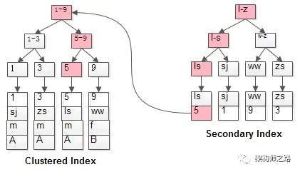

# 数据库

## 关系型、非关系型数据库

### 一、关系型数据库？

**1.概念**

关系型数据库是指采用了关系模型来组织数据的数据库。简单来说，关系模式就是二维表格模型。

主要代表：SQL Server，Oracle,Mysql,PostgreSQL。


**2.优点**

（1）容易理解，二维表的结构非常贴近现实世界，二维表格，容易理解。

（2）使用方便，通用的sql语句使得操作关系型数据库非常方便。

（3）易于维护，数据库的ACID属性，大大降低了数据冗余和数据不一致的概率。

**3.瓶颈**

(1 )海量数据的读写效率。

对于网站的并发量高，往往达到每秒上万次的请求，对于传统关系型数据库来说，硬盘I/o是一个很大的挑战。

(2) 高扩展性和可用性。

在基于web的结构中，数据库是最难以横向拓展的，当一个应用系统的用户量和访问量与日俱增的时候，数据库没有办法像web Server那样简单的通过添加更多的硬件和服务节点来拓展性能和负载能力。

### 二、从关系型到非关系型

关系型数据库的最大优点就是事务的一致性，这个特性，使得关系型数据库中可以适用于一切要求一致性比较高的系统中。比如：银行系统。

但是在网页应用中，对这种一致性的要求不是那么的严格，允许有一定的时间间隔，所以关系型数据库这个特点不是那么的重要了。相反，关系型数据库为了维护一致性所付出的巨大代价就是读写性能比较差。而像微博、facebook这类应用，对于并发读写能力要求极高，关系型数据库已经无法应付。所以必须用一种新的数据结构存储来替代关系型数据库。所以非关系型数据库应用而生。

### 三、非关系型

**1.概念**

NoSQL非关系型数据库，主要指那些非关系型的、分布式的，且一般不保证ACID的数据存储系统，主要代表MongoDB，Redis、CouchDB。

NoSQL提出了另一种理念，以键值来存储，且结构不稳定，每一个元组都可以有不一样的字段，这种就不会局限于固定的结构，可以减少一些时间和空间的开销。使用这种方式，为了获取用户的不同信息，不需要像关系型数据库中，需要进行多表查询。仅仅需要根据key来取出对应的value值即可。

**2.分类**

非关系数据库大部分是开源的，实现比较简单，大都是针对一些特性的应用需求出现的。根据结构化方法和应用场景的不同，分为以下几类。

（1）面向高性能并发读写的key-value数据库

主要特点是具有极高的并发读写性能，例如Redis、Tokyo Cabint等。

（2）面向海量数据访问的面向文档数据库

特点是，可以在海量的数据库快速的查询数据。例如MongoDB以及CouchDB.

（3）面向可拓展的分布式数据库

解决的主要问题是传统数据库的扩展性上的缺陷。

**3.缺点**

但是由于Nosql约束少，所以也不能够像sql那样提供where字段属性的查询。因此适合存储较为简单的数据。有一些不能够持久化数据，所以需要和关系型数据库结合。


### 四、对比

**1.存储上？**

Sql通常以数据库表的形式存储，例如存储用户信息，SQL中增加外部关系的话，需要在原表中增加一个外键，来关联外部数据表。如下：

NoSql采用key-value的形式存储

**2.事务**

SQL中如果多张表需要同批次被更新，即如果其中一张表跟新失败的话，其他表也不会更新成功。这种场景可以通过事务来控制，可以在所有命令完成之后，再统一提交事务。在Nosql中没有事务这个概念，每一个数据集都是原子级别的。


**3.数据表 VS 数据集**

关系型是表格型的，存储在数据表的行和列中。彼此关联，容易提取。而非关系型是大块存储在一起。


**4.预定义结构 VS 动态结构**

在sql中，必须定义好地段和表结构之后，才能够添加数据，例如定义表的主键、索引、外键等。表结构可以在定义之后更新，但是如果有比较大的结构变更，就会变的比较复杂。

在Nosql数据库中，数据可以在任何时候任何地方添加。不需要预先定义。


**5.存储规范 VS 存储代码**

关系型数据库为了规范性，把数据分配成为最小的逻辑表来存储避免重复，获得精简的空间利用。但是多个表之间的关系限制，多表管理就有点复杂。

当然精简的存储可以节约宝贵的数据存储，但是现在随着社会的发展，磁盘上付出的代价是微不足知道的。

非关系型是平面数据集合中，数据经常可以重复，单个数据库很少被分开，而是存储成为一个整体，这种整块读取数据效率更高。


**6.纵向拓展 VS 横向拓展**

为了支持更多的并发量，SQL数据采用纵向扩展，提高处理能力，通过提高计算机性能来提高处理能力。

NoSql通过横向拓展，非关系型数据库天然是分布式的，所以可以通过集群来实现负载均衡。


**7.其他方面**

比如：关系型是结构化查询语言，NoSql是采用更简单而且精确的数据访问方式；SQl数据库大多比较昂贵，而NoSql大多是开源的。

五、选择？

目前许多大型互联网都会选用MySql+NoSql的组合方案，因为SQL和NoSql都有各自的优缺点。

关系型数据库适合存储结构化数据，比如：用户的账号、地址：

（1）这些数据通常需要做结构化查询，比如说Join，这个时候，关系型数据库就要胜出一筹。

（2）这些数据的规模、增长的速度通常是可以预期的。

（3）事务性、一致性,适合存储比较复杂的数据。


NoSql适合存储非结构化数据，比如：文章、评论：

（1）这些数据通常用于模糊处理，例如全文搜索、机器学习，适合存储较为简单的数据。

（2）这些数据是海量的，并且增长的速度是难以预期的。

（3）按照key获取数据效率很高，但是对于join或其他结构化查询的支持就比较差。


总结：

SQL数据库依然强大，可以可靠的处理事务并且保持事务的完整性，只有你的数据非常大，操作扩展需要更加分布式的系统时，才考虑NoSql数据库。


## MySQL


### 什么是MySQL?

MySQL 是一种关系型数据库，在Java企业级开发中非常常用，因为 MySQL 是开源免费的，MySQL的默认端口号是**3306**。


### MySQL 基本架构概览

下图是 MySQL 的一个简要架构图，从下图你可以很清晰的看到用户的 SQL 语句在 MySQL 内部是如何执行的。

先简单介绍一下下图涉及的一些组件的基本作用帮助大家理解这幅图，在 1.2 节中会详细介绍到这些组件的作用。

- **连接器：** 身份认证和权限相关(登录 MySQL 的时候)。
- **查询缓存:** 执行查询语句的时候，会先查询缓存（MySQL 8.0 版本后移除，因为这个功能不太实用）。
- **分析器:** 没有命中缓存的话，SQL 语句就会经过分析器，分析器说白了就是要先看你的 SQL 语句要干嘛，再检查你的 SQL 语句语法是否正确。
- **优化器：** 按照 MySQL 认为最优的方案去执行。
- **执行器:** 执行语句，然后从存储引擎返回数据。


简单来说 MySQL 主要分为 Server 层和存储引擎层：

•**Server 层**：主要包括连接器、查询缓存、分析器、优化器、执行器等，所有跨存储引擎的功能都在这一层实现，比如存储过程、触发器、视图，函数等，还有一个通用的日志模块 binglog 日志模块。

•**存储引擎**： 主要负责数据的存储和读取，采用可以替换的插件式架构，支持 InnoDB、MyISAM、Memory 等多个存储引擎，其中 InnoDB 引擎有自有的日志模块 redolog 模块。**现在最常用的存储引擎是 InnoDB，它从 MySQL 5.5.5 版本开始就被当做默认存储引擎了。**


#### 1.2 Server 层基本组件介绍

##### 1) 连接器

连接器主要和身份认证和权限相关的功能相关，就好比一个级别很高的门卫一样。

主要负责用户登录数据库，进行用户的身份认证，包括校验账户密码，权限等操作，如果用户账户密码已通过，连接器会到权限表中查询该用户的所有权限，之后在这个连接里的权限逻辑判断都是会依赖此时读取到的权限数据，也就是说，后续只要这个连接不断开，即时管理员修改了该用户的权限，该用户也是不受影响的。

##### 2) 查询缓存(MySQL 8.0 版本后移除)

查询缓存主要用来缓存我们所执行的 SELECT 语句以及该语句的结果集。

连接建立后，执行查询语句的时候，会先查询缓存，MySQL 会先校验这个 sql 是否执行过，以 Key-Value 的形式缓存在内存中，Key 是查询预计，Value 是结果集。如果缓存 key 被命中，就会直接返回给客户端，如果没有命中，就会执行后续的操作，完成后也会把结果缓存起来，方便下一次调用。当然在真正执行缓存查询的时候还是会校验用户的权限，是否有该表的查询条件。

MySQL 查询不建议使用缓存，因为查询缓存失效在实际业务场景中可能会非常频繁，假如你对一个表更新的话，这个表上的所有的查询缓存都会被清空。对于不经常更新的数据来说，使用缓存还是可以的。

所以，一般在大多数情况下我们都是不推荐去使用查询缓存的。

MySQL 8.0 版本后删除了缓存的功能，官方也是认为该功能在实际的应用场景比较少，所以干脆直接删掉了。

##### 3) 分析器

MySQL 没有命中缓存，那么就会进入分析器，分析器主要是用来分析 SQL 语句是来干嘛的，分析器也会分为几步：

**第一步，词法分析**，一条 SQL 语句有多个字符串组成，首先要提取关键字，比如 select，提出查询的表，提出字段名，提出查询条件等等。做完这些操作后，就会进入第二步。

**第二步，语法分析**，主要就是判断你输入的 sql 是否正确，是否符合 MySQL 的语法。

完成这 2 步之后，MySQL 就准备开始执行了，但是如何执行，怎么执行是最好的结果呢？这个时候就需要优化器上场了。

##### 4) 优化器

优化器的作用就是它认为的最优的执行方案去执行（有时候可能也不是最优，这篇文章涉及对这部分知识的深入讲解），比如多个索引的时候该如何选择索引，多表查询的时候如何选择关联顺序等。

可以说，经过了优化器之后可以说这个语句具体该如何执行就已经定下来。

##### 5) 执行器

当选择了执行方案后，MySQL 就准备开始执行了，首先执行前会校验该用户有没有权限，如果没有权限，就会返回错误信息，如果有权限，就会去调用引擎的接口，返回接口执行的结果。

#### 2.1 查询语句

说了以上这么多，那么究竟一条 sql 语句是如何执行的呢？其实我们的 sql 可以分为两种，一种是查询，一种是更新（增加，更新，删除）。我们先分析下查询语句，语句如下：

```
select * from tb_student  A where A.age='18' and A.name=' 张三 ';
```

结合上面的说明，我们分析下这个语句的执行流程：

- 先检查该语句是否有权限，如果没有权限，直接返回错误信息，如果有权限，在 MySQL8.0 版本以前，会先查询缓存，以这条 sql 语句为 key 在内存中查询是否有结果，如果有直接缓存，如果没有，执行下一步。
- 通过分析器进行词法分析，提取 sql 语句的关键元素，比如提取上面这个语句是查询 select，提取需要查询的表名为 tb_student,需要查询所有的列，查询条件是这个表的 id='1'。然后判断这个 sql 语句是否有语法错误，比如关键词是否正确等等，如果检查没问题就执行下一步。
- 接下来就是优化器进行确定执行方案，上面的 sql 语句，可以有两种执行方案：

```
  a.先查询学生表中姓名为“张三”的学生，然后判断是否年龄是 18。  b.先找出学生中年龄 18 岁的学生，然后再查询姓名为“张三”的学生。
```

​    那么优化器根据自己的优化算法进行选择执行效率最好的一个方案（优化器认为，有时候不一定最好）。那么确认了执行计划后就准备开始执行了。

进行权限校验，如果没有权限就会返回错误信息，如果有权限就会调用数据库引擎接口，返回引擎的执行结果。


#### 2.2 更新语句

以上就是一条查询 sql 的执行流程，那么接下来我们看看一条更新语句如何执行的呢？sql 语句如下：

```
update tb_student A set A.age='19' where A.name=' 张三 ';
```

我们来给张三修改下年龄，在实际数据库肯定不会设置年龄这个字段的，不然要被技术负责人打的。其实条语句也基本上会沿着上一个查询的流程走，只不过执行更新的时候肯定要记录日志啦，这就会引入日志模块了，MySQL 自带的日志模块式 **binlog（归档日志）** ，所有的存储引擎都可以使用，我们常用的 InnoDB 引擎还自带了一个日志模块 **redo log（重做日志）**，我们就以 InnoDB 模式下来探讨这个语句的执行流程。流程如下：

•先查询到张三这一条数据，如果有缓存，也是会用到缓存。

•然后拿到查询的语句，把 age 改为 19，然后调用引擎 API 接口，写入这一行数据，InnoDB 引擎把数据保存在内存中，同时记录 redo log，此时 redo log 进入 prepare 状态，然后告诉执行器，执行完成了，随时可以提交。

•执行器收到通知后记录 binlog，然后调用引擎接口，提交 redo log 为提交状态。

•更新完成。


#### redolog

##### redo log 与 crash safe

http://www.360doc.com/content/21/0209/10/58006001_961412061.shtml


https://baijiahao.baidu.com/s?id=1657491030064034525&wfr=spider&for=pc

**为了保证事务的持久性**，mysql的InnoDB采用了WAL 技术，WAL 的全称是 Write-Ahead Logging，它的关键点就是先写日志，再写磁盘。
 具体来说，当有一条记录需要更新的时候，InnoDB 引擎就会先把记录写到 redo log里面，并更新内存，这个时候更新就算完成了。同时，InnoDB 引擎会在适当的时候，将这个操作记录更新到磁盘里面，而这个更新往往是在系统比较空闲的时候做。
 InnoDB 的 redo log 是固定大小的，比如可以配置为一组 4 个文件，每个文件的大小是 1GB，那么这块“粉板”总共就可以记录 4GB 的操作。从头开始写，写到末尾就又回到开头循环写，如下面这个图所示。


 write pos 是当前记录的位置，一边写一边后移，写到第 3 号文件末尾后就回到 0 号文件开头。checkpoint 是当前要擦除的位置，也是往后推移并且循环的，擦除记录前要把记录更新到数据文件。write pos 和 checkpoint 之间的是还空着的部分，可以用来记录新的操作。如果 write pos 追上 checkpoint，表示redo log满了，这时候不能再执行新的更新，得停下来先擦掉一些记录，把 checkpoint 推进一下。有了 redo log，InnoDB 就可以保证即使数据库发生异常重启，之前提交的记录都不会丢失，这个能力称为 **crash-safe**。


#### binlog

MySQL 整体来看，其实就有两块：一块是 Server 层，它主要做的是 MySQL 功能层面的事情；还有一块是引擎层，负责存储相关的具体事宜。上面我们聊到的 redo log 是 InnoDB 引擎特有的日志，而 Server 层也有自己的日志，称为 binlog（归档日志）。
 **为什么会有两份日志呢？**因为最开始 MySQL 里并没有 InnoDB 引擎。MySQL 自带的引擎是 MyISAM，但是 MyISAM 没有 crash-safe 的能力，binlog 日志只能用于归档。而 InnoDB 是另一个公司以插件形式引入 MySQL 的，既然只依靠 binlog 是没有 crash-safe 能力的，所以 InnoDB 使用另外一套日志系统——也就是 redo log 来实现 crash-safe 能力。
 这两种日志有以下三点不同。
 1.redo log 是 InnoDB 引擎特有的；binlog 是 MySQL 的 Server 层实现的，所有引擎都可以使用。
 **2.redo log 是物理日志，记录的是“在某个数据页上做了什么修改”；binlog 是逻辑日志，记录的是这个语句的原始逻辑，比如“给 ID=2 这一行的 c 字段加 1 ”。**
 3.redo log 是循环写的，空间固定会用完；binlog 是可以追加写入的。“追加写”是指 binlog 文件写到一定大小后会切换到下一个，并不会覆盖以前的日志。


#### UNDO LOG

undo log有两个作用：提供回滚和多个行版本控制(MVCC)。

在数据修改的时候，不仅记录了redo，还记录了相对应的undo，如果因为某些原因导致事务失败或回滚了，可以借助该undo进行回滚。

undo log和redo log记录物理日志不一样，它是**逻辑日志**。**可以认为当delete一条记录时，undo log中会记录一条对应的insert记录，反之亦然，当update一条记录时，它记录一条对应相反的update记录。**

当执行rollback时，就可以从undo log中的逻辑记录读取到相应的内容并进行回滚。有时候应用到**行版本控制**的时候，也是通过undo log来实现的：当读取的某一行被其他事务锁定时，它可以**从undo log中分析出该行记录以前的数据是什么**，**从而提供该行版本信息，让用户实现非锁定一致性读取**。

**undo log****是采用**段(segment)**的方式来记录的，每个undo操作在记录的时候占用一个**undo log segment**。

另外，**undo log**也会产生**redo log**，因为undo log也要**实现持久性保护**。


undo log和redolog 主要用于保证数据的原子性，保存了事务发生之前的数据的一个版本，可以用于回滚。比如一条 INSERT 语句，对应一条 DELETE 的 undo log ，对于每个 UPDATE 语句，对应一条相反的 UPDATE 的 undo log ，这样在发生错误时，就能回滚到事务之前的数据状态。同时，undo log 也是 MVCC (多版本并发控制) 实现的关键。

重做日志记录了事务的行为,可以很好地通过其对页进行“重做”操作。但是事务有时还需要进行回滚操作,这时就需要undo。因此在对数据库进行修改时, InnoDB存储引擎不但会产生redo,还会产生一定量的undo。
redo存放在重做日志文件中,与redo不同,undo存放在数据库内部的一个特殊段(segment)中,这个段称为undo段(undo segment)。undo段位于共享表空间内。
除了回滚操作,undo的另一个作用是MVCC,即在 InnoDB存储引擎中MVCC的实现是通过undo来完成。当用户读取一行记录时,若该记录已经被其他事务占用,当前事务可以通过undo读取之前的行版本信息,以此实现非锁定读取。
**undo log会产生redo log,也就是undo log的产生会伴随着 redo log的产生,这是因为undo log也需要持久性的保护。**


####  redo log和二进制日志（binlog）的区别

https://www.cnblogs.com/f-ck-need-u/p/9010872.html

innodb事务日志包括redo log和undo log。redo log是重做日志，提供前滚操作，undo log是回滚日志，提供回滚操作。

undo log不是redo log的逆向过程，其实它们都算是用来恢复的日志：

**1.redo log通常是物理日志，记录的是数据页的物理修改，而不是某一行或某几行修改成怎样怎样，它用来恢复提交后的物理数据页(恢复数据页，且只能恢复到最后一次提交的位置)。**
**2.undo用来回滚行记录到某个版本。undo log一般是逻辑日志，根据每行记录进行记录。**

redo log不是二进制日志。虽然二进制日志中也记录了innodb表的很多操作，**也能实现重做的功能，**但是它们之间有很大区别。

二进制日志是在**存储引擎的上层**产生的，不管是什么存储引擎，对数据库进行了修改都会产生二进制日志。而redo log是innodb层产生的，只记录该存储引擎中表的修改。**并且二进制日志先于redo log**被记录。

**二进制日志**记录操作的方法是**逻辑性的语句**。即便它是基于行格式的记录方式，其本质也还是逻辑的SQL设置，**如下图**。而**redo log是在物理格式上的日志，它记录的是数据库中每个页的修改（对 XXX表空间中的XXX数据页XXX偏移量的地方作了XXX更新。）。**

```mysql
mysql> show binlog events ``in` `'mysql-bin.000003'``\G
*************************** 1. row ***************************
  ``Log_name: mysql-bin.000003     　　　　　　　　　　　　　　 ----> 查询的binlog日志文件名
    ``Pos: 4         　　　　　　　　　　　　　　 ----> pos起始点:
 ``Event_type: Format_desc        　　　　　　　　　　　　　　 ----> 事件类型
 ``Server_id: 1             　　　　　　　　　　　　　　 ----> 标识是由哪台服务器执行的
End_log_pos: 120        　　　　　　　　　　　　　　----> pos结束点:120(即：下行的pos起始点)
    ``Info: use `juzidb`; 
    INSERT INTO `tb1` VALUES (1,``'UFO'``)  ---> 执行的sql语句
       
*************************** 2. row ***************************
  ``Log_name: mysql-bin.000003
    ``Pos: 542
 ``Event_type: Query
 ``Server_id: 1
End_log_pos: 625
    ``Info: BEGIN
*************************** 3. row ***************************
  ``Log_name: mysql-bin.000003
    ``Pos: 946
 ``Event_type: Query
 ``Server_id: 1
End_log_pos: 1044
    ``Info: drop database juzidb
```


**二进制日志**只在每次事务**提交**的时候**一次性写入日志**(对于**非事务表的操作，则是每次执行语句成功后就直接写入**)。而**redo log**在数据准备修改前写入缓存中的redo log中，然后才对缓存中的数据执行修改操作；而且保证**在发出事务提交指令**时，**先向缓存中的redo log写入日志**，**写入完成后才执行提交动作**。

因为**二进制日志只在提交的时候一次性写入**，所以二进制日志中的**记录方式和提交顺序有关**，且**一次提交对应一次记录**。而redo log中是记录的物理页的修改，redo log文件中**同一个事务可能多次记录**，**最后一个提交的事务**记录**会覆盖所有未提交的事务记录**。

事务日志记录的是物理页的情况，它具有**幂等性**，因此记录日志的方式极其简练。**幂等性的意思是多次操作前后状态是一样的，例如新插入一行后又删除该行，前后状态没有变化。**而**二进制日志记录的是所有影响数据的操作**，记录的内容较多。**例如插入一行记录一次，删除该行又记录一次。**


### 什么是事务?

**事务是逻辑上的一组操作，要么都执行，要么都不执行。**

事务最经典也经常被拿出来说例子就是转账了。假如小明要给小红转账1000元，这个转账会涉及到两个关键操作就是：将小明的余额减少1000元，将小红的余额增加1000元。万一在这两个操作之间突然出现错误比如银行系统崩溃，导致小明余额减少而小红的余额没有增加，这样就不对了。事务就是保证这两个关键操作要么都成功，要么都要失败。


### 事务的四大特性(ACID)

[](https://camo.githubusercontent.com/a56cfc4add00ae0a268516f154d400fecd22a80b1bde794c8188b1293ee093e7/68747470733a2f2f6d792d626c6f672d746f2d7573652e6f73732d636e2d6265696a696e672e616c6979756e63732e636f6d2f323031392d362f2545342542412538422545352538412541312545372538392542392545362538302541372e706e67)

1. **原子性（Atomicity）：** 事务是最小的执行单位，不允许分割。事务的原子性确保动作要么全部完成，要么完全不起作用；

   原子性，是基于日志的`Redo/Undo`机制。Redo log用来记录某数据块被修改后的值，可以用来恢复未写入 data file 的已成功事务更新的数据；Undo log是用来记录数据更新前的值，保证数据更新失败能够回滚。假如某个时刻数据库崩溃，在崩溃之前有事务A和事务B在执行，事务A已经提交，而事务B还未提交。当数据库重启进行 crash-recovery 时，就会通过Redo log将已经提交事务的更改写到数据文件，而还没有提交的就通过Undo log进行roll back。

2. **一致性（Consistency）：** 数据库事务的一致性是指：保证事务只能把数据库从一个有效（正确）的状态“转移”到另一个有效（正确）的状态。那么，什么是数据库的有效(正确）的状态？

   ​		一致性是指数据处于一种语义上的有意义且正确的状态。一致性是对数据可见性的约束，保证在一个事务中的多次操作的数据中间状态对其他事务不可见的。因为这些中间状态，是一个过渡状态，与事务的开始状态和事务的结束状态是不一致的。
   　　举个粒子，张三给李四转账100元。事务要做的是从张三账户上减掉100元，李四账户上加上100元。一致性的含义是其他事务要么看到张三还没有给李四转账的状态，要么张三已经成功转账给李四的状态，而对于张三少了100元，李四还没加上100元这个中间状态是不可见的。
   　　那么反驳的声音来了：
   　　要么转账操作全部成功，要么全部失败，这是原子性。从例子上看全部成功，那么一致性就是原子性的一部分咯，为什么还要单独说一致性和原子性？
   　　你说的不对。在未提交读的隔离级别下是事务内部操作是可见的，明显违背了一致性，怎么解释？
   　　好吧，需要注意的是：
   原子性和一致性的的侧重点不同：**原子性关注状态，要么全部成功，要么全部失败，不存在部分成功的状态。**而**一致性关注数据的可见性，中间状态的数据对外部不可见，只有最初状态和最终状态的数据对外可见**

   　　隔离性是多个事物的时候, 相互不能干扰，一致性是要保证操作前和操作后数据或者数据结构的一致性，而我提到的事务的一致性是**关注**数据的中间状态，也就是一致性需要监视中间状态的数据，如果有变化，即刻回滚

3. **隔离性（Isolation）：** 并发访问数据库时，一个用户的事务不被其他事务所干扰，各并发事务之间数据库是独立的；一个事务所做的修改在最终提交以前，对其它事务是不可见的。

   锁（共享读锁，排他写锁，mvcc）

4. **持久性（Durability）：** 一个事务被提交之后。它对数据库中数据的改变是持久的，即使数据库发生故障也不应该对其有任何影响。

   

原子性、持久性通过数据库的redo和undo来完成

一致性是最终目的，通过其他三大特性实现


### 事务的实现

重做日志**（redo）用来实现事务的持久性，有两部分组成，一是内存中的重做日志，一个是硬盘上的重做日志文件**。innodb是支持事务的存储引擎，通过日志先行WAL，来实现数据库的事务的特性，在一个事务提交的时候，**并不是直接对内存的脏数据进行落盘，而是先把重做日志缓冲中的日志写入文件，然后再提交成功。**这样保证了即使在断电的情况下，依然可以依靠redo log进行数据的恢复与重做。只要是提交的事务，在redo中就会有记录，数据库断电后重启，数据库会对提交的事务，但是没有写入硬盘的脏数据，利用redo来进行重做。 还要一个保证事务的是undo，undo有两个作用：1.实现事务的回滚2.实现mvcc的快照读取redo是物理逻辑日志，计算页的物理修改操作.undo是逻辑记录，记录了行的操作内容.**两阶段提交:先写redo -buffer再写binlog 并落盘最后落盘redo.**


#### 两阶段提交

**为了保证两份日志的逻辑一致性**mysql采用了两阶段提交。
下面是一个 update 语句的执行流程图，图中浅色框表示是在 InnoDB 内部执行的，深色框表示是在执行器中执行的。


**两阶段提交机制的必要性**

最后三步看上去有点“绕”，将 redo log 的写入拆成了两个步骤：prepare 和 commit，这就是"两阶段提交"。
 **为什么必须有“两阶段提交”呢？**
 如果不使用两阶段提交，假设当前 ID=2 的行，字段 c 的值是 0，再假设执行 update 语句过程中在写完第一个日志后，第二个日志还没有写完期间发生了 crash，会出现什么情况呢？
 1.**先写 redo log 后写 binlog。**假设在 redo log 写完，binlog 还没有写完的时候，MySQL 进程异常重启。由于我们前面说过的，redo log 写完之后，系统即使崩溃，仍然能够把数据恢复回来，所以恢复后这一行 c 的值是 1。
 但是由于 binlog 没写完就 crash 了，这时候 binlog 里面就没有记录这个语句。因此，之后备份日志的时候，存起来的 binlog 里面就没有这条语句。
 然后你会发现，如果需要用这个 binlog 来恢复临时库的话，由于这个语句的 binlog 丢失，这个临时库就会少了这一次更新，恢复出来的这一行 c 的值就是 0，与原库的值不同。
 2.**先写 binlog 后写 redo log。**如果在 binlog 写完之后 crash，由于 redo log 还没写，崩溃恢复以后这个事务无效，所以这一行 c 的值是 0。但是 binlog 里面已经记录了“把 c 从 0 改成 1”这个日志。所以，在之后用 binlog 来恢复的时候就多了一个事务出来，恢复出来的这一行 c 的值就是 1，与原库的值不同。
 可以看到，如果不使用“两阶段提交”，那么数据库的状态就有可能和用它的日志恢复出来的库的状态不一致。
 **简单说，redo log 和 binlog 都可以用于表示事务的提交状态，而两阶段提交就是让这两个状态保持逻辑上的一致。**


### 并发事务带来哪些问题?

在典型的应用程序中，多个事务并发运行，经常会操作相同的数据来完成各自的任务（多个用户对同一数据进行操作）。并发虽然是必须的，但可能会导致以下的问题。

- **丢失修改（Lost to modify）:** 指在一个事务读取一个数据时，另外一个事务也访问了该数据，那么在第一个事务中修改了这个数据后，第二个事务也修改了这个数据。这样第一个事务内的修改结果就被丢失，因此称为丢失修改。 例如：事务1读取某表中的数据A=20，事务2也读取A=20，事务1修改A=A-1，事务2也修改A=A-1，最终结果A=19，事务1的修改被丢失。

  第一类丢失更新： A事务撤销事务，覆盖了B事务提交的事务。

  

  

  第二类丢失更新：A事务提交事务，覆盖了B事务提交的事务。

  

  

- **脏读（Dirty read）:** 当一个事务正在访问数据并且对数据进行了修改，而这种修改还没有提交到数据库中，这时另外一个事务也访问了这个数据，然后使用了这个数据。因为这个数据是还没有提交的数据，那么另外一个事务读到的这个数据是“脏数据”，依据“脏数据”所做的操作可能是不正确的。

  所谓脏读就是A事务读取到了B事务还未提交的数据。
   图例分析：
  

  

- **不可重复读（Unrepeatableread）:** 指在一个事务内多次读同一数据。在这个事务还没有结束时，另一个事务也访问该数据。那么，在第一个事务中的两次读数据之间，由于第二个事务的修改导致第一个事务两次读取的数据可能不太一样。这就发生了在一个事务内两次读到的数据是不一样的情况，因此称为不可重复读。

  不可重复读指的是A事务读取到了B事务已经提交的更改数据，在同个时间段内，两次查询结果不一致。 图例分析：

  

  

  

- **幻读（Phantom read）:** 幻读与不可重复读类似。它发生在一个事务（T1）读取了几行数据，接着另一个并发事务（T2）插入了一些数据时。在随后的查询中，第一个事务（T1）就会发现多了一些原本不存在的记录，就好像发生了幻觉一样，所以称为幻读。

  幻读一般是在数据统计的事务上，A事务读取到了B事务提交的新增数据，导致统计结果前后不一致。
   图例分析：
  

**不可重复读和幻读区别：**

其中针对不可重复读和幻象读容易混淆，不可重复读一般针对的是行级别的数据的更改（修改或删除），幻象读一般针对表级别的新增数据，在统计事务中，两次读取的数据统计不一致。针对这两种情况，采用不同的策略进行预防。针对不可重复读，一般采取行级锁机制，防止读到更改的数据。针对幻象读，一般采用表级锁机制，将整个表锁住，防止新增数据行。


### 事务隔离级别有哪些?MySQL的默认隔离级别是?

**SQL 标准定义了四个隔离级别：**

- **READ-UNCOMMITTED(读取未提交)：** 最低的隔离级别，**允许读取尚未提交的数据变更**，**可能会导致脏读、幻读或不可重复读**。

  如果一个事务已经开始写数据，则另外一个事务则不允许同时进行写操作，但允许其他事务读此行数据。该隔离级别可以通过“排他写锁”实现。这样就避免了更新丢失，却可能出现脏读。也就是说事务B读取到了事务A未提交的数据。(写不让写)

- **READ-COMMITTED(读取已提交)：** 允许读取并发事务已经提交的数据，**可以阻止脏读，但是幻读或不可重复读仍有可能发生**。

  读取数据的事务允许其他事务继续访问该行数据，但是未提交的写事务将会禁止其他事务访问该行。该隔离级别避免了脏读，但是却可能出现不可重复读。**事务A事先读取了数据，事务B紧接了更新了数据，并提交了事务，而事务A再次读取该数据时，数据已经发生了改变。**（写不让读）

- **REPEATABLE-READ(可重复读)：** 对同一字段的多次读取结果都是一致的，除非数据是被本身事务自己所修改，**可以阻止脏读和不可重复读，但幻读仍有可能发生**。

  可重复读是指在一个事务内，多次读同一数据。在这个事务还没有结束时，另外一个事务也访问该同一数据。那么，在第一个事务中的两次读数据之间，即使第二个事务对数据进行修改，第一个事务两次读到的的数据是一样的。这样就发生了在一个事务内两次读到的数据是一样的，因此称为是可重复读。读取数据的事务将会禁止写事务（但允许读事务），写事务则禁止任何其他事务。这样避免了不可重复读取和脏读，但是有时可能出现幻象读。（读取数据的事务）这可以通过“共享读锁”和“排他写锁”实现。（读不让写）

  可以加间隙锁解决幻读问题

- **SERIALIZABLE(可串行化)：** 最高的隔离级别，完全服从ACID的隔离级别。所有的事务依次逐个执行，这样事务之间就完全不可能产生干扰，也就是说，**该级别可以防止脏读、不可重复读以及幻读**。

  


### 索引优化

#### 前言

在之前，我对索引有以下的认知：

- **索引可以加快数据库的检索速度**
- 表**经常**进行`INSERT/UPDATE/DELETE`操作就不要建立索引了，换言之：**索引会降低**插入、删除、修改等维护任务的速度。
- 索引需要**占物理和数据空间**。
- 了解过索引的最左匹配原则
- 知道索引的分类：聚集索引和非聚集索引
- Mysql支持Hash索引和B+树索引两种

看起来好像啥都知道，但面试让你说的时候可能就GG了：

- 使用索引为什么可以加快数据库的检索速度啊？
- 为什么说索引会降低插入、删除、修改等维护任务的速度。
- 索引的最左匹配原则指的是什么？
- Hash索引和B+树索引有什么区别？主流的使用哪一个比较多？InnoDB存储都支持吗？
- 聚集索引和非聚集索引有什么区别？

##### 1.1聊聊索引的基础知识

首先Mysql的基本存储结构是**页**(记录都存在页里边)：


- **各个数据页**可以组成一个**双向链表**
- 而每个数据页中的记录又可以组成一个单向链表
  - 每个数据页都会为存储在它里边儿的记录生成一个**页目录**，在通过**主键**查找某条记录的时候可以在页目录中使用**二分法快速定位**到对应的槽，然后再遍历该槽对应分组中的记录即可快速找到指定的记录
  - 以**其他列**(非主键)作为搜索条件：只能从最小记录开始**依次遍历单链表中的每条记录**。

所以说，如果我们写`select * from user where username = 'Java3y'`这样没有进行任何优化的sql语句，默认会这样做：

- 定位到记录所在的页
  - 需要遍历双向链表，找到所在的页
- 从所在的页内中查找相应的记录
  - 由于不是根据主键查询，只能遍历所在页的单链表了

很明显，在数据量很大的情况下这样查找会**很慢**！

##### 1.2索引提高检索速度

索引做了些什么可以让我们查询加快速度呢？

其实就是**将无序的数据变成有序(相对)**：


要找到id为8的记录简要步骤：


很明显的是：**没有用索引**我们是需要**遍历双向链表**来定位对应的页，现在通过**“目录”**就可以很快地定位到对应的页上了！

其实底层结构就是**B+树**，B+树作为树的一种实现，能够让我们**很快地**查找出对应的记录。


https://blog.csdn.net/u011863024/article/details/115470147

#### SQL性能下降原因

1.查询语句写的烂

2.索引失效

单值

```mysql
select * from user where name='';
create index idx_user_name on user(name);
```

复合

```mysql
select * from user where name='' and email='';
create index idx_user_name on user(name, email);
```

3.关联查询太多join（设计缺陷或不得已的需求）

4.服务器调优及各个参数设置（缓冲、线程数等）

#### SQL执行加载顺序

手写

```mysql
SELECT DISTINCT
    <select_list>
FROM
    <left_table> <join_type>
JOIN 
    <right_table> 
ON
    <join_condition>
WHERE
    <where_condition>
GROUP BY
    <group_by_list>
HAVING
    <having_condition>
ORDER BY
    <order_by_condition>
LIMIT
    <limit_number>

```


机读

```mysql
1 FROM <left_table>
2 ON <join_condition>
3 <join_type> JOIN <right_table>
4 WHERE <where_condition>
5 GROUP BY <group_by_list>
6 HAVING <having_condition>
7 SELECT
8 DISTINCT <select_list>
9 ORDER BY <order_by_condition>
10 LIMIT <limit_number>

```


#### 七种JOIN理论


MySQL不支持full join，不过可以换种方法表示(图6) (2,3union)

```mysql
mysql> select * from tbl_emp a left join tbl_dept b on a.deptId = b.id
    -> union
    -> select * from tbl_emp a right join tbl_dept b on a.deptId = b.id;
+------+------+--------+------+----------+--------+
| id   | NAME | deptId | id   | deptName | locAdd |
+------+------+--------+------+----------+--------+
|    1 | z3   |      1 |    1 | RD       | 11     |
|    2 | z4   |      1 |    1 | RD       | 11     |
|    3 | z5   |      1 |    1 | RD       | 11     |
|    4 | w5   |      2 |    2 | HR       | 12     |
|    5 | w6   |      2 |    2 | HR       | 12     |
|    6 | s7   |      3 |    3 | MK       | 13     |
|    7 | s8   |      4 |    4 | MIS      | 14     |
|    8 | s9   |     51 | NULL | NULL     | NULL   |
| NULL | NULL |   NULL |    5 | FD       | 15     |
+------+------+--------+------+----------+--------+
9 rows in set (0.00 sec)

```


图7(4,5union)

```mysql
mysql> select * from tbl_emp a left join tbl_dept b on a.deptId = b.id where b.id is null 
union 
select * from tbl_emp a right join tbl_dept b on a.deptId = b.id where a.deptId is null;
+------+------+--------+------+----------+--------+
| id   | NAME | deptId | id   | deptName | locAdd |
+------+------+--------+------+----------+--------+
|    8 | s9   |     51 | NULL | NULL     | NULL   |
| NULL | NULL |   NULL |    5 | FD       | 15     |
+------+------+--------+------+----------+--------+
2 rows in set (0.00 sec)

```


#### 索引是什么

MySQL官方对索引的定义为：**索引（Index）是帮助MySQL高效获取数据的数据结构。可以得到索引的本质：索引是数据结构。**

索引的目的在于提高查询效率，可以类比字典。

如果要查“mysql”这个单词，我们肯定需要定位到m字母，然后从下往下找到y字母，再找到剩下的sql。

如果没有索引，那么你可能需要逐个逐个寻找，如果我想找到Java开头的单词呢？或者Oracle开头的单词呢？

是不是觉得如果没有索引，这个事情根本无法完成？

你可以简单理解为**“排好序的快速查找数据结构”。**

索引**两大**作用：**查找和排序**


#### 索引优劣势

优势

类似大学图书馆建书目索引，**提高数据检索的效率，降低数据库的IO成本**。

通过索引列对数据进行排序，**降低数据排序的成本，降低了CPU的消耗**。

劣势

实际上索引也是一张表，该表保存了主键与索引字段，并指向实体表的记录，所以索引列也是**要占用空间**的（占空间）

虽然索引大大提高了查询速度，同时却会**降低更新表的速度**，如对表进行INSERT、UPDATE和DELETE。因为更新表时，MySQL不仅要保存数据，还要保存一下索引文件每次更新添加了索引列的字段，都会调整因为更新所带来的键值变化后的索引信息。


#### 索引分类和建索引命令语句

MySQL索引分类：

- 单值索引：即一个索引只包含单个列，一个表可以有多个单列索引。
- 唯一索引：索引列的值必须唯一，但允许有空值。
- 复合索引：即一个索引包含多个列。


**基本语法**：
**创建**

```mysql
CREATE [UNIQUE] INDEX indexName ON mytable(columnName(length));
ALTER mytable ADD [UNIQUE] INDEX [indexName] ON (columnName(length));
```

**删除**

```mysql
DROP INDEX [indexName] ON mytable;
```

**查看**

```mysql
SHOW INDEX FROM tableName;
```

使用alter命令 - **有四种方式来添加数据表的索引**

```mysql
ALTER TABLE tbl_name ADD PRIMARY KEY (column_list);：该语句添加一个主键，这意味着索引值必须是唯一的，且不能为NULL。
ALTER TABLE tbl name ADD UNIQUE index_name (column_list);：这条语句创建索引的值必须是唯一的(除了NULL外，NULL可能会出现多次)。
ALTER TABLE tbl_name ADD INDEX index_name (column_list);：添加普通索引，索引值可出现多次。
ALTER TABLE tbl_name ADD FULLTEXT index_name (column_list);：该语句指定了索引为FULLTEXT，用于全文索引。
```

```java
//TODO
```


#### 哪些情况适合建索引

主键自动建立唯一索引
频繁作为查询条件的字段应该创建索引
查询中与其它表关联的字段，外键关系建立索引
频繁更新的字段不适合创建索引，因为每次更新不单单是更新了记录还会更新索引
Where条件里用不到的字段不创建索引
单键/组合索引的选择问题，who?(在高并发下倾向创建组合索引)
查询中排序的字段，排序字段若通过索引去访问将大大提高排序速度
查询中统计或者分组字段

#### 哪些情况不适合建索引

表记录太少
经常增删改的表
数据重复且分布平均的表字段，因此应该只为最经常查询和最经常排序的数据列建立索引。注意，如果某个数据列包含许多重复的内容，为它建立索引就没有太大的实际效果。

假如一个表有10万行记录，有一个字段A只有T和F两种值，且每个值的分布概率天约为50%，那么对这种表A字段建索引一般不会提高数据库的查询速度。

索引的选择性是指索引列中不同值的数目与表中记录数的比。如果一个表中有2000条记录，表索引列有1980个不同的值，那么这个索引的选择性就是1980/2000=0.99。**一个索引的选择性越接近于1，这个索引的效率就越高**。


**MySQL常见瓶颈**

- CPU：CPU在饱和的时候一般发生在数据装入内存或从磁盘上读取数据时候
- IO：磁盘I/O瓶颈发生在装入数据远大于内存容量的时候
- 服务器硬件的性能瓶颈：top，free，iostat和vmstat来查看系统的性能状态


#### explain使用简介

使用EXPLAIN关键字可以模拟优化器执行SQL查询语句，从而知道MySQL是如何处理你的SQL语句的。分析你的查询语句或是表结构的性能瓶颈。

能干嘛

表的读取顺序
数据读取操作的操作类型
哪些索引可以使用
哪些索引被实际使用
表之间的引用
每张表有多少行被优化器查询

- explain + sql语句

执行计划包含的信息

- | id | select_type | table | partitions | type | possible_keys | key | key_len | ref | rows | filtered | Extra |

```mysql
mysql> select * from tbl_dept;
+----+----------+--------+
| id | deptName | locAdd |
+----+----------+--------+
|  1 | RD       | 11     |
|  2 | HR       | 12     |
|  3 | MK       | 13     |
|  4 | MIS      | 14     |
|  5 | FD       | 15     |
+----+----------+--------+
5 rows in set (0.00 sec)

mysql> explain select * from tbl_dept;
+----+-------------+----------+------------+------+---------------+------+---------+------+------+----------+-------+
| id | select_type | table    | partitions | type | possible_keys | key  | key_len | ref  | rows | filtered | Extra |
+----+-------------+----------+------------+------+---------------+------+---------+------+------+----------+-------+
|  1 | SIMPLE      | tbl_dept | NULL       | ALL  | NULL          | NULL | NULL    | NULL |    5 |   100.00 | NULL  |
+----+-------------+----------+------------+------+---------------+------+---------+------+------+----------+-------+
1 row in set, 1 warning (0.00 sec)

```

##### explain之id介绍

select查询的序列号，包含一组数字，表示查询中执行select子句或**操作表的顺序**

三种情况：

**id相同，执行顺序由上至下**

id不同，如果是子查询，id的序号会递增，id值越大优先级越高，越先被执行

id相同，执行顺序由上至下


id不同，如果是子查询，id的序号会递增，id值越大优先级越高，越先被执行


id如果相同，可以认为是一组，从上往下顺序执行；在所有组中，id值越大，优先级越高，越先执行，衍生=DERIVED

小结

**id越大越先查询**

##### explain之select_type和table介绍

select_type：查询的类型，主要是用于区别普通查询、联合查询、子查询等的复杂查询。

select_type有哪些？

SIMPLE - 简单的select查询,查询中不包含子查询或者UNION。
PRIMARY - 查询中若包含任何复杂的子部分，最外层查询则被标记为。
SUBQUERY - 在SELECT或WHERE列表中包含了子查询。
DERIUED - 在FROM列表中包含的子查询被标记为DERIVED（衍生）MySQL会递归执行这些子查询，把结果放在临时表里。
UNION - 若第二个SELECT出现在UNION之后，则被标记为UNION；若UNION包含在FROM子句的子查询中外层SELECT将被标记为：DERIVED。
UNION RESULT - 从UNION表获取结果的SELECT。

table：显示这一行的数据是关于哪张表的。


##### explain之type介绍

访问类型排列

type显示的是访问类型，是较为重要的一个指标，结果值从最好到最坏依次是：

system > const > eq_ref > ref > fulltext > ref_or_null > index_merge > unique_subquery > index_subquery > range > index >ALL

**system>const>eq_ref>ref>range>index>ALL**

一般来说，得保证查询至少达到range级别，最好能达到ref。

详细说明

system：表只有一行记录（等于系统表），这是const类型的特列，平时不会出现，这个也可以忽略不计。

const：表示通过索引一次就找到了，const用于比较primary key或者unique索引。因为只匹配一行数据，所以很快如将主键置于where列表中，MySQL就能将该查询转换为一个常量。


eq_ref：唯一性索引扫描，对于每个索引键，表中只有一条记录与之匹配。常见于主键或唯一索引扫描。


ref：非唯一性索引扫描，返回匹配某个单独值的所有行，本质上也是一种索引访问，它返回所有匹配某个单独值的行，然而，它可能会找到多个符合条件的行，所以他应该属于查找和扫描的混合体。


range：只检索给定范围的行,使用一个索引来选择行。key列显示使用了哪个索引一般就是在你的where语句中出现了between、<、>、in等的查询。这种范围扫描索引扫描比全表扫描要好，因为它只需要开始于索引的某一点，而结束语另一点，不用扫描全部索引。


index：Full Index Scan，index与ALL区别为index类型只遍历索引树。这通常比ALL快，因为索引文件通常比数据文件小（也就是说虽然all和Index都是读全表，但index是从索引中读取的，而all是从硬盘中读的）。


**all**：Full Table Scan，将遍历全表以找到匹配的行。


备注：一般来说，得保证查询至少达到range级别，最好能达到ref。


##### explain之possible_keys和key介绍

**possible_keys**

显示可能应用在这张表中的索引，一个或多个。查询涉及到的字段火若存在索引，则该索引将被列出，但不一定被查询实际使用。

**key**

实际使用的索引。如果为NULL，则没有使用索引

查询中若使用了覆盖索引，则该索引仅出现在key列表中


##### explain之key_len介绍

表示索引中使用的字节数，可通过该列计算查询中使用的索引的长度。在不损失精确性的情况下，长度越短越好

key_len显示的值为索引字段的最大可能长度，**并非实际使用长度**，即key_len是根据表定义计算而得，不是通过表内检索出的


##### explain之ref介绍

显示索引的哪一列被使用了，如果可能的话，是一个常数。哪些列或常量被用于查找索引列上的值。


由key_len可知t1表的idx_col1_col2被充分使用，col1匹配t2表的col1，col2匹配了一个常量，即 ‘ac’。

查询中与其它表关联的字段，外键关系建立索引


##### explain之rows介绍

根据表统计信息及索引选用情况，大致估算出找到所需的记录所需要读取的行数。


##### explain之Extra介绍

包含不适合在其他列中显示但十分重要的额外信息。

**Using filesort**

说明mysql会对数据使用一个外部的索引排序，而不是按照表内的索引顺序进行读取。**MySQL中无法利用索引完成的排序操作称为"文件排序"**


**Using temporary**

使了用临时表保存中间结果，MysQL在对查询结果排序时使用临时表。**常见于排序order by和分组查询group by**。


**Using index**

表示相应的select操作中使用了覆盖索引（Covering Index），避免访问了表的数据行，效率不错！

如果同时出现using where，表明索引被用来执行索引键值的查找；

如果没有同时出现using where，表明索引用来读取数据而非执行查找动作。


如果同时**出现using where，表明索引被用来执行索引键值的查找**；


##### 索引两表优化案例

索引两表优化，左连接右表建索引，右连接左表建索引

这是由左连接特性决定的。LEFT JOIN条件用于确定如何从右表搜索行，左边一定都有，所以右边是我们的关键点，一定需要在右表建立索引。


##### 索引三表优化案例

Join语句的优化

尽可能减少Join语句中的NestedLoop的循环总次数：“永远用小结果集驱动大的结果集”。

优先优化NestedLoop的内层循环，保证Join语句中被驱动表上Join条件字段已经被索引。

当无法保证被驱动表的Join条件字段被索引且内存资源充足的前提下，不要太吝惜JoinBuffer的设置。


#### 覆盖索引

（Covering Index）一说为索引覆盖。

理解方式一：就是select的数据列只用从索引中就能够取得，不必读取数据行，MySQL可以利用索引返回select列表中的字段，而不必根据索引再次读取数据文件，换句话说查询列要被所建的索引覆盖。

理解方式二：索引是高效找到行的一个方法，但是一般数据库也能使用索引找到一个列的数据，因此它不必读取整个行。毕竟索引叶子节点存储了它们索引的数据；当能通过读取索引就可以得到想要的数据，那就不需要读取行了。一个索引包含了（或覆盖了）满足查询结果的数据就叫做覆盖索引。

注意：

如果要使用覆盖索引，一定要注意select列表中只取出需要的列，不可select*，因为

如果将所有字段一起做索引会导致索引文件过大，查询性能下降。


**小结**

解决like '%字符串%'时索引不被使用的方法？复合索引，然后覆盖索引。

##### mysql覆盖索引与回表

*select id,name where name='shenjian'*

*select id,name**,sex** where name='shenjian'*

**多查询了一个属性，为何检索过程完全不同？**

**什么是回表查询？**

**什么是索引覆盖？**

**如何实现索引覆盖？**

**哪些场景，可以利用索引覆盖来优化SQL？**

这些，这是今天要分享的内容。

*画外音：本文试验基于MySQL5.6-InnoDB。*

**一、什么是回表查询？**

这先要从InnoDB的索引实现说起，InnoDB有两大类索引：

- 聚集索引(clustered index)
- 普通索引(secondary index)

**InnoDB聚集索引和普通索引有什么差异？**

InnoDB**聚集索引**的叶子节点存储行记录，因此， InnoDB必须要有，且只有一个聚集索引：

（1）如果表定义了PK，则PK就是聚集索引；

（2）如果表没有定义PK，则第一个not NULL unique列是聚集索引；

（3）否则，InnoDB会创建一个隐藏的row-id作为聚集索引；

*画外音：所以PK查询非常快，直接定位行记录。*

InnoDB**普通索引**的叶子节点存储主键值。

*画外音：注意，不是存储行记录头指针，MyISAM的索引叶子节点存储记录指针。*

举个栗子，不妨设有表：

*t(id PK, name KEY, sex, flag);*

*画外音：id是聚集索引，name是普通索引。*

表中有四条记录：

*1, shenjian, m, A*

*3, zhangsan, m, A*

*5, lisi, m, A*

*9, wangwu, f, B*


两个B+树索引分别如上图：

（1）id为PK，聚集索引，叶子节点存储行记录；

（2）name为KEY，普通索引，叶子节点存储PK值，即id；

既然从普通索引无法直接定位行记录，那**普通索引的查询过程是怎么样的呢？**

通常情况下，需要扫码两遍索引树。

例如：

```mysql
select * from t where name='lisi';
```

**是如何执行的呢？**



如**粉红色**路径，需要扫码两遍索引树：

（1）先通过普通索引定位到主键值id=5；

（2）在通过聚集索引定位到行记录；

这就是所谓的**回表查询**，**先定位主键值，再定位行记录，它的性能较扫一遍索引树更低。**

**二、什么是索引覆盖\**\**(Covering index)\**\**？**

额，楼主并没有在MySQL的官网找到这个概念。

*画外音：治学严谨吧？*

借用一下SQL-Server官网的说法。


MySQL官网，类似的说法出现在explain查询计划优化章节，即explain的输出结果Extra字段为Using index时，能够触发索引覆盖。


不管是SQL-Server官网，还是MySQL官网，都表达了：**只需要在一棵索引树上就能获取SQL所需的所有列数据，无需回表，速度更快**。

**三、如何实现索引覆盖？**

常见的方法是：将被查询的字段，建立到联合索引里去。

仍是《[迅猛定位低效SQL？](https://links.jianshu.com/go?to=http%3A%2F%2Fmp.weixin.qq.com%2Fs%3F__biz%3DMjM5ODYxMDA5OQ%3D%3D%26mid%3D2651962587%26idx%3D1%26sn%3Dd197aea0090ce93b156e0774c6dc3019%26chksm%3Dbd2d09078a5a801138922fb5f2b9bb7fdaace7e594d55f45ce4b3fc25cbb973bbc9b2deb2c31%26scene%3D21%23wechat_redirect)》中的例子：

```mysql
create table user (
id int primary key,
name varchar(20),
sex varchar(5),
index(name)
)engine=innodb;
```

第一个SQL语句：


*select id,name from user where name='shenjian';*

能够命中name索引，索引叶子节点存储了主键id，通过name的索引树即可获取id和name，无需回表，符合索引覆盖，效率较高。

*画外音，Extra：**Using index**。*

第二个SQL语句：


```mysql
select id,name,sex from user where name='shenjian';
```

能够命中name索引，索引叶子节点存储了主键id，但sex字段必须回表查询才能获取到，不符合索引覆盖，需要再次通过id值扫码聚集索引获取sex字段，效率会降低。

*画外音，Extra：**Using index condition**。*

如果把(name)单列索引升级为联合索引(name, sex)就不同了。

```mysql
create table user (
id int primary key,
name varchar(20),
sex varchar(5),
index(name, sex)
)engine=innodb;
```


可以看到：

```mysql
select id,name ... where name='shenjian';
select id,name,sex ... where name='shenjian';
```

都能够命中索引覆盖，无需回表。

*画外音，Extra：**Using index**。*

**四、哪些场景可以利用索引覆盖来优化SQL？**

**场景1：全表count查询优化**


原表为：

```mysql
user(PK id, name, sex)；
```

直接：

```mysql
select count(name) from user;
```

不能利用索引覆盖。

添加索引：

```mysql
alter table user add key(name);
```

就能够利用索引覆盖提效。

**场景2：列查询回表优化**

```mysql
select id,name,sex ... where name='shenjian';
```

这个例子不再赘述，将单列索引(name)升级为联合索引(name, sex)，即可避免回表。

```mysql
create table user (
id int primary key,
name varchar(20),
sex varchar(5),
index(name, sex)
)engine=innodb;
```

**场景3：分页查询**

```java
select id,name,sex ... order by name limit 500,100;
```

将单列索引(name)升级为联合索引(name, sex)，也可以避免回表。


#### 索引失效

1.最佳左前缀法则 - 如果索引了多列，要遵守最左前缀法则。指的是查询从索引的最左前列开始并且不跳过复合索引中间列。
2.不在索引列上做任何操作（计算、函数、（自动or手动）类型转换），会导致索引失效而转向全表扫描。
3.存储引擎不能使用索引中范围条件右边的列。
4.尽量使用覆盖索引（只访问索引的查询（索引列和查询列一致）），减少select *。
5.mysql在使用不等于（!=或者<>）的时候无法使用索引会导致全表扫描。
6.i.s null, is not null 也无法使用索引。
7.like以通配符开头（’%abc…’），mysql索引失效会变成全表扫描的操作。

解决like '%字符串%'时索引不被使用的方法？复合索引，然后覆盖索引。

8.字符串不加单引号索引失效。
9.少用or，用它来连接时会索引失效。


#### **优化总结口诀**

全值匹配我最爱， 最左前缀要遵守；

带头大哥不能死， 中间兄弟不能断；

索引列上少计算， 范围之后全失效；

LIKE 百分写最右， 覆盖索引不写 *；

不等空值还有 OR， 索引影响要注意；

VAR 引号不可丢， SQL 优化有诀窍。


#### 小表驱动大表

优化原则：小表驱动大表，即**小的数据集驱动大的数据集**(类似于java的外循环次数尽量要比内循环次数小)。

当B表的数据集必须小于A表的数据集时，用in优于exists。

```mysql
select * from A where id in (select id from B)
等价于:
for select id from B
for select * from A where A.id = B.id

```


当B表的数据集必须小于A表的数据集时，用in优于exists。

```mysql
select * from A where exists (select 1 from B where B.id = A.id)
等价于：
for select * from A
for select * from B where B.id = A.id

```


**EXISTS关键字**

```mysql
SELECT ...FROM table WHERE EXISTS (subquery)
```

该语法可以理解为：将主查询的数据，放到子查询中做条件验证，根据验证结果（TRUE或FALSE）来决定主查询的数据结果是否得以保留。

EXSTS(subquey)只返回TRUE或FALSE，因此子查询中的SELECT * 也可以是 SELECT 1 或select ‘X’，官方说法是实际执行时会忽略SELECT清单，因此没有区别。
EXISTS子查询的实际执行过程可能经过了优化而不是我们理解上的逐条对比，如果担忧效率问题，可进行实际检验以确定是否有效率问题。
EXISTS子查询往往也可以用条件表达式，其他子查询或者JOIN来替代，何种最优需要具体问题具体分析

**in和exists用法**

**示例表：**

```mysql
mysql> select * from tbl_emp;
+----+------+--------+
| id | NAME | deptId |
+----+------+--------+
|  1 | z3   |      1 |
|  2 | z4   |      1 |
|  3 | z5   |      1 |
|  4 | w5   |      2 |
|  5 | w6   |      2 |
|  6 | s7   |      3 |
|  7 | s8   |      4 |
|  8 | s9   |     51 |
+----+------+--------+
8 rows in set (0.02 sec)

mysql> select * from tbl_dept;
+----+----------+--------+
| id | deptName | locAdd |
+----+----------+--------+
|  1 | RD       | 11     |
|  2 | HR       | 12     |
|  3 | MK       | 13     |
|  4 | MIS      | 14     |
|  5 | FD       | 15     |
+----+----------+--------+
5 rows in set (0.01 sec)

```


**用法比较**

```mysql
mysql> select * from tbl_emp e where e.deptId in (select id from tbl_dept d);
+----+------+--------+
| id | NAME | deptId |
+----+------+--------+
|  1 | z3   |      1 |
|  2 | z4   |      1 |
|  3 | z5   |      1 |
|  4 | w5   |      2 |
|  5 | w6   |      2 |
|  6 | s7   |      3 |
|  7 | s8   |      4 |
+----+------+--------+
7 rows in set (0.00 sec)

mysql> select * from tbl_emp e where exists (select 1 from tbl_dept d where d.id = e.deptId);
+----+------+--------+
| id | NAME | deptId |
+----+------+--------+
|  1 | z3   |      1 |
|  2 | z4   |      1 |
|  3 | z5   |      1 |
|  4 | w5   |      2 |
|  5 | w6   |      2 |
|  6 | s7   |      3 |
|  7 | s8   |      4 |
+----+------+--------+
7 rows in set (0.00 sec)

mysql> select * from tbl_emp e where exists (select 'X' from tbl_dept d where d.id = e.deptId);
+----+------+--------+
| id | NAME | deptId |
+----+------+--------+
|  1 | z3   |      1 |
|  2 | z4   |      1 |
|  3 | z5   |      1 |
|  4 | w5   |      2 |
|  5 | w6   |      2 |
|  6 | s7   |      3 |
|  7 | s8   |      4 |
+----+------+--------+
7 rows in set (0.00 sec)

```


#### 为排序OrderBy使用索引优化

为排序使用索引

MySql两种排序方式∶文件排序 或 扫描有序索引排序
MySql能为 排序 与 查询 使用相同的索引
创建复合索引 a_b_c (a, b, c)

order by能使用索引最左前缀

ORDER BY a
ORDER BY a, b
ORDER BY a, b, c
ORDER BY a DESC, b DESC, c DESC
如果WHERE使用素引的最左前缀定义为常量，则order by能使用索引

WHERE a = const ORDER BY b,c
WHERE a = const AND b = const ORDER BY c
WHERE a = const ORDER BY b, c
WHERE a = const AND b > const ORDER BY b, c
不能使用索引进行排序

ORDER BY a ASC, b DESC, c DESC //排序不—致
WHERE g = const ORDER BY b, c //产丢失a索引
WHERE a = const ORDER BY c //产丢失b索引
WHERE a = const ORDER BY a, d //d不是素引的一部分
WHERE a in (…) ORDER BY b, c //对于排序来说,多个相等条件也是范围查询


#### GroupBy优化与慢查询日志

GroupBy优化

group by实质是先排序后进行分组，遵照索引建的最佳左前缀。
当无法使用索引列，增大max_length_for_sort_data参数的设置 + 增大sort_buffer_size参数的设置。
where高于having，能写在where限定的条件就不要去having限定了


#### 通常SQL调优过程：

观察，至少跑1天，看看生产的慢SQL情况。
开启慢查询日志，设置阙值，比如超过5秒钟的就是慢SQL，并将它抓取出来。
explain + 慢SQL分析。
show profile。
运维经理 or DBA，进行SQL数据库服务器的参数调优。

##### 总结

慢查询日志的开启，设置阙值并捕获
explain + 慢SQL分析
show profile查询SQL在Mysql服务器里面的执行细节和生命周期情况
SQL数据库服务器的参数调优。


##### 慢查询日志

MySQL数据库没有开启慢查询日志，需要我们手动来设置这个参数

###### **查看是否开启及如何开启**

- 默认 - `SHOW VARIABLES LIKE '%slow_query_log%';`
- 开启 - `set global slow_query_log=1;`，只对当前数据库生效，如果MySQL重启后则会失效。

```mysql
mysql> SHOW VARIABLES LIKE '%slow_query_log%';
+---------------------+--------------------------+
| Variable_name       | Value                    |
+---------------------+--------------------------+
| slow_query_log      | OFF                      |
| slow_query_log_file | DESKTOP-LNJQ0VF-slow.log |
+---------------------+--------------------------+
2 rows in set, 1 warning (0.00 sec)

mysql> set global slow_query_log=1;
Query OK, 0 rows affected (0.01 sec)

mysql> SHOW VARIABLES LIKE '%slow_query_log%';
+---------------------+--------------------------+
| Variable_name       | Value                    |
+---------------------+--------------------------+
| slow_query_log      | ON                       |
| slow_query_log_file | DESKTOP-LNJQ0VF-slow.log |
+---------------------+--------------------------+
2 rows in set, 1 warning (0.00 sec)

```


###### **设置慢SQL阈值时间**：

`set global long_query_time=3;`


##### 用Show Profile进行sql分析

默认情况下，参数处于关闭状态，并保存最近15次的运行结果。


###### 是否支持，看看当前的mysql版本是否支持

```mysql
mysql> show variables like 'profiling';
+---------------+-------+
| Variable_name | Value |
+---------------+-------+
| profiling     | OFF   |
+---------------+-------+
1 row in set, 1 warning (0.00 sec)

```


###### 开启功能，默认是关闭，使用前需要开启。

```mysql
mysql> set profiling=on;
Query OK, 0 rows affected, 1 warning (0.00 sec)

mysql> show variables like 'profiling';
+---------------+-------+
| Variable_name | Value |
+---------------+-------+
| profiling     | ON    |
+---------------+-------+
1 row in set, 1 warning (0.00 sec)

```


###### 查看结果，`show profiles;`

```mysql
mysql> show profiles;
+----------+------------+-----------------------------------------------+
| Query_ID | Duration   | Query                                         |
+----------+------------+-----------------------------------------------+
|        1 | 0.00204000 | show variables like 'profiling'               |
|        2 | 0.55134250 | select * from emp group by id%10 limit 150000 |
|        3 | 0.56902000 | select * from emp group by id%20 order by 5   |
+----------+------------+-----------------------------------------------+
3 rows in set, 1 warning (0.00 sec)

```


###### 诊断SQL，`show profile cpu,block io for query 上一步前面的问题SQL数字号码;`

```mysql
mysql> show profile cpu,block io for query 3;
+----------------------+----------+----------+------------+--------------+---------------+
| Status               | Duration | CPU_user | CPU_system | Block_ops_in | Block_ops_out |
+----------------------+----------+----------+------------+--------------+---------------+
| starting             | 0.000049 | 0.000000 |   0.000000 |         NULL |          NULL |
| checking permissions | 0.000005 | 0.000000 |   0.000000 |         NULL |          NULL |
| Opening tables       | 0.000012 | 0.000000 |   0.000000 |         NULL |          NULL |
| init                 | 0.000021 | 0.000000 |   0.000000 |         NULL |          NULL |
| System lock          | 0.000009 | 0.000000 |   0.000000 |         NULL |          NULL |
| optimizing           | 0.000003 | 0.000000 |   0.000000 |         NULL |          NULL |
| statistics           | 0.000017 | 0.000000 |   0.000000 |         NULL |          NULL |
| preparing            | 0.000008 | 0.000000 |   0.000000 |         NULL |          NULL |
| Creating tmp table   | 0.000045 | 0.000000 |   0.000000 |         NULL |          NULL |
| Sorting result       | 0.000004 | 0.000000 |   0.000000 |         NULL |          NULL |
| executing            | 0.000002 | 0.000000 |   0.000000 |         NULL |          NULL |
| Sending data         | 0.568704 | 0.546875 |   0.046875 |         NULL |          NULL |
| Creating sort index  | 0.000048 | 0.000000 |   0.000000 |         NULL |          NULL |
| end                  | 0.000003 | 0.000000 |   0.000000 |         NULL |          NULL |
| query end            | 0.000005 | 0.000000 |   0.000000 |         NULL |          NULL |
| removing tmp table   | 0.000006 | 0.000000 |   0.000000 |         NULL |          NULL |
| query end            | 0.000003 | 0.000000 |   0.000000 |         NULL |          NULL |
| closing tables       | 0.000004 | 0.000000 |   0.000000 |         NULL |          NULL |
| freeing items        | 0.000061 | 0.000000 |   0.000000 |         NULL |          NULL |
| cleaning up          | 0.000015 | 0.000000 |   0.000000 |         NULL |          NULL |
+----------------------+----------+----------+------------+--------------+---------------+
20 rows in set, 1 warning (0.00 sec)

```


参数备注

ALL：显示所有的开销信息。
BLOCK IO：显示块lO相关开销。
CONTEXT SWITCHES ：上下文切换相关开销。
CPU：显示CPU相关开销信息。
IPC：显示发送和接收相关开销信息。
MEMORY：显示内存相关开销信息。
PAGE FAULTS：显示页面错误相关开销信息。
SOURCE：显示和Source_function，Source_file，Source_line相关的开销信息。
SWAPS：显示交换次数相关开销的信息。
6.日常开发需要注意的结论

converting HEAP to MyISAM 查询结果太大，内存都不够用了往磁盘上搬了。
Creating tmp table 创建临时表，拷贝数据到临时表，用完再删除
Copying to tmp table on disk 把内存中临时表复制到磁盘，危险!
locked


### InnoDB

https://mp.weixin.qq.com/s?__biz=MzI5MzE4MzYxMw==&mid=2247487458&idx=1&sn=0ae7cca5ce826f81d60d85ce74adb2e6&source=41#wechat_redirect

####  **逻辑存储结构**

MySQL 的存储结构分为 5 级：表空间、段、簇、页、行。


**表空间 Table Space**

上节课讲磁盘结构的时候讲过了，表空间可以看做是 InnoDB 存储引擎逻辑结构的最高层，所有的数据都存放在表空间中。

分为：系统表空间、独占表空间、通用表空间、临时表空间、Undo 表空间。

**段 Segment**

表空间是由各个段组成的，常见的段有数据段、索引段、回滚段等，段是一个逻辑的概念。一个 ibd 文件（独立表空间文件）里面会由很多个段组成。

创建一个索引会创建两个段，一个是索引段：leaf node segment，一个是数据段：non-leaf node segment。

索引段管理非叶子节点的数据。数据段管理叶子节点的数据。

也就是说，一个表的段数，就是索引的个数乘以 2。

**簇 Extent**

一个段（Segment）又由很多的簇（也可以叫区）组成，每个区的大小是 1MB（64个连续的页）。

每一个段至少会有一个簇，一个段所管理的空间大小是无限的，可以一直扩展下去，但是扩展的最小单位就是簇。

**页 Page**

为了高效管理物理空间，对簇进一步细分，就得到了页。簇是由连续的页（Page）组成的空间，一个簇中有 64 个连续的页。（1MB／16KB=64）。这些页面在物理上和逻辑上都是连续的。

跟大多数数据库一样，InnoDB 也有页的概念（也可以称为块），每个页默认 16KB。

页是 InnoDB 存储引擎磁盘管理的最小单位，通过 innodb_page_size 设置。

一个表空间最多拥有 2^32 个页，默认情况下一个页的大小为 16KB，也就是说一个表空间最多存储 64TB 的数据。

注意，文件系统中，也有页的概念。

操作系统和内存打交道，最小的单位是页 Page。文件系统的内存页通常是 4K。


**行 Row（仅供了解）**

InnoDB 存储引擎是面向行的（row-oriented），也就是说数据的存放按行进行存放。


###  **B+树（ 加强版多路平衡查找树）**

我们来看一下 InnoDB 里面的 B+树的存储结构：


MySQL 中的 B+Tree 有几个特点：

**1、它的关键字的数量是跟路数相等的；**

**2、B+Tree 的根节点和枝节点中都不会存储数据，只有叶子节点才存储数据。搜索到关键字不会直接返回，会到最后一层的叶子节点。比如我们搜索 id=28，虽然在第一层直接命中了，但是全部的数据在叶子节点上面，所以我还要继续往下搜索，一直到叶子节点。**

举个例子：假设一条记录是 1K，一个叶子节点（一页）可以存储 16 条记录。非叶子节点可以存储多少个指针？


假设索引字段是 bigint 类型，长度为 8 字节。指针大小在 InnoDB 源码中设置为6 字节，这样一共 14 字节。非叶子节点（一页）可以存储 16384/14=1170 个这样的单元（键值+指针），代表有 1170 个指针。


树 深 度 为 2 的 时 候 ， 有 1170^2 个 叶 子 节 点 ， 可 以 存 储 的 数 据 为1170*1170*16=21902400。


在查找数据时一次页的查找代表一次 IO，也就是说，一张 2000 万左右的表，查询数据最多需要访问 3 次磁盘。

所以在 InnoDB 中 B+ 树深度一般为 1-3 层，它就能满足千万级的数据存储。

**3、B+Tree 的每个叶子节点增加了一个指向相邻叶子节点的指针，它的最后一个数据会指向下一个叶子节点的第一个数据，形成了一个有序链表的结构。**

**4、它是根据左闭右开的区间 [ )来检索数据。**

**我们来看一下 B+Tree 的数据搜寻过程：**

1）比如我们要查找 28，在根节点就找到了键值，但是因为它不是页子节点，所以会继续往下搜寻，28 是[28,66)的左闭右开的区间的临界值，所以会走中间的子节点，然后继续搜索，它又是[28,34)的左闭右开的区间的临界值，所以会走左边的子节点，最后在叶子节点上找到了需要的数据。

2）第二个，如果是范围查询，比如要查询从 22 到 60 的数据，当找到 22 之后，只需要顺着节点和指针顺序遍历就可以一次性访问到所有的数据节点，这样就极大地提高了区间查询效率（不需要返回上层父节点重复遍历查找）。

**总结一下，InnoDB 中的 B+Tree 的特点：**

1)它是 B Tree 的变种，B Tree 能解决的问题，它都能解决。B Tree 解决的两大问题是什么？（每个节点存储更多关键字；路数更多）

2)扫库、扫表能力更强（如果我们要对表进行全表扫描，只需要遍历叶子节点就可以了，不需要遍历整棵 B+Tree 拿到所有的数据）

3) B+Tree 的磁盘读写能力相对于 B Tree 来说更强（根节点和枝节点不保存数据区，所以一个节点可以保存更多的关键字，一次磁盘加载的关键字更多）

4)排序能力更强（因为叶子节点上有下一个数据区的指针，数据形成了链表）

5)效率更加稳定（B+Tree 永远是在叶子节点拿到数据，所以 IO 次数是稳定的）

**为什么不用红黑树？**

红黑树也是 BST 树，但是不是严格平衡的。

必须满足 5 个约束：

**1、节点分为红色或者黑色。**

**2、根节点必须是黑色的。**

**3、叶子节点都是黑色的 NULL 节点。**

**4、红色节点的两个子节点都是黑色（不允许两个相邻的红色节点）。**

**5、从任意节点出发，到其每个叶子节点的路径中包含相同数量的黑色节点。**

插入：60、56、68、45、64、58、72、43、49


基于以上规则，可以推导出：

从根节点到叶子节点的最长路径（红黑相间的路径）不大于最短路径（全部是黑色节点）的 2 倍。

为什么不用红黑树？1、只有两路；2、不够平衡。3.不能范围查找。4.哈希扩容太慢（resize 方法

进行扩容，会伴随着一次重新 hash 分配，并且会遍历 hash 表中所有的元素，是非常耗时的。在编写程序中，要尽量避免 resize）

红黑树一般只放在内存里面用。例如 Java 的 TreeMap。


### MyISAM和InnoDB区别

MyISAM是MySQL的默认数据库引擎（5.5版之前）。虽然性能极佳，而且提供了大量的特性，包括全文索引、压缩、空间函数等，但MyISAM不支持事务和行级锁，而且最大的缺陷就是崩溃后无法安全恢复。不过，5.5版本之后，MySQL引入了InnoDB（事务性数据库引擎），MySQL 5.5版本后默认的存储引擎为InnoDB。

大多数时候我们使用的都是 InnoDB 存储引擎，但是在某些情况下使用 MyISAM 也是合适的比如读密集的情况下。（如果你不介意 MyISAM 崩溃恢复问题的话）。

**两者的对比：**

1. **是否支持行级锁** : MyISAM 只有表级锁(table-level locking)，而InnoDB 支持行级锁(row-level locking)和表级锁,默认为行级锁。
2. **是否支持事务和崩溃后的安全恢复： MyISAM** 强调的是性能，每次查询具有原子性,其执行速度比InnoDB类型更快，但是不提供事务支持。但是**InnoDB** 提供事务支持，外部键等高级数据库功能。 具有事务(commit)、回滚(rollback)和崩溃修复能力(crash recovery capabilities)的事务安全(transaction-safe (ACID compliant))型表。
3. **是否支持外键：** MyISAM不支持，而InnoDB支持。
4. **是否支持MVCC** ：仅 InnoDB 支持。应对高并发事务, MVCC比单纯的加锁更高效;MVCC只在 `READ COMMITTED` 和 `REPEATABLE READ` 两个隔离级别下工作;MVCC可以使用 乐观(optimistic)锁 和 悲观(pessimistic)锁来实现;各数据库中MVCC实现并不统一。推荐阅读：[MySQL-InnoDB-MVCC多版本并发控制](https://segmentfault.com/a/1190000012650596)
5. ......

《MySQL高性能》上面有一句话这样写到:

> 不要轻易相信“MyISAM比InnoDB快”之类的经验之谈，这个结论往往不是绝对的。在很多我们已知场景中，InnoDB的速度都可以让MyISAM望尘莫及，尤其是用到了聚簇索引，或者需要访问的数据都可以放入内存的应用。

一般情况下我们选择 InnoDB 都是没有问题的，但是某些情况下你并不在乎可扩展能力和并发能力，也不需要事务支持，也不在乎崩溃后的安全恢复问题的话，选择MyISAM也是一个不错的选择。但是一般情况下，我们都是需要考虑到这些问题的。

#### MyISAM和InnoDB实现BTree索引方式的区别

#### MyISAM

B+Tree叶节点的data域存放的是数据记录的地址。在索引检索的时候，首先按照B+Tree搜索算法搜索索引，如果指定的Key存在，则取出其 data 域的值，然后以 data 域的值为地址读取相应的数据记录。这被称为“非聚簇索引”。

#### InnoDB

其数据文件本身就是索引文件。相比MyISAM，索引文件和数据文件是分离的，其表数据文件本身就是按B+Tree组织的一个索引结构，树的叶节点data域保存了完整的数据记录。这个索引的key是数据表的主键，因此InnoDB表数据文件本身就是主索引。这被称为“聚簇索引（或聚集索引）”，而其余的索引都作为辅助索引，辅助索引的data域存储相应记录主键的值而不是地址，这也是和MyISAM不同的地方。在根据主索引搜索时，直接找到key所在的节点即可取出数据；在根据辅助索引查找时，则需要先取出主键的值，在走一遍主索引。 因此，在设计表的时候，不建议使用过长的字段作为主键，也不建议使用非单调的字段作为主键，这样会造成主索引频繁分裂。 PS：整理自《Java工程师修炼之道》

**4.2.1.MyISAM**

在 MyISAM 里面，另外有两个文件：

一个是.MYD 文件，D 代表 Data，是 MyISAM 的数据文件，存放数据记录，比如我们的 user_myisam 表的所有的表数据。

一个是.MYI 文件，I 代表 Index，是 MyISAM 的索引文件，存放索引，比如我们在id 字段上面创建了一个主键索引，那么主键索引就是在这个索引文件里面。

也就是说，在 MyISAM 里面，索引和数据是两个独立的文件。

> 那我们怎么根据索引找到数据呢？

MyISAM 的 B+Tree 里面，叶子节点存储的是数据文件对应的磁盘地址。所以从索引文件.MYI 中找到键值后，会到数据文件.MYD 中获取相应的数据记录。


> 这里是主键索引，如果是辅助索引，有什么不一样呢？

在 MyISAM 里面，辅助索引也在这个.MYI 文件里面。

辅助索引跟主键索引存储和检索数据的方式是没有任何区别的，一样是在索引文件里面找到磁盘地址，然后到数据文件里面获取数据。


InnoDB

> InnoDB 只有一个文件（.ibd 文件），那索引放在哪里呢？

在 InnoDB 里面，它是以主键为索引来组织数据的存储的，所以索引文件和数据文件是同一个文件，都在.ibd 文件里面。

在 InnoDB 的主键索引的叶子节点上，它直接存储了我们的数据。


### Mysql的锁机制

**面试官：** 哦？性能越来越差？为什么会性能越来越差？你能说一说原因吗？

哎呀，我这嘴，少说一句会死啊，这下好了，这个得说底层实现原理了，从原来的假装若有所思，变成了真正得若有所思。

**我：** 这个得从Mysq的锁说起，在Mysql中的锁可以分为分**享锁/读锁（Shared Locks）**、**排他锁/写锁（Exclusive Locks）** 、**间隙锁**、**行锁（Record Locks）**、**表锁**。

**我：** 在四个隔离级别中加锁肯定是要消耗性能的，而读未提交是没有加任何锁的，所以对于它来说也就是没有隔离的效果，所以它的性能也是最好的。

**我：** 对于串行化加的是一把大锁，读的时候加共享锁，不能写，写的时候，加的是排它锁，阻塞其它事务的写入和读取，若是其它的事务长时间不能写入就会直接报超时，所以它的性能也是最差的，对于它来就没有什么并发性可言。

**我：** 对于读提交和可重复读，他们俩的实现是兼顾解决数据问题，然后又要有一定的并发行，所以在实现上锁机制会比串行化优化很多，提高并发性，所以性能也会比较好。


#### 间隙锁

1. 记录锁、间隙锁、临键锁，都属于排它锁；
2. 记录锁就是锁住一行记录；
3. 间隙锁只有在事务隔离级别 RR 中才会产生；
4. 唯一索引只有锁住多条记录或者一条不存在的记录的时候，才会产生间隙锁，指定给某条存在的记录加锁的时候，只会加记录锁，不会产生间隙锁；
5. 普通索引不管是锁住单条，还是多条记录，都会产生间隙锁；
6. 间隙锁会封锁该条记录相邻两个键之间的空白区域，防止其它事务在这个区域内插入、修改、删除数据，这是为了防止出现 幻读 现象；
7. 普通索引的间隙，优先以普通索引排序，然后再根据主键索引排序（多普通索引情况还未研究）；
8. 事务级别是RC（读已提交）级别的话，间隙锁将会失效。


### MVCC

官方一点的解释：**并发访问(读或写)数据库时，对正在事务内处理的数据做 多版本的管理。以达到用来避免写操作的堵塞，从而引发读操作的并发问题。**

阿里数据库内核2017/12月报

> 多版本控制: 指的是一种提高并发的技术。最早的数据库系统，只有读读之间可以并发，读写，写读，写写都要阻塞。引入多版本之后，**只有写写之间相互阻塞，其他三种操作都可以并行**，这样大幅度提高了InnoDB的并发度。在内部实现中，与Postgres在数据行上实现多版本不同，InnoDB是在undolog中实现的，通过undolog可以找回数据的历史版本。找回的数据历史版本可以提供给用户读(按照隔离级别的定义，有些读请求只能看到比较老的数据版本)，也可以在回滚的时候覆盖数据页上的数据。在InnoDB内部中，会记录一个全局的活跃读写事务数组，其主要用来判断事务的可见性。
> MVCC是一种多版本并发控制机制。

数据库默认隔离级别：RR（Repeatable Read，可重复读），MVCC主要适用于Mysql的**RC,RR**隔离级别

MVCC的实现，通过**保存数据在某个时间点的快照来实现**的。这意味着一个事务无论运行多长时间，在同一个事务里能够看到数据**一致的视图**。根据事务开始的时间不同，同时也意味着在同一个时刻不同事务看到的相同表里的数据可能是不同的。

每行数据都存在一个版本，每次数据更新时都更新该版本。**修改时Copy出当前版本随意修改**，各个事务之间无干扰。**保存时比较版本号，如果成功（commit），则覆盖原记录；失败则放弃copy（rollback）**


#### MVCC简介

https://blog.csdn.net/whoamiyang/article/details/51901888

#### 1.1 什么是MVCC

MVCC是一种多版本并发控制机制。

#### 1.2 MVCC是为了解决什么问题?

大多数的MYSQL事务型存储引擎,如,InnoDB，Falcon以及PBXT都不使用一种简单的行锁机制.事实上,他们都和MVCC–多版本并发控制来一起使用.
大家都应该知道,锁机制可以控制并发操作,但是其系统开销较大,而MVCC可以在大多数情况下代替行级锁,使用MVCC,能降低其系统开销.

#### 1.3 MVCC实现

MVCC是通过保存数据在某个时间点的快照来实现的. 不同存储引擎的MVCC. 不同存储引擎的MVCC实现是不同的,典型的有乐观并发控制和悲观并发控制.


#### 2.MVCC 具体实现分析

下面,我们通过InnoDB的MVCC实现来分析MVCC使怎样进行并发控制的.
InnoDB的MVCC,是通过在每行记录后面保存两个隐藏的列来实现的,这两个列，分别保存了这个行的创建时间，一个保存的是行的删除时间。这里存储的并不是实际的时间值,而是系统版本号(可以理解为事务的ID)，没开始一个新的事务，系统版本号就会自动递增，事务开始时刻的系统版本号会作为事务的ID.下面看一下在REPEATABLE READ隔离级别下,MVCC具体是如何操作的.

2.1简单的小例子

```mysql
create table yang(
id int primary key auto_increment,
name varchar(20));
```

假设系统的版本号从1开始.

INSERT
InnoDB为新插入的每一行保存当前系统版本号作为版本号.
第一个事务ID为1；

```mysql
start transaction;
insert into yang values(NULL,'yang') ;
insert into yang values(NULL,'long');
insert into yang values(NULL,'fei');
commit;
```


对应在数据中的表如下(后面两列是隐藏列,我们通过查询语句并看不到)

id	name	创建时间(事务ID)	删除时间(事务ID)
1	yang		1								undefined
2	long		1								undefined
3	fei			1								undefined

SELECT
InnoDB会根据以下两个条件检查每行记录:
a.InnoDB只会查找版本早于当前事务版本的数据行(也就是,行的系统版本号小于或等于事务的系统版本号)，这样可以确保事务读取的行，要么是在事务开始前已经存在的，要么是事务自身插入或者修改过的.
b.行的删除版本要么未定义,要么大于当前事务版本号,这可以确保事务读取到的行，在事务开始之前未被删除.
只有a,b同时满足的记录，才能返回作为查询结果.

DELETE
InnoDB会为删除的每一行保存当前系统的版本号(事务的ID)作为删除标识.
看下面的具体例子分析:
第二个事务,ID为2;

```mysql
start transaction;
select * from yang;  //(1)
select * from yang;  //(2)
commit; 
```

假设1
假设在执行这个事务ID为2的过程中,刚执行到(1),这时,有另一个事务ID为3往这个表里插入了一条数据;
第三个事务ID为3;

```mysql
start transaction;
insert into yang values(NULL,'tian');
commit;
```


这时表中的数据如下:

id	name	创建时间(事务ID)	删除时间(事务ID)
1	yang		1							undefined
2	long		1							undefined
3	fei			1							undefined
4	tian		3								undefined
然后接着执行事务2中的(2),由于id=4的数据的创建时间(事务ID为3),执行当前事务的ID为2,而InnoDB只会查找事务ID小于等于当前事务ID的数据行,所以id=4的数据行并不会在执行事务2中的(2)被检索出来,在事务2中的两条select 语句检索出来的数据都只会下表:

id	name	创建时间(事务ID)	删除时间(事务ID)
1	yang			1								undefined
2	long			1								undefined
3	fei				1								undefined
假设2
假设在执行这个事务ID为2的过程中,刚执行到(1),假设事务执行完事务3后，接着又执行了事务4;
第四个事务:

```mysql
start   transaction;  
delete from yang where id=1;
commit;  
```


此时数据库中的表如下:

此时数据库中的表如下:

id	name	创建时间(事务ID)	删除时间(事务ID)
1	yang			1								4
2	long			1					undefined
3	fei			1						undefined
4	tian			3						undefined
接着执行事务ID为2的事务(2),根据SELECT 检索条件可以知道,它会检索创建时间(创建事务的ID)小于当前事务ID的行和删除时间(删除事务的ID)大于当前事务的行,而id=4的行上面已经说过,而id=1的行由于删除时间(删除事务的ID)大于当前事务的ID,所以事务2的(2)select * from yang也会把id=1的数据检索出来.所以,事务2中的两条select 语句检索出来的数据都如下:

id	name	创建时间(事务ID)	删除时间(事务ID)
1	yang				1							4
2	long				1					undefined
3	fei					1					undefined
UPDATE
InnoDB执行UPDATE，实际上是新插入了一行记录，并保存其创建时间为当前事务的ID，同时保存当前事务ID到要UPDATE的行的删除时间.

假设3
假设在执行完事务2的(1)后又执行,其它用户执行了事务3,4,这时，又有一个用户对这张表执行了UPDATE操作:
第5个事务:

```mysql
start  transaction;
update yang set name='Long' where id=2;
commit;
```


根据update的更新原则:会生成新的一行,并在原来要修改的列的删除时间列上添加本事务ID,得到表如下:

id	name	创建时间(事务ID)	删除时间(事务ID)
1	yang		1								4
2	long		1									5
3	fei			1						undefined
4	tian		3							undefined
2	Long		5							undefined
继续执行事务2的(2),根据select 语句的检索条件,得到下表:

id	name	创建时间(事务ID)	删除时间(事务ID)
1	yang			1									4
2	long			1										5
3	fei				1								undefined
还是和事务2中(1)select 得到相同的结果.


### **面试官： 你在上面提到MVCC（多版本并发控制），你能说一说原理吗？**

**我：** 在实现MVCC时用到了一致性视图，用于支持读提交和可重复读的实现。

**我：** 在实现可重复读的隔离级别，只需要在事务开始的时候创建一致性视图，也叫做快照，之后的查询里都共用这个一致性视图，后续的事务对数据的更改是对当前事务是不可见的，这样就实现了可重复读。

**我：** 而读提交，每一个语句执行前都会重新计算出一个新的视图，这个也是可重复读和读提交在MVCC实现层面上的区别。


MySQL的MVCC机制
MVCC是一种多版本并发控制机制，意思是不加锁，维持一个数据的多个版本，使读写操作没有冲突，是MySQL的InnoDB存储引擎实现隔离级别的一种具体方式，用于实现提交读和可重复读这两种隔离级别。MVCC在每行记录后面保存两个隐藏的列，分别保存这个行的创建版本号和删除版本号，（只会查找版本早于当前事务版本的数据行）然后Innodb的MVCC将数据在某个时间点的快照存储在Undo日志中，该日志通过回滚指针指向修改前的最后一个历史版本。当事务进行回滚时，可以用undo log的数据进行恢复。
解决以下问题：
在并发读写数据库时，通过不加锁的方式，使得在读操作时不会阻塞写操作，写操作时不会阻塞读操作，提高数据库的并发读写性能；
实现Innodb的读提交和可重复读的隔离级别。


## 分库分表

MySQL：互联网公司常用分库分表方案汇总！ - 芋道源码的文章 - 知乎 https://zhuanlan.zhihu.com/p/137368446

Mysql分库分表实战 https://blog.csdn.net/wdcl2468/article/details/102911160

### **一、数据库瓶颈**

不管是IO瓶颈，还是CPU瓶颈，最终都会导致数据库的活跃连接数增加，进而逼近甚至达到数据库可承载活跃连接数的阈值。在业务Service来看就是，可用数据库连接少甚至无连接可用。接下来就可以想象了吧（并发量、吞吐量、崩溃）。


#### **1、IO瓶颈**

第一种：磁盘读IO瓶颈，热点数据（很短时间内被大量用户执行访问、操作）太多，数据库缓存放不下，每次查询时会产生大量的IO，降低查询速度 -> **分库和垂直分表**。

第二种：网络IO瓶颈，请求的数据太多，网络带宽不够 -> **分库**。


#### **2、CPU瓶颈**

第一种：SQL问题，如SQL中包含join，group by，order by，非索引字段条件查询等，增加CPU运算的操作 -> SQL优化，建立合适的索引，在业务Service层进行业务计算。

第二种：单表数据量太大，查询时扫描的行太多，SQL效率低，CPU率先出现瓶颈 -> **水平分表**。


### **二、分库分表**

#### **1、水平分库**


1. 概念：以**字段**为依据，按照一定策略（hash、range等），将一个**库**中的数据拆分到多个**库**中。
2. 结果：

- 每个**库**的**结构**都一样；
- 每个**库**的**数据**都不一样，没有交集；
- 所有**库**的**并集**是全量数据；

场景：系统绝对并发量上来了，只是单表的数据量太多，影响了SQL效率，加重了CPU负担，以至于成为瓶颈。

分析：库多了，io和cpu的压力自然可以成倍缓解。


#### **2、垂直分库**


1. 概念：以**字段**为依据，按照字段的活跃性，将**表**中字段拆到不同的**表**（主表和扩展表）中。
2. 结果：

- 每个**表**的**结构**都不一样；
- 每个**表**的**数据**也不一样，一般来说，每个表的**字段**至少有一列交集，一般是主键，用于关联数据；
- 所有**表**的**并集**是全量数据；

场景：系统绝对并发量并没有上来，表的记录并不多，但是字段多，并且热点数据和非热点数据在一起，单行数据所需的存储空间较大。以至于数据库缓存的数据行减少，查询时会去读磁盘数据产生大量的随机读IO，产生IO瓶颈。

分析：可以用列表页和详情页来帮助理解。垂直分表的拆分原则是将热点数据（可能会冗余经常一起查询的数据）放在一起作为主表，非热点数据放在一起作为扩展表。这样更多的热点数据就能被缓存下来，进而减少了随机读IO。拆了之后，要想获得全部数据就需要关联两个表来取数据。但记住，**千万别用join**，因为join不仅会增加CPU负担并且会讲两个表耦合在一起（必须在一个数据库实例上）。关联数据，应该在业务Service层做文章，分别获取主表和扩展表数据然后用关联字段关联得到全部数据。