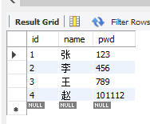
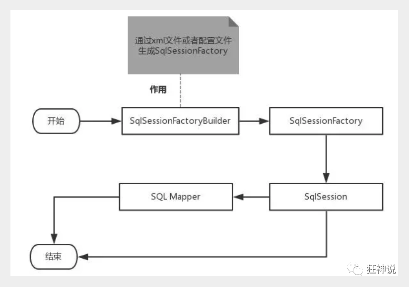
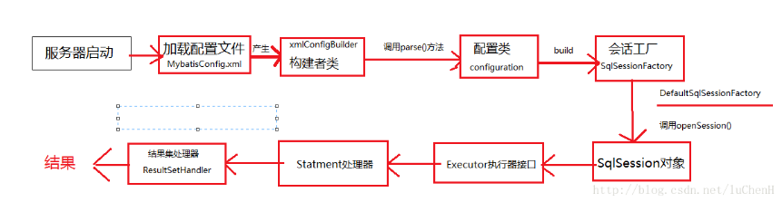

Mysql


建表插入数据

```mysql
create database `mybatis`;
use `mybatis`;

CREATE TABLE `user` (
    `id` INT(20) NOT NULL PRIMARY KEY,
    `name` VARCHAR(30) DEFAULT NULL,
    `pwd` VARCHAR(30) DEFAULT NULL
)  ENGINE=INNODB DEFAULT CHARSET=UTF8;

insert into `user` (`id`,`name`,`pwd`) values
(1,'张','123'),
(2,'李','456'),
(3,'王','789')

insert into `user` (`id`,`name`,`pwd`) values
(4,'赵','101112')
```





mybatis

```html
https://mybatis.org/mybatis-3/zh/getting-started.html
```


新建一个普通maven项目

删除src目录

导入maven依赖


创建一个模块

编写mybatis核心配置文件

```xml
<?xml version="1.0" encoding="UTF-8" ?>
<!DOCTYPE configuration
        PUBLIC "-//mybatis.org//DTD Config 3.0//EN"
        "http://mybatis.org/dtd/mybatis-3-config.dtd">
<!--核心配置文件-->
<configuration>

    <environments default="development">
        <environment id="development">
            <transactionManager type="JDBC"/>
            <dataSource type="POOLED">
                <property name="driver" value="com.mysql.cj.jdbc.Driver"/>
                <property name="url"
                          value="jdbc:mysql://localhost:3306/mybatis?serverTimezone=GMT%2B8&amp;useSSL=true&amp;useUnicode=true&amp;characterEncoding=UTF-8"/>
                <property name="username" value="root"/>
                <property name="password" value="qqqq"/>
            </dataSource>
        </environment>
    </environments>

    <!--每一个Mapper.xml都需要在Mybatis核心配置文件中注册-->
    <mappers>
        <mapper resource="UserMapper.xml"/>
    </mappers>
</configuration>
```


### 从 XML 中构建 SqlSessionFactory

每个基于 MyBatis 的应用都是以一个 SqlSessionFactory 的实例为核心的。SqlSessionFactory 的实例可以通过 SqlSessionFactoryBuilder 获得。而 SqlSessionFactoryBuilder 则可以从 XML 配置文件或一个预先配置的 Configuration 实例来构建出 SqlSessionFactory 实例。

从 XML 文件中构建 SqlSessionFactory 的实例非常简单，建议使用类路径下的资源文件进行配置。 但也可以使用任意的输入流（InputStream）实例，比如用文件路径字符串或 file:// URL 构造的输入流。MyBatis 包含一个名叫 Resources 的工具类，它包含一些实用方法，使得从类路径或其它位置加载资源文件更加容易。

```java
String resource = "org/mybatis/example/mybatis-config.xml";
InputStream inputStream = Resources.getResourceAsStream(resource);
SqlSessionFactory sqlSessionFactory = new SqlSessionFactoryBuilder().build(inputStream);
```


### 从 SqlSessionFactory 中获取 SqlSession

既然有了 SqlSessionFactory，顾名思义，我们可以从中获得 SqlSession 的实例。SqlSession 提供了在数据库执行 SQL 命令所需的所有方法。你可以通过 SqlSession 实例来直接执行已映射的 SQL 语句。

编写mybatis工具类


```java
package com.qi.utils;

import org.apache.ibatis.io.Resources;
import org.apache.ibatis.session.SqlSession;
import org.apache.ibatis.session.SqlSessionFactory;
import org.apache.ibatis.session.SqlSessionFactoryBuilder;

import java.io.IOException;
import java.io.InputStream;

public class MybatisUtils {
    private static SqlSessionFactory sqlSessionFactory;

    static {
        try {
            //获取sqlSessionFactory对象
            String resource = "mybatis-config.xml";
            InputStream inputStream = Resources.getResourceAsStream(resource);
            sqlSessionFactory = new SqlSessionFactoryBuilder().build(inputStream);
        } catch (IOException e) {
            e.printStackTrace();
        }
    }

    public static SqlSession getsqlSession() {
        return sqlSessionFactory.openSession();
    }
}
```


编写代码

实体类

```java
package com.qi.pojo;

//实体类
public class User {
    private int id;
    private String name;
    private String pwd;

    public User() {
    }

    public User(int id, String name, String pwd) {
        this.id = id;
        this.name = name;
        this.pwd = pwd;
    }

    public int getId() {
        return id;
    }

    public void setId(int id) {
        this.id = id;
    }

    public String getName() {
        return name;
    }

    public void setName(String name) {
        this.name = name;
    }

    public String getPwd() {
        return pwd;
    }

    public void setPwd(String pwd) {
        this.pwd = pwd;
    }

    @Override
    public String toString() {
        return "User{" +
                "id=" + id +
                ", name='" + name + '\'' +
                ", pwd='" + pwd + '\'' +
                '}';
    }
}
```

dao接口

```java
package com.qi.dao;

import com.qi.pojo.User;

import java.util.List;

public interface UserDao {
    List<User> getUserList();
}
```

接口实现类 由原来的UserDaoImpl转变为一个Mapper配置文件

```xml
<?xml version="1.0" encoding="UTF-8" ?>
<!DOCTYPE mapper
        PUBLIC "-//mybatis.org//DTD Mapper 3.0//EN"
        "http://mybatis.org/dtd/mybatis-3-mapper.dtd">

<!--绑定一个对应的dao/mapper接口-->
<mapper namespace="com.qi.dao.UserDao">
    <!--查询语句-->
    <select id="getUserList" resultType="com.qi.pojo.User">
        select * from mybatis.user;
    </select>

</mapper>
```


测试

junit测试

```java
package com.qi.dao;

import com.qi.pojo.User;
import com.qi.utils.MybatisUtils;
import org.apache.ibatis.session.SqlSession;
import org.junit.Test;

import java.util.List;

public class UserDaoTest {
    @Test
    public void test() {
        //获取sqlSession对象
        SqlSession sqlSession = MybatisUtils.getsqlSession();
        //方式一：执行sql
        UserDao userMapper = sqlSession.getMapper(UserDao.class);
        List<User> userList = userMapper.getUserList();
        for (User user : userList) {
            System.out.println(user.toString());
        }

        //关闭SqlSession 减少内存调用
        sqlSession.close();

    }
}

```


maven

约定大于配置，可能遇到写的配置文件无法被导出或者生效的问题

```xml
<!--在build中配置resources，来防止我们导出失败的问题-->
<build>
    <resources>
        <resource>
            <directory>src/mian/resource</directory>
            <includes>
                <include>**/*.properties</include>
                <include>**/*.xml</include>
            </includes>
            <filtering>true</filtering>
        </resource>
        <resource>
            <directory>src/mina/java</directory>
            <includes>
                <include>**/*.properties</include>
                <include>**/*.xml</include>
            </includes>
            <filtering>true</filtering>
        </resource>
    </resources>
</build>
```


子项目pom.xml

```xml
<?xml version="1.0" encoding="UTF-8"?>
<project xmlns="http://maven.apache.org/POM/4.0.0"
         xmlns:xsi="http://www.w3.org/2001/XMLSchema-instance"
         xsi:schemaLocation="http://maven.apache.org/POM/4.0.0 http://maven.apache.org/xsd/maven-4.0.0.xsd">
    <parent>
        <artifactId>Myabtis-Study</artifactId>
        <groupId>com.kuang</groupId>
        <version>1.0-SNAPSHOT</version>
    </parent>
    <modelVersion>4.0.0</modelVersion>

    <artifactId>mybatis-01</artifactId>

    <!--在build中配置resources，来防止我们导出失败的问题-->
    <build>
        <resources>
            <resource>
                <directory>src/mian/resource</directory>
                <includes>
                    <include>**/*.properties</include>
                    <include>**/*.xml</include>
                </includes>
                <filtering>true</filtering>
            </resource>
            <resource>
                <directory>src/mina/java</directory>
                <includes>
                    <include>**/*.properties</include>
                    <include>**/*.xml</include>
                </includes>
                <filtering>true</filtering>
            </resource>
        </resources>
    </build>


    <properties>
        <maven.compiler.source>11</maven.compiler.source>
        <maven.compiler.target>11</maven.compiler.target>
    </properties>

</project>
```


父项目pom.xml

```xml
<?xml version="1.0" encoding="UTF-8"?>
<project xmlns="http://maven.apache.org/POM/4.0.0"
         xmlns:xsi="http://www.w3.org/2001/XMLSchema-instance"
         xsi:schemaLocation="http://maven.apache.org/POM/4.0.0 http://maven.apache.org/xsd/maven-4.0.0.xsd">
    <modelVersion>4.0.0</modelVersion>

    <groupId>com.kuang</groupId>
    <artifactId>Myabtis-Study</artifactId>
    <packaging>pom</packaging>
    <version>1.0-SNAPSHOT</version>
    <modules>
        <module>mybatis-01</module>
    </modules>

    <dependencies>
        <!-- https://mvnrepository.com/artifact/mysql/mysql-connector-java -->
        <dependency>
            <groupId>mysql</groupId>
            <artifactId>mysql-connector-java</artifactId>
            <version>8.0.16</version>
        </dependency>
        <!-- https://mvnrepository.com/artifact/org.mybatis/mybatis -->
        <dependency>
            <groupId>org.mybatis</groupId>
            <artifactId>mybatis</artifactId>
            <version>3.5.2</version>
        </dependency>
        <!-- https://mvnrepository.com/artifact/junit/junit -->
        <dependency>
            <groupId>junit</groupId>
            <artifactId>junit</artifactId>
            <version>4.12</version>
        </dependency>
    </dependencies>

    <!--在build中配置resources，来防止我们导出失败的问题-->
    <build>
        <resources>
            <resource>
                <directory>src/mian/resource</directory>
                <includes>
                    <include>**/*.properties</include>
                    <include>**/*.xml</include>
                </includes>
                <filtering>true</filtering>
            </resource>
            <resource>
                <directory>src/mina/java</directory>
                <includes>
                    <include>**/*.properties</include>
                    <include>**/*.xml</include>
                </includes>
                <filtering>true</filtering>
            </resource>
        </resources>
    </build>

    <properties>
        <maven.compiler.source>11</maven.compiler.source>
        <maven.compiler.target>11</maven.compiler.target>
    </properties>

</project>
```


### **作用域（Scope）和生命周期**

理解我们目前已经讨论过的不同作用域和生命周期类是至关重要的，因为错误的使用会导致非常严重的并发问题。

我们可以先画一个流程图，分析一下Mybatis的执行过程！




**作用域理解**

- SqlSessionFactoryBuilder 的作用在于创建 SqlSessionFactory，创建成功后，SqlSessionFactoryBuilder 就失去了作用，所以它只能存在于创建 SqlSessionFactory 的方法中，而不要让其长期存在。因此 **SqlSessionFactoryBuilder 实例的最佳作用域是方法作用域**（也就是局部方法变量）。
- SqlSessionFactory 可以被认为是一个数据库连接池，它的作用是创建 SqlSession 接口对象。因为 MyBatis 的本质就是 Java 对数据库的操作，所以 SqlSessionFactory 的生命周期存在于整个 MyBatis 的应用之中，所以一旦创建了 SqlSessionFactory，就要长期保存它，直至不再使用 MyBatis 应用，所以可以认为 SqlSessionFactory 的生命周期就等同于 MyBatis 的应用周期。
- 由于 SqlSessionFactory 是一个对数据库的连接池，所以它占据着数据库的连接资源。如果创建多个 SqlSessionFactory，那么就存在多个数据库连接池，这样不利于对数据库资源的控制，也会导致数据库连接资源被消耗光，出现系统宕机等情况，所以尽量避免发生这样的情况。
- 因此在一般的应用中我们往往希望 SqlSessionFactory 作为一个单例，让它在应用中被共享。所以说 **SqlSessionFactory 的最佳作用域是应用作用域。**
- 如果说 SqlSessionFactory 相当于数据库连接池，那么 SqlSession 就相当于一个数据库连接（Connection 对象），你可以在一个事务里面执行多条 SQL，然后通过它的 commit、rollback 等方法，提交或者回滚事务。所以它应该存活在一个业务请求中，处理完整个请求后，应该关闭这条连接，让它归还给 SqlSessionFactory，否则数据库资源就很快被耗费精光，系统就会瘫痪，所以用 try...catch...finally... 语句来保证其正确关闭。
- **所以 SqlSession 的最佳的作用域是请求或方法作用域。**


# [MyBatis的执行流程](https://www.cnblogs.com/qingmuchuanqi48/p/10968102.html)

这个是一个大致的流程图



详细的流程为:

　　1.加载全局配置文件(MybatisConfig.xml),这个配置文件中通常是别名设置,拦截器的设置,(当ssm整合后,环境配置与mapper映射文件的注册会转移到spring配置文件中)

　　2.xml全局配置文件会产生一个构建者类,叫做xmlconfigBuilder,这个类是用来通过xml配置文件来构建Configuration对象实例的,构建的过程就是解析(MybatisConfig.xml)配置文件调用parse产生configuration对象

　　3.随后产生的就是Mybatis的配置类(Configuration),这个类可以作为项目的全局配置对象

　　4.接下来便是SqlSessionFactory(会话工厂)的构建者类,(SqlSessionFactoryBuilder),configuration配置对象,就可以调用会话工厂构建者类中的build方法完成对会话工厂对象的构建.

　　5.产生SqlSessionFactory(会话工厂),是用来生成会话的接口,有一个实现类(DefaultSqlSessionFactory)这个实现类是真正的会话的工厂类,并且它是单例的.会一直存在到服务器关闭.

　　6.通过调用会话工厂的实现类中(DefaultSqlSessionFactory)的openSession()方法完成SqlSession对象的创建.

　　7.产生sqlsession,该接口是会话,并且是非线程安全的.每一次对数据库的访问都需要创建一个sqlsession,当得到结果后sqlsession就会被废弃,所以声明周期短.

　　8.当然这当中还有一个Excutor执行器接口,这才是内部真正对数据库进行操作的操作者,他才是真正的干事的.

　　9.另外就是StatementHandler该类是Statment处理器,封装了对数据库各种操作方法,使用时候,就调用其中的一些方法.

　　10.最后就是结果集处理器(ResultSetHandler),这个处理器的作用就是对结果进行处理并返回的.